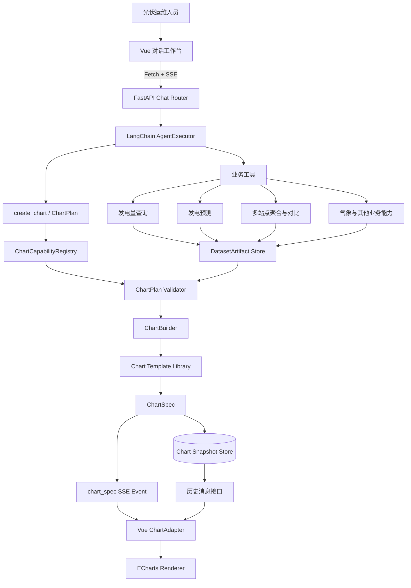
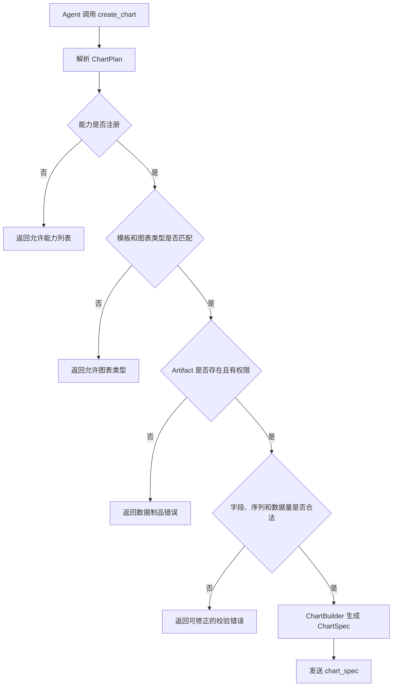
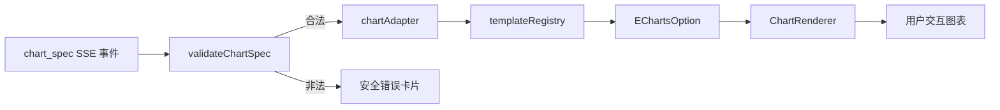
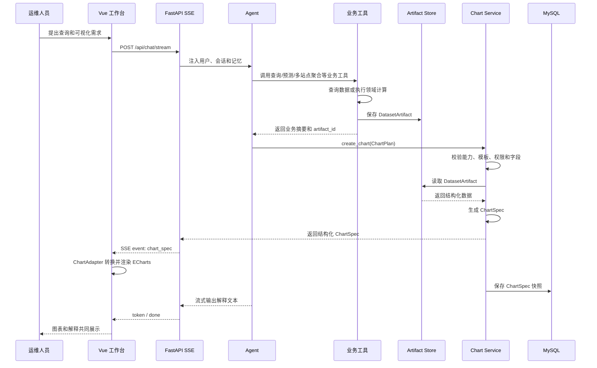
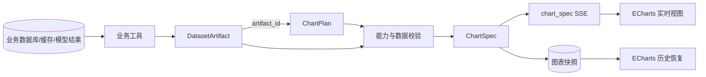
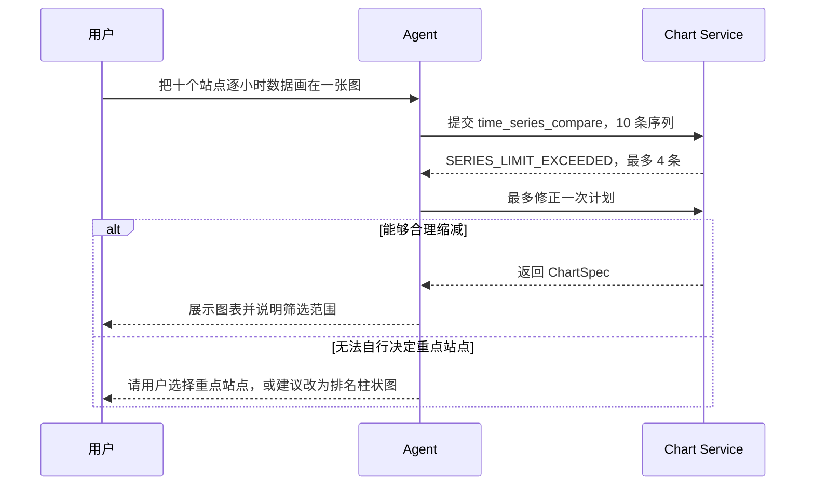
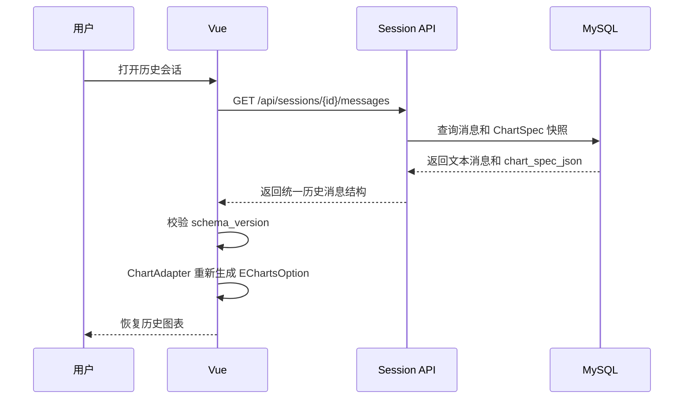
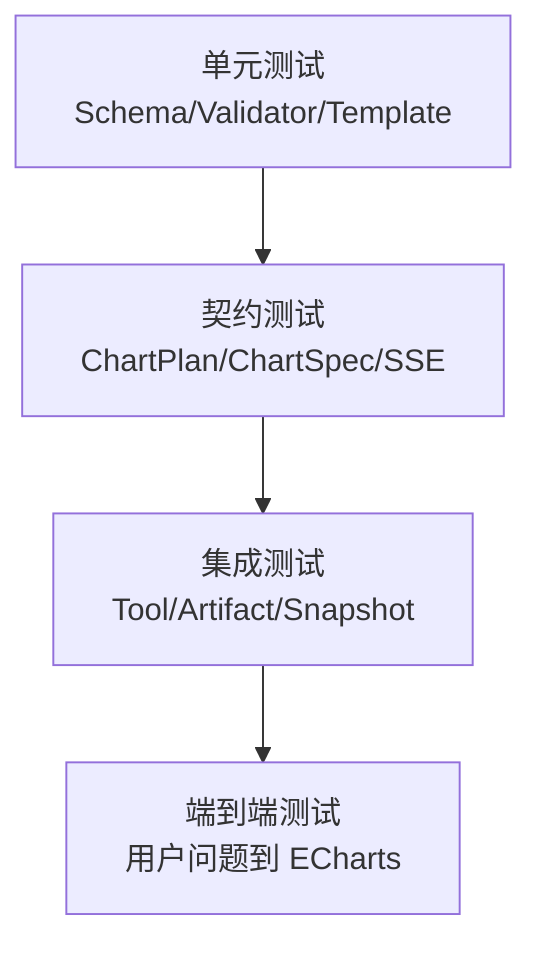
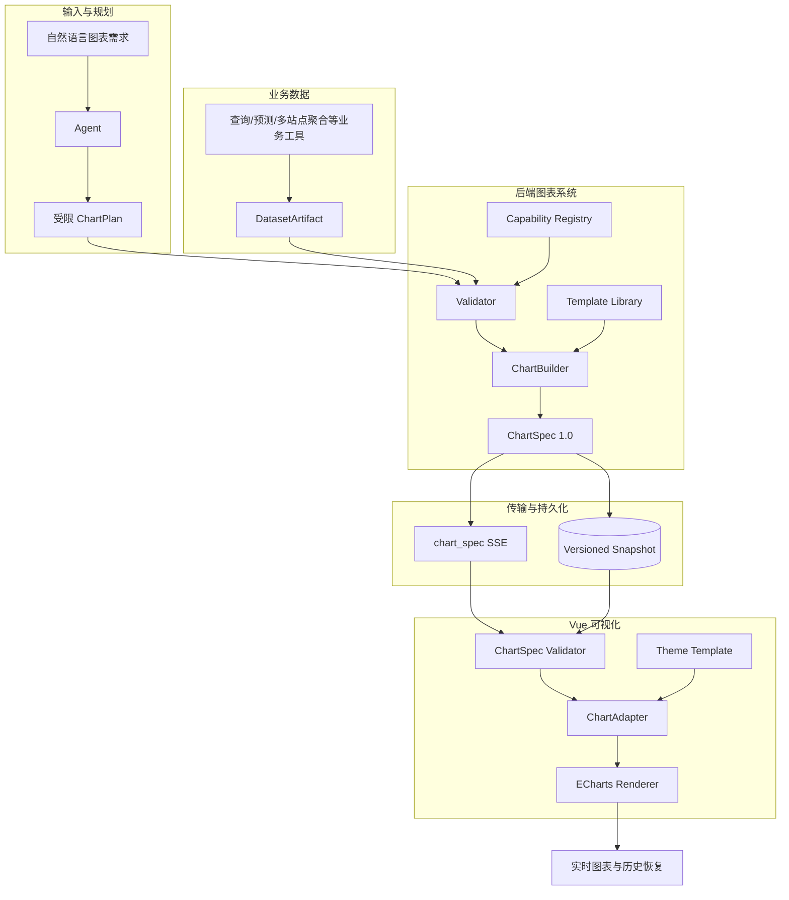
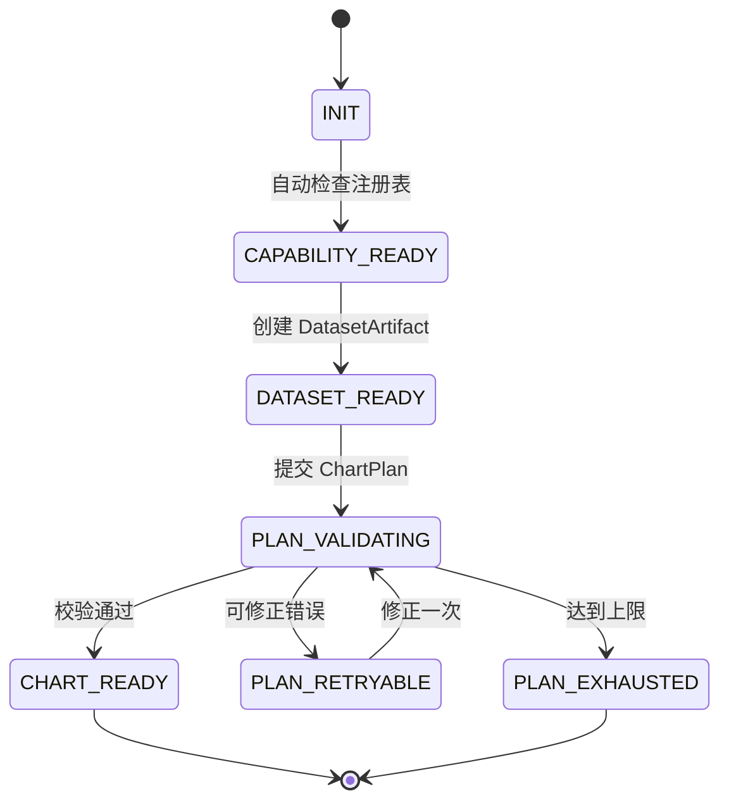

# SolarAgent 通用图表能力架构与分阶段实施方案

> 方案日期：2026-07-16  
> 方案修订：2026-07-17：第一版仅开放单序列时间趋势、多序列时间对比、周期汇总趋势  
> 方案状态：第一版核心图表闭环已落地，当前进入代码级流程收口与后续状态机演进阶段
> 适用范围：SolarAgent 后端 Agent 工具链、FastAPI SSE 事件、Vue/ECharts 渲染和历史图表恢复  
> 核心目标：把当前写死的几种图表，升级为**“受限规划、统一协议、模板渲染、可验证、可恢复”**的**通用可视化能力**

## 一、先给结论

SolarAgent 不应该继续为“单日预测”“范围查询”“预测与实际对比”等场景分别增加图表分支。更合适的演进方向是**建立一条统一图表链路**：

```text
业务工具产生真实数据
        ↓
Agent 在注册能力范围内提交 ChartPlan
        ↓
后端校验计划并生成统一 ChartSpec
        ↓
SSE 发送独立 chart_spec 事件
        ↓
Vue 根据模板转换为 EChartsOption
        ↓
图表实时展示并保存历史快照
```

本方案确定以下边界：

1. Agent 可以选择图表意图和图表类型，但只能在“图表能力注册表”允许的范围内选择。
2. Agent 输出的是 `ChartPlan`，不是业务数据，也不是原始 ECharts 配置。
3. 业务工具负责查询、预测、跨站点聚合和其他领域计算，并产出结构化数据制品 `DatasetArtifact`。
4. 图表系统不负责跨站点查询和指标计算；它只消费业务工具已经对齐并汇总好的各站点结果字段。
5. 后端根据模板和数据制品生成最终 `ChartSpec`，并执行硬校验。
6. 前端不猜测 Markdown 中是否存在 JSON，只渲染正式的 `chart_spec` 事件。
7. 前端不执行 Agent 生成的 JavaScript，也不接受任意 ECharts option。

这项优化的价值不只是“多画几种图”，而是完成一次真正的**工程收口**：以后增加一种受支持的图表能力，主要扩展注册表、模板和数据适配，不再修改聊天主流程。

---

## 二、为什么当前方案需要重建

### 2.1 当前实现的能力

当前后端主要围绕以下场景组织图表数据：

- 单日预测结果逐小时图表。
- 指定日期范围内的逐小时或按日汇总图表。
- 单日预测结果与真实结果对比图表。
- 图表结构通过工具结束事件发送给前端。
- 前端使用 ECharts 渲染，并保存图表快照用于历史恢复。

这些能力已经验证了**“结构化图表数据 + 前端模板渲染”**的方向是正确的，但目前仍然是场景驱动的硬编码。

### 2.2 当前问题的根因

以“横向对比多个站点某日的预测与实际总发电量”为例，模型可以在最终 Markdown 回答中生成一份看似标准的 JSON，但它没有通过正式图表事件进入前端：


这里不是 ECharts 不支持多条序列，而是第二份数据没有进入结构化图表通道。

如果让前端扫描 Markdown 并提取 JSON，会继续产生以下问题：

- 流式输出时 JSON 尚未闭合。
- 普通说明中的 JSON 可能被误判为图表。
- 一条回答可能包含多个 JSON，前端无法判断哪个应该执行。
- 模型可能返回不受支持的字段或任意 ECharts 配置。
- Markdown、业务数据和视图协议的职责混在一起。
- 历史恢复无法确定应该保存哪一份图表结构。

因此需要把图表从“回答文本的一部分”提升为独立、受控、可持久化的系统事件。

---

## 三、核心概念

### 3.1 图表能力 Capability

图表能力表示系统正式支持的一类可视化任务。第一版只开放以下三类：

- 单个指标的时间趋势。
- 多组时间序列对比。
- 按日、按月等周期汇总。

多站点同一天逐小时发电量对比，属于“多组时间序列对比”，不是单独新增一种站点图表能力。后续版本再考虑以下扩展能力：

- 多站点或多设备类别对比。
- 分类占比分布。

**能力不是 ECharts 的所有功能，而是 SolarAgent 结合光伏业务主动开放的有限能力集合。**

### 3.2 数据序列 Series

序列是一张图中同时展示的一组数据。折线图中的一条线、柱状图中的一组柱子，通常都是一个序列。

例如对多个站点同时展示预测值与实际值：

```text
横轴类别：英杰站、清水站、哲丰一车间等站点
序列 1：实际总发电量
序列 2：预测总发电量
```

序列限制表示一张图允许同时展示多少组数据。限制序列数量是产品可读性约束，不是数据库查询能力限制。

### 3.3 DatasetArtifact

`DatasetArtifact` 是**业务工具执行后**产生的**结构化数据制品**。它描述字段、类型、单位、数据行、来源和业务元数据。

**图表系统只接受数据制品，不接受模型在回答文本中临时编造的数据数组。**

### **3.4 ChartPlan**

`ChartPlan` 是 Agent 提交给图表系统的可视化计划。它表达：

- 想完成什么可视化意图。
- 选择哪个受支持模板。
- 使用哪份数据制品。
- 横轴绑定哪个字段。
- 展示哪些序列字段。

ChartPlan 不包含任意 JavaScript，不包含 ECharts option，也不负责生成业务数值。

### 3.5 ChartSpec

`ChartSpec` 是后端校验 ChartPlan、读取数据制品之后生成的最终图表协议，也是前端和数据库快照共同使用的稳定契约。

### 3.6 图表模板 Template

模板是后端和前端共同认知的一类结构化图表规则。例如 `multi_line_compare` 规定：

- 只能使用折线图。
- 至少 2 条、最多 4 条序列。
- 横轴必须是日期或时间类型。
- 纵轴字段必须是数值类型。
- 所有序列必须与同一横轴对齐。
- 前端使用统一图例、Tooltip、颜色和主题规则。

---

## 四、目标系统架构

### 4.1 总体架构图



### 4.2 模块职责

| 模块 | 主要职责 | 明确不负责 |
|---|---|---|
| Agent | 理解用户意图，选择已注册能力，提交 ChartPlan | 不生成业务数据，不生成 ECharts option |
| 业务工具 | 查询真实数据、执行预测、跨站点聚合和领域计算 | 不决定前端视觉样式 |
| Artifact Store | 保存本轮任务产生的结构化数据制品 | 不做图表规划 |
| Capability Registry | 声明系统支持的图表意图、模板和限制 | 不查询业务数据 |
| ChartPlan Validator | 校验能力、模板、字段、类型、权限和数据量 | 不进行领域计算 |
| ChartBuilder | 将已验证数据组装成统一 ChartSpec | 不执行模型生成的代码 |
| Template Library | 定义受支持图表的结构和默认规则 | 不理解预测和跨站点聚合算法 |
| SSE Gateway | 发送独立 chart_spec 事件 | 不把图表混入 Markdown |
| Vue ChartAdapter | 将 ChartSpec 转换为 EChartsOption | 不识别光伏业务意图 |
| ChartRenderer | 管理 ECharts 生命周期、主题和 resize | 不修改业务数据 |
| Snapshot Store | 保存可恢复的 ChartSpec 快照 | 不作为原始业务事实表 |

### 4.3 重要业务边界：多站点聚合与图表彻底分离


图表系统不负责查询多个站点，也不负责决定汇总口径。业务工具必须先完成站点权限过滤、同一天逐小时时间轴对齐、指标聚合和缺失值处理，再把结果交给图表系统。将来站点查询或聚合规则变化，图表协议和前端不需要随之修改。

---

## 五、图表能力注册表

### 5.1 第一版能力范围（V1，仅开放三项）

| capability_id | 中文含义 | 允许图表类型 | 序列限制 | 典型业务场景 |
|---|---|---|---:|---|
| `time_series_trend` | 单序列时间趋势 | 折线图 | 1 | 某站点逐小时发电量 |
| `time_series_compare` | 多序列时间对比 | 折线图 | 2～4 | 预测/实际、多站点同一天逐小时发电量 |
| `period_aggregate` | 周期汇总趋势 | 柱状图、折线图 | 1～3 | 10 天日总发电量、月度汇总 |

### 5.2 后续注册候选（V2+，暂不启用）

以下能力可以保留在设计中，但第一版不加入可用注册表，不允许 Agent 生成：

| capability_id | 中文含义 | 计划图表类型 | 典型业务场景 |
|---|---|---|---|
| `category_compare` | 类别数值对比 | 柱状图 | 多站点发电量排名、设备对比 |
| `proportion_distribution` | 分类占比分布 | 饼图、环形图 | 能量构成、状态类别占比 |

第一版不开放：

- 雷达图、桑基图、地图、3D 图。
- 任意混合图和任意双 Y 轴。
- Agent 自定义颜色、动画、Tooltip HTML。
- Agent 自定义 ECharts formatter 或 JavaScript 函数。
- 未注册的数据变换。

工程封口要求：注册表可以预留后续能力的定义，但必须通过 `enabled` 或独立的启用清单控制实际可用范围；V1 的运行时注册表只能返回上面三项。

### 5.3 注册项结构

```python
{
    "capability_id": "time_series_compare",
    "allowed_chart_types": ["line"],
    "allowed_granularities": ["hourly", "daily"],
    "min_series": 2,
    "max_series": 4,
    "max_points_per_series": 1000,
    "max_total_points": 3000,
    "required_x_types": ["date", "datetime", "time"],
    "required_y_type": "number",
    "template_id": "multi_line_compare"
}
```

这些规则由后端执行，不能只写在 Prompt 中。

### 5.3 超出能力范围时的产品行为

用户要求十条曲线时，系统不应强行绘制，也不应只返回技术错误，而应给出业务可理解的选择：

```text
当前单张时间对比图最多展示 4 组数据。
可以指定 4 个重点站点、拆分为多张图，或改成站点总发电量柱状排名。
```

Agent 可以根据工具返回的允许范围修正一次 ChartPlan。连续失败时停止重试，改为向用户说明当前支持范围。

---

## 六、三份核心数据协议

### 6.1 DatasetArtifact：业务数据制品

下面的站点汇总表用于说明 `DatasetArtifact` 的字段绑定方式，同时保留多站点横向对比这一后续候选场景。它不代表 V1 已开放 `category_compare`；V1 的多站点场景应按同一天逐小时数据接入 `time_series_compare`。

```json
{
  "artifact_id": "artifact_8f3c21",
  "artifact_type": "category_table",
  "owner": {
    "user_id": 1,
    "session_id": "857b0742"
  },
  "schema": {
    "station_name": {
      "type": "category",
      "label": "站点"
    },
    "actual_generation_kwh": {
      "type": "number",
      "label": "实际总发电量",
      "unit": "kWh"
    },
    "predicted_generation_kwh": {
      "type": "number",
      "label": "预测总发电量",
      "unit": "kWh"
    }
  },
  "rows": [
    {
      "station_name": "宁波海曙英杰250KW光伏",
      "actual_generation_kwh": 1268.4,
      "predicted_generation_kwh": 1309.1
    },
    {
      "station_name": "哲丰新材料一号机",
      "actual_generation_kwh": 842.6,
      "predicted_generation_kwh": 815.9
    },
    {
      "station_name": "哲丰一车间",
      "actual_generation_kwh": 1536.2,
      "predicted_generation_kwh": 1498.7
    },
    {
      "station_name": "哲丰新材料清水站",
      "actual_generation_kwh": 1102.8,
      "predicted_generation_kwh": 1134.5
    }
  ],
  "metadata": {
    "date": "2026-07-17",
    "station_count": 4,
    "granularity": "daily_total",
    "source_tool": "multi_station_generation_query"
  }
}
```

必须校验：

- `artifact_id` 唯一。
- 数据制品属于当前用户和当前会话。
- Schema 与 rows 中字段一致。
- 数值字段不能包含无法处理的字符串、NaN 或 Infinity。
- 元数据标明站点、时间范围、粒度和来源工具。

### 6.2 ChartPlan：Agent 的受限图表计划

```json
{
  "schema_version": "1.0",
  "capability_id": "category_compare",
  "chart_type": "bar",
  "template_id": "category_grouped_bar",
  "title": "多个站点预测与实际总发电量对比",
  "artifact_id": "artifact_8f3c21",
  "bindings": {
    "x_field": "station_name",
    "series": [
      {
        "field": "actual_generation_kwh",
        "name": "实际总发电量"
      },
      {
        "field": "predicted_generation_kwh",
        "name": "预测总发电量"
      }
    ]
  }
}
```

ChartPlan 允许 Agent 决定：

- 注册表内的能力。
- 当前能力允许的图表类型。
- 使用的数据制品。
- 字段绑定和图例名称。
- 经过长度和字符校验的标题。

ChartPlan 不允许 Agent提交：

- 原始数据数组。
- 任意单位。
- 任意颜色和主题。
- ECharts option。
- JavaScript、HTML 或 formatter。
- 数据制品中不存在的字段。

### 6.3 ChartSpec：前后端统一图表协议

```json
{
  "schema_version": "1.0",
  "chart_id": "chart_b701e2",
  "capability_id": "category_compare",
  "template_id": "category_grouped_bar",
  "chart_type": "bar",
  "title": "多个站点预测与实际总发电量对比",
  "dataset": {
    "dimensions": [
      "station_name",
      "actual_generation_kwh",
      "predicted_generation_kwh"
    ],
    "rows": [
      {
        "station_name": "宁波海曙英杰250KW光伏",
        "actual_generation_kwh": 1268.4,
        "predicted_generation_kwh": 1309.1
      },
      {
        "station_name": "哲丰新材料一号机",
        "actual_generation_kwh": 842.6,
        "predicted_generation_kwh": 815.9
      },
      {
        "station_name": "哲丰一车间",
        "actual_generation_kwh": 1536.2,
        "predicted_generation_kwh": 1498.7
      },
      {
        "station_name": "哲丰新材料清水站",
        "actual_generation_kwh": 1102.8,
        "predicted_generation_kwh": 1134.5
      }
    ]
  },
  "encoding": {
    "x": {
      "field": "station_name",
      "label": "站点"
    },
    "series": [
      {
        "field": "actual_generation_kwh",
        "name": "实际总发电量",
        "type": "bar",
        "unit": "kWh"
      },
      {
        "field": "predicted_generation_kwh",
        "name": "预测总发电量",
        "type": "bar",
        "unit": "kWh"
      }
    ]
  },
  "metadata": {
    "start_date": "2026-07-17",
    "end_date": "2026-07-17",
    "station_count": 4,
    "granularity": "daily_total",
    "source_artifact_id": "artifact_8f3c21"
  }
}
```

采用 `dataset.rows + field binding`，而不是让每条序列维护一组容易错位的平行数组。这样可以减少横轴和序列长度不一致的问题，也更适合后续扩展多序列。

---

## 七、后端模块设计

### 7.1 推荐目录

```text
backend/app/charting/
├── schemas.py                # DatasetArtifact、ChartPlan、ChartSpec
├── capabilities.py           # 图表能力注册表
├── validators.py             # 权限、字段、数量、类型校验
├── builder.py                # ChartPlan + Artifact -> ChartSpec
├── artifact_store.py         # 当前会话数据制品管理
├── errors.py                 # 稳定错误码
├── service.py                # 对外统一入口
└── templates/
    ├── single_line.py
    ├── multi_line_compare.py
    ├── aggregate_chart.py
    ├── category_bar.py
    └── proportion_pie.py

backend/tools/
└── create_chart_tool.py      # Agent 只能通过该工具提交 ChartPlan
```

### 7.2 `create_chart` 工具

该工具使用 Pydantic `args_schema` 约束参数。工具内部不相信 Agent 提交的任何字符串字段，必须再次经过注册表和 Validator 校验。



### 7.3 稳定错误协议

建议使用稳定错误码：

| 错误码 | 含义 | 是否允许 Agent 重试 |
|---|---|---:|
| `UNSUPPORTED_CAPABILITY` | 能力未注册 | 是 |
| `UNSUPPORTED_CHART_TYPE` | 图表类型不在白名单 | 是 |
| `INVALID_TEMPLATE` | 模板不匹配 | 是 |
| `ARTIFACT_NOT_FOUND` | 数据制品不存在 | 否 |
| `ARTIFACT_FORBIDDEN` | 无权访问数据制品 | 否 |
| `FIELD_NOT_FOUND` | 绑定字段不存在 | 是 |
| `FIELD_TYPE_MISMATCH` | 字段类型不满足模板 | 是 |
| `SERIES_LIMIT_EXCEEDED` | 序列数量超限 | 是 |
| `POINT_LIMIT_EXCEEDED` | 数据点过多 | 是 |
| `CHART_BUILD_FAILED` | 后端构建失败 | 否 |

Agent 对可修正错误最多重试一次。前端收到最终失败事件后显示中文说明和可操作建议。

---

## 八、前端模块设计

### 8.1 推荐目录

```text
frontend/src/charting/
├── validateChartSpec.js      # 前端轻量协议校验
├── chartAdapter.js           # ChartSpec -> EChartsOption
├── templateRegistry.js       # 深浅主题和模板视觉规则
├── formatters.js             # 单位、时间、Tooltip 格式化
└── legacyAdapter.js          # 旧快照迁移期兼容层

frontend/src/components/
└── ChartRenderer.vue         # ECharts 生命周期和容器管理
```

### 8.2 前端转换链路



### 8.3 前端安全边界

- 只接受后端定义的 `schema_version`。
- 只接受白名单 `capability_id`、`template_id` 和 `chart_type`。
- 不使用 `eval`、`new Function` 或模型提供的 formatter。
- Tooltip 内容统一转义。
- 颜色和主题由前端模板分配。
- 数据量超过前端安全阈值时拒绝渲染并显示提示。
- 协议非法时展示错误卡片，不让整个对话页面崩溃。

### 8.4 主题与视觉一致性

ChartSpec 不保存具体主题颜色。前端按模板为不同序列分配稳定语义颜色，使同一历史快照能同时适配深色和浅色模式。

```text
ChartSpec：描述数据和语义
Template：描述布局和视觉规则
Theme：描述深浅模式颜色
```

---

## 九、完整运行链路与数据走向

### 9.1 实时图表链路



### 9.2 数据流向图



需要理解三种数据的区别：

| 数据 | 作用 | 是否业务事实 |
|---|---|---:|
| 业务数据库/模型结果 | 系统真实数据来源 | 是 |
| DatasetArtifact | 一次工具任务的数据制品 | 派生数据 |
| ChartSpec 快照 | 可恢复的视图描述 | 否 |

### 9.3 不支持请求的处理链路



---

## 十、历史图表恢复与版本化

### 10.1 图表快照建议字段

```text
chart_snapshot
├── chart_id
├── session_id
├── message_id
├── user_id
├── schema_version
├── capability_id
├── template_id
├── chart_spec_json
├── source_artifact_id
└── created_at
```

### 10.2 历史恢复链路



### 10.3 旧数据迁移

当前旧版图表结构不能直接删除，否则历史对话会失去图表。迁移期保留一个隔离的 `LegacyChartAdapter`：

```text
旧 chart_data
      ↓
LegacyChartAdapter
      ↓
ChartSpec 1.0
      ↓
统一 ChartAdapter
```

兼容逻辑只存在于迁移层，不继续污染新的 ChartBuilder 和前端渲染主流程。旧快照迁移完成后删除兼容层。

---

## 十一、分阶段实施路线：每一阶段都形成闭环

本方案不采用“先把所有类都建好，最后才看到图”的开发方式。每个阶段必须完成一条可运行、可验证、可演示的闭环。

### 阶段一：统一协议与单序列实时图表闭环

#### 目标

先打通新架构最短路径，证明 ChartSpec 和前端 Adapter 能够真实工作。

#### 实现范围

后端：

- 建立 `backend/app/charting/` 基础目录。
- 定义 `ChartSpec 1.0` Pydantic 模型。
- 建立最小能力注册表，只开放 `time_series_trend`。
- 建立 `single_line` 模板和 ChartBuilder。
- 将一个现有、稳定的单日逐小时图表场景迁移到新协议。
- SSE 增加独立 `chart_spec` 事件。

前端：

- 新建 `validateChartSpec.js`。
- 新建 `chartAdapter.js`。
- 将 ECharts 生命周期拆到 `ChartRenderer.vue`。
- 支持单折线、Tooltip、坐标轴单位和深浅主题。

测试：

- ChartSpec 模型校验测试。
- 单折线模板测试。
- SSE `chart_spec` 事件契约测试。
- 前端 Adapter 输入输出测试。

#### 阶段闭环

```text
用户查询单日逐小时数据
    → 业务工具返回真实数据
    → 后端生成 ChartSpec
    → SSE 发送 chart_spec
    → 前端新 Adapter 渲染单折线图
```

#### 验收标准

- Markdown 中不再需要图表 JSON。
- 前端能渲染单日 24 小时数据。
- Tooltip 能显示具体时间和发电量。
- 深浅模式均可用。
- 非法 ChartSpec 不会导致对话页面崩溃。

### 阶段二：DatasetArtifact + ChartPlan + 多序列时间对比闭环

#### 目标

让 Agent 不再直接组织最终图表数据，并以预测/实际和多站点同一天逐小时对比建立真正的“受限规划”能力。

#### 实现范围

后端：

- 定义 `DatasetArtifact` 和 `ChartPlan`。
- 建立会话级 Artifact Store。
- 业务工具返回业务摘要和 `artifact_id`。
- 新增带 Pydantic `args_schema` 的 `create_chart` 工具。
- 注册 `time_series_compare` 能力。
- 建立 `multi_line` 模板。
- 实现时间轴对齐、字段、权限、序列数量、单位和数据点校验。

前端：

- ChartAdapter 支持多序列折线图。
- 支持预测/实际、多站点序列、图例、Tooltip 和空值处理。
- 图表卡片展示站点、时间范围和统计粒度。

测试：

- Artifact 用户/会话隔离测试。
- ChartPlan 非法能力、非法字段测试。
- 时间轴对齐和序列数量测试。
- 预测/实际、多站点逐小时双序列和多序列渲染测试。

#### 阶段闭环

```text
业务工具查询并对齐多个站点逐小时结果
    → 保存 DatasetArtifact
    → Agent 提交受限 ChartPlan
    → 后端校验并生成 time_series_compare ChartSpec
    → 前端渲染多序列折线对比图
```

该闭环优先覆盖预测与实际的逐小时对比，以及多个站点在同一日期、同一指标口径下的逐小时对比。图表系统不参与跨站点查询、时间对齐和业务计算。

#### 验收标准

- Agent 不能提交数据制品中不存在的字段。
- Agent 不能超过 `time_series_compare` 允许的序列数量和数据点数量。
- 各序列必须使用相同日期范围、统计粒度和指标单位。
- 预测/实际和多站点序列都能正确显示名称、图例和 Tooltip。

### 阶段三：历史快照、版本兼容与会话恢复闭环

#### 目标

让新协议生成的图表跨刷新、跨会话和服务重启稳定恢复。

#### 实现范围

后端：

- 调整图表快照表，保存完整 ChartSpec 和 `schema_version`。
- 绑定 `message_id`、`session_id` 和 `user_id`。
- 历史消息接口返回 ChartSpec。
- 实现旧 `chart_data` 到 ChartSpec 1.0 的迁移适配。

前端：

- 历史消息统一走 ChartAdapter。
- 根据 `schema_version` 选择解析方式。
- 图表恢复失败时只影响当前卡片，不影响整段会话。

测试：

- 实时图表保存后重新加载测试。
- 用户间快照越权测试。
- 旧快照兼容测试。
- 无效快照降级测试。

#### 阶段闭环

```text
实时生成图表
    → ChartSpec 快照入库
    → 用户离开会话
    → 再次打开历史会话
    → 同一份 ChartSpec 重新渲染
```

#### 验收标准

- 历史恢复不重新调用 Agent。
- 历史恢复不重新执行预测或业务工具。
- 深浅模式切换不修改快照数据。
- 旧图表在迁移期仍可查看。

### 阶段四：周期汇总闭环与后续能力预留

#### 目标

在稳定协议上扩展能力，而不是增加聊天路由分支。

#### 实现范围

- 注册 `period_aggregate` 能力，完成 V1 三项能力的最后一个闭环。
- 增加汇总柱状/折线模板。
- 实现日期粒度、序列数量、非负值和数据点校验。
- 验证 Agent 只能从 V1 三项能力中选择。
- 预留 `category_compare`、`proportion_distribution` 的注册接口，但保持关闭状态。

#### 阶段闭环

```text
10 天日总发电量
    → period_aggregate
    → 柱状图或折线图

V1 完成标志：`time_series_trend` + `time_series_compare` + `period_aggregate`
    → 三类图表都经过同一套 ChartPlan/ChartSpec/SSE/Adapter 链路
```

#### 验收标准

- 新增能力不修改 SSE 主流程。
- 新增能力不修改会话消息结构。
- 不支持的图表类型能返回明确的允许范围。
- 超出序列或数据点限制时给出可理解建议。
- 后续能力即使已经写入候选注册定义，也不会在 V1 运行时被 Agent 选中。

### 阶段五：可靠性、观测、评测与发布闭环

#### 目标

把“能够演示”提升为“能够解释、回归验证和稳定发布”。

#### 实现范围

- 为每次 ChartPlan、校验失败和 ChartSpec 生成记录 `trace_id`。
- 统计图表生成成功率、失败原因、模板分布和耗时。
- 建立黄金问题集和 ChartPlan 评测集。
- 增加前后端契约测试和 CI。
- 增加大数据量、空数据、异常值和并发会话测试。
- 清理旧图表工具的重复分支和迁移兼容代码。
- 更新 README、架构文档和演示脚本。

#### 阶段闭环

```text
提交图表需求
    → 生成/失败都有 trace_id
    → 指标记录原因和耗时
    → 自动化测试防止协议回归
    → 版本可以稳定演示和发布
```

#### 验收标准

- 可以回答“最近图表失败主要是什么原因”。
- 修改模板后自动化测试可以发现协议回归。
- Agent 选择能力的准确率有真实测试数据。
- README 能按步骤复现至少三类图表闭环。

### 11.6 阶段依赖关系


实施原则：必须先完成当前阶段的验收标准，再进入下一阶段。V1 只验收三项能力；类别对比、占比分布等能力后续再注册，不能因为候选定义已经存在就提前暴露给 Agent。

---

## 十二、测试体系

### 12.1 后端测试分层



关键测试清单：

- 能力与图表类型白名单。
- 序列最小值、最大值。
- 单序列数据点和总数据点限制。
- 时间字段排序、重复和缺失处理。
- 数值字段 NaN、Infinity 和字符串异常。
- Artifact 用户与会话权限。
- ChartSpec schema_version。
- SSE 事件字段完整性。
- 历史快照恢复。
- 深浅模式和 ResizeObserver。
- 非法协议的安全降级。

### 12.2 黄金业务用例

| 用例 | 预期能力 | 预期模板 |
|---|---|---|
| 查看英杰站某日逐小时实际发电量 | `time_series_trend` | 单折线 |
| 对比两组逐小时结果 | `time_series_compare` | 多折线 |
| 查看最近 10 天日总发电量 | `period_aggregate` | 柱状或折线 |
| 比较多个站点同一天逐小时发电量 | `time_series_compare` | 多折线 |
| 类别数值对比 | V2+ `category_compare` | 暂不开放 |
| 展示分类构成占比 | V2+ `proportion_distribution` | 暂不开放 |
| 请求 10 条逐小时曲线 | 拒绝或引导拆分 | 不生成非法图表 |
| 请求未支持的雷达图 | 返回支持范围 | 不生成图表 |

---

## 十三、产品价值与工程价值

### 13.1 对产品的提升

- 用户可以用自然语言表达更多图表需求，但系统仍有清晰边界。
- 图表失败时给出可执行建议，而不是展示 JSON 或静默失败。
- 同一套协议覆盖实时展示和历史恢复。
- 业务算法变化不会迫使前端跟着修改。
- 图表类型扩展从“改主链路”变成“注册新能力和模板”。

### 13.2 对工程架构的提升

```text
过去：场景分支 + 工具专用 JSON + 前端兼容判断

现在：业务数据制品 + 受限 ChartPlan + 统一 ChartSpec + 模板适配
```

这体现了几个重要工程能力：

- LLM 与确定性代码之间的职责边界。
- Schema 驱动开发。
- 后端能力白名单和安全校验。
- 前后端契约设计。
- 事件驱动的结构化输出。
- 结果快照与历史可恢复性。
- 模块化单体的可演进设计。

---

## 十四、简历与面试表达

### 14.1 项目亮点的正确定位

这项能力不是“使用 ECharts 画图”，而是：

> 设计并实现一套面向垂直 Agent 的受控可视化协议，使大模型只能在能力白名单内提交 ChartPlan，后端基于真实业务数据生成可验证 ChartSpec，前端通过模板安全渲染并支持历史恢复。

### 14.2 完成后可写入简历的表述

在功能尚未实现前不要把下面内容写成已完成。完成对应阶段后，可根据真实情况改写为：

> 针对 Agent 图表输出场景硬编码、Markdown JSON 无法稳定渲染的问题，设计 ChartPlan/ChartSpec 双层协议与图表能力注册表，将 LLM 的自由选择限制在受支持意图和模板内；通过 Pydantic 校验、SSE 结构化事件和 Vue/ECharts Adapter，实现单序列、多序列、周期汇总等图表的统一渲染与历史恢复。

完成阶段五并取得真实指标后，可以补充：

- 支持的能力数量和模板数量。
- ChartPlan 首次生成成功率。
- 图表历史恢复成功率。
- 非法计划拦截用例数量。
- 新增模板所需修改模块数量。

不要编造准确率、性能提升或用户规模，必须用实际测试数据支撑。

### 14.3 面试官可能追问的问题

#### 为什么不让模型直接生成 ECharts option？

回答重点：模型输出不稳定，可能包含未支持字段、函数和 HTML；前端执行任意配置存在安全和可维护性问题。因此使用 ChartPlan 表达意图，后端白名单生成 ChartSpec，前端模板生成 EChartsOption。

#### 为什么 ChartPlan 不直接携带数据？

回答重点：业务数据必须来自查询、预测或其他领域工具。Agent 只引用有权限的数据制品，避免模型编造数据，也能保留数据来源和审计链路。

#### Prompt 已经规定格式，为什么还需要注册表和 Validator？

回答重点：Prompt 是概率性行为提示，不是权限和校验机制。注册表与 Pydantic Validator 才是确定性安全边界。

#### 为什么不为每种业务场景单独写一个图表工具？

回答重点：业务场景会持续增长，专用工具会造成工具膨胀和重复代码。统一 ChartPlan + 模板库能让能力沿稳定协议扩展。

#### 多站点横向对比的数据是谁查询和聚合的？

回答重点：图表模块不直接查询各站点数据，也不决定汇总口径。多站点业务工具负责权限过滤、日期和粒度对齐、指标聚合及缺失值处理，图表模块只负责校验字段绑定并生成 `time_series_compare` ChartSpec。类别柱状图等能力先保留为后续注册项，不影响 V1 的工程封口验证。

#### 如何保证历史图表还能打开？

回答重点：保存版本化 ChartSpec 快照，历史加载时不重新调用模型；旧协议通过隔离的 LegacyAdapter 迁移。

#### 如何限制一张图不要画太多线？

回答重点：能力注册表同时限制序列数、单序列数据点和总数据点。超过限制时给出拆图、筛选或更换模板建议。

### 14.4 面试讲述链路


推荐讲述顺序：

1. 先展示真实失败案例：模型输出了标准 JSON，但前端没有进入图表通道。
2. 说明没有选择“解析 Markdown JSON”的临时方案。
3. 解释业务数据、Agent 计划、后端协议和前端模板的边界。
4. 展示能力注册表如何限制 Agent 自由度。
5. 展示多序列图表和历史恢复结果。
6. 最后用测试数据说明系统稳定性和扩展成本。

这种讲法能引导面试官继续追问 Agent 可靠性、结构化输出、前后端协议、安全边界和工程扩展，而不只停留在“用了 LangChain 和 ECharts”。

---

## 十五、最终验收总图



最终判断这项优化是否完成，不是看增加了多少个类，而是看下面五条能否同时成立：

1. Agent 不能绕过能力注册表生成任意图表。
2. 业务数据不由模型在回答中临时编造。
3. 同一 ChartSpec 能实时渲染，也能历史恢复。
4. 新增模板不需要修改聊天和 SSE 主流程。
5. 所有不支持、越权和非法数据都有明确的失败路径与测试。

当这五条同时满足时，SolarAgent 的可视化就从“几个写死的图表工具”升级成了真正可扩展、可审计、可面试讲解的 Agent 可视化子系统。

---

## 三十、当前版本流程保护与版本演进记录

本节用于集中记录实现演进；前文统一按照当前版本的架构、能力边界和工程职责进行说明。

### 30.1 当前版本的代码级流程保护

图表执行上下文目前使用 `capability_preflight_done` 记录能力注册表是否已经检查：

```text
false
  → get_power_dataset / create_chart_plan 进入
  → 代码调用 get_enabled_capabilities()
  → mark_capability_preflight()
  → true
  → 继续数据查询或 ChartPlan 校验
```

这不是依赖 Prompt 的软约束。Prompt 只提供推荐顺序，真正的流程正确性由工具入口保证：状态为 `false` 时自动完成注册表预检，状态为 `true` 时直接放行。这样即使模型因上下文较长跳过公开的 `get_chart_capabilities` 工具，也不会把内部编排错误暴露给用户。

### 30.2 状态机演进设计（后续实现）

当前布尔状态是状态机的最小实现，后续可以扩展为：



状态机的核心原则是：状态缺失时执行对应的补偿函数，而不是直接报错；只有能力未注册、数据不存在、权限不匹配或计划超过边界时，才进入明确失败状态。

### 30.3 从第一版到当前版本的改动链路


每一步都围绕同一个工程目标：把隐含在 Prompt、字符串和场景分支中的约定，逐步收口到注册表、协议、校验器、Builder、状态保护和测试中。
