# SolarAgent 项目全景评估与优化路线

> 评估日期：2026-07-16  
> 评估对象：SolarAgent 当前仓库代码、数据库脚本、Vue 前端、Agent 工具链和项目文档  
> 评估方式：代码静态审查，未运行项目，不代表已经完成运行时验收

## 一、先给结论

SolarAgent 不是简单的“大模型聊天页面”，而是一个面向光伏电站运维场景的垂直 AI 应用原型。当前已经具备真实业务数据、发电预测模型、Agent 工具调用、人工确认、SSE 流式交互、结构化图表和历史恢复等能力。

项目当前的主要问题不在于方向错误，也不在于功能太少，而在于已经完成了较多功能，却还没有完成工程化收口：数据结构、模型版本、任务状态、测试、部署、观测和多站点能力还没有形成稳定的生产边界。

当前适合的定位是：

```text
功能完整的垂直 AI 原型
        ↓
单站点内部试点候选
        ↓ 需要工程收口、可信评测和任务审计
多站点生产系统
```

综合评价：

| 维度 | 当前判断 | 说明 |
|---|---:|---|
| 光伏业务价值 | 8/10 | 查询、预测、复盘和数据治理都有真实场景 |
| AI 应用含金量 | 7/10 | 有工具编排、记忆、人工确认、流式事件和结构化输出 |
| 产品闭环完整度 | 6/10 | 查询与预测闭环已有，异常处理和结果回流还缺 |
| 工程成熟度 | 4/10 | 测试、部署、迁移、可观测和模块边界不足 |
| 多站点复制能力 | 3/10 | 预测模型实际仍硬编码英杰站 |
| 简历竞争力 | 7.5/10 | 对 AI 应用/Agent 岗位有亮点，但缺少评测和部署证据 |

## 二、当前系统全景

### 2.1 当前架构

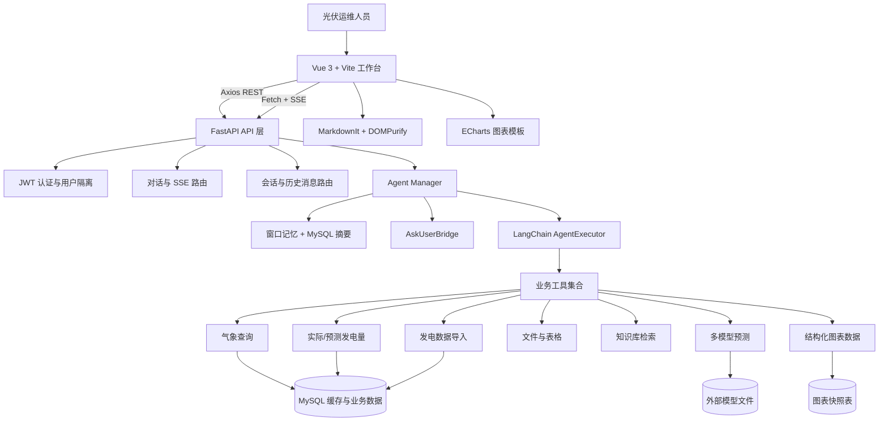

### 2.2 当前最有价值的对话链路

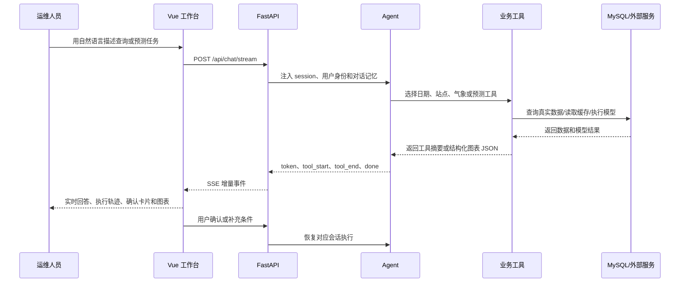

### 2.3 当前已形成的能力

- 用户注册、登录、JWT Bearer Token 校验。
- 会话按照用户隔离，避免直接相信前端传入的 `user_id`。
- 普通 REST 接口使用 Axios，流式对话使用 Fetch + `ReadableStream`。
- Agent 调用气象、实际发电量、预测、文件、表格、知识库和图表工具。
- 预测前通过 AskUser 要求用户确认站点和日期。
- 支持 Token 增量输出、工具开始/结束、用户等待和完成事件。
- Markdown 输出经过 MarkdownIt 解析和 DOMPurify 清洗。
- 图表由 Agent 产生结构化数据，前端按白名单模板渲染 ECharts。
- 支持单日逐小时、多日逐小时和按日汇总图表。
- 图表快照独立保存，历史会话可以重新渲染图表。
- 对话记忆使用窗口消息和摘要，消息持久化到 MySQL。

## 三、工程落地评估

### 3.1 可以落地的部分

当前项目已经满足“技术验证”和“单站点演示”的基本条件。特别是以下设计不是普通聊天项目常见的表面功能：

1. Agent 不直接操作数据库，而是通过业务工具完成任务。
2. 用户确认通过后才继续高风险预测或导入。
3. SSE 不只传最终文本，还传输工具调用过程。
4. 图表采用结构化协议，而不是让模型生成前端代码。
5. 历史图表有独立快照，不依赖重新调用模型。
6. 用户和会话拥有服务端隔离边界。

### 3.2 阻碍生产落地的关键问题

#### P0：数据库和部署不可复现

当前仓库存在以下风险：

- README 引用了不存在的 `tests/` 和部分历史迁移文件。
- 仓库没有完整的 `user_info` 建表脚本。
- [init_schema.sql](../backend/sql/init_schema.sql) 使用了 `DROP TABLE`，不适合作为生产初始化脚本。
- 数据库访问层没有统一的连接池和 Repository 边界。

实际影响：新开发者无法从空环境稳定启动；生产环境误执行初始化脚本可能删除业务数据。

目标状态：

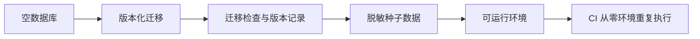

#### P0：预测模型不可复现且实际只支持单站

[pv_predictor.py](../backend/tools/pv_predictor.py) 需要加载晴天、非晴天、多种子模型、Scaler、特征配置和融合模型，但模型资产不在仓库中；`.env.example` 中的模型路径也没有准确反映实际目录结构。

代码还在预测入口硬编码了英杰模型。这意味着其他站点可能使用了不匹配的训练模型，业务上不能直接宣称支持多站点预测。

建议引入模型注册中心：

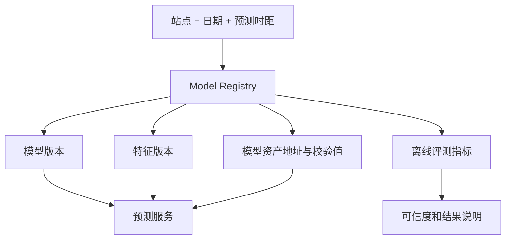

#### P0：历史实况回测不等于生产回测

过去日期使用真实历史天气，可以评价“模型在知道真实天气时的能力”，但不能等价于“生产环境在当时只能拿到天气预报时的能力”。

因此需要同时保留：

| 回测类型 | 使用数据 | 评价内容 |
|---|---|---|
| 模型能力回测 | 历史真实天气 | 发电模型本身的上限能力 |
| 生产链路回测 | 当时发布的天气预报快照 | 实际上线效果 |

每次预测应持久化 `model_version`、`prediction_as_of`、`forecast_issue_time`、`weather_snapshot_id` 和 `prediction_horizon`。

#### P0：Agent 状态只在单进程内存

Agent、会话锁和 AskUserBridge 在内存字典中维护。单进程时可以工作，多 worker 或服务重启后会产生问题：

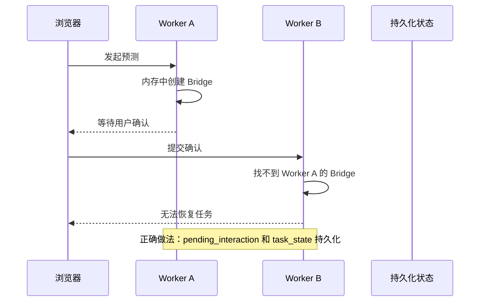

#### P0：停止前端流式显示不等于停止后端业务

浏览器取消 Fetch 后，已经进入线程的同步工具、外部 HTTP 请求、模型推理或数据写入可能继续执行。导入和外部提交类工具尤其需要任务状态、幂等键和补偿策略。

### 3.3 重要但可分阶段处理的问题

- 异步 FastAPI 路由中直接执行同步 PyMySQL/SQLAlchemy 查询，会阻塞事件循环。
- 多个模块重复创建和销毁数据库 Engine，连接池无法统一管理。
- 会话主要从消息表聚合，没有正式会话实体、标题、归档和任务状态。
- 文件目录未按用户、会话或组织隔离。
- 路径安全使用字符串 `startswith`，应改为 `Path.resolve()` + `commonpath`。
- 登录没有限流、Refresh Token、撤销和实时禁用校验。
- 生产入口仍嵌入旧 HTML 测试页面，包含测试账号提示。
- 预测缓存没有模型版本和天气预报发布时间，难以审计。
- 工具异常直接将内部异常文本返回前端，缺少错误码和脱敏层。
- Agent、工具、数据库规则、日志和文件处理耦合在大文件中。

## 四、产品经理视角：真正的业务价值和缺口

### 4.1 产品价值不是“可以聊天”

产品应该定位为：

> 面向光伏电站运维人员的自然语言运营分析和预测复盘工作台。

价值表达应该从“聊天”转为：

- 减少人工查库、查文件和拼报表的时间。
- 更早发现发电数据缺失和预测偏差。
- 将天气、发电和模型结果放在同一个判断上下文中。
- 将一次判断过程保存成可追溯的任务记录。
- 帮助运维人员形成日报、复盘和处理依据。

### 4.2 当前闭环和目标闭环

当前闭环：

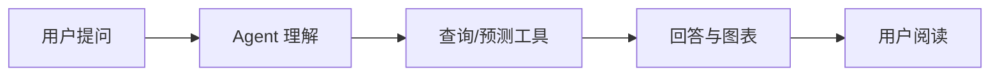

目标闭环：

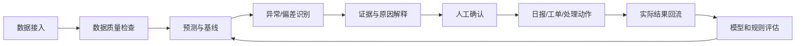

第二阶段建议只把一个主闭环做深：

> 每日光伏预测与偏差复盘。

建议流程：

1. 检查昨天和今天的数据完整性。
2. 展示昨天预测与实际偏差。
3. 标记偏差最大的时段。
4. 结合天气、数据质量和历史规律生成证据。
5. 生成今天或明天预测。
6. 展示预测区间和可信度。
7. 运维人员确认并生成日报或异常记录。
8. 实际数据到达后，自动评估本次预测效果。

### 4.3 产品指标

| 指标类型 | 建议指标 |
|---|---|
| 模型 | MAE、RMSE、MAPE、日总量偏差率、峰值时刻误差 |
| 任务 | Agent 完成率、工具选择准确率、确认超时率、任务耗时 |
| 数据 | 数据完整率、缺失小时数、重复记录数、异常值比例 |
| 产品 | 每日活跃运维人员、日报生成率、复盘使用率、重复使用率 |
| 业务 | 提前发现异常次数、减少人工查数时间、无效排查减少量 |

## 五、HR 和面试官视角

### 5.1 适合展示的岗位方向

| 岗位 | 当前匹配度 | 需要补强的证据 |
|---|---:|---|
| AI 应用/Agent 工程师 | 较强 | Agent 评测、状态机、可观测性 |
| Python 后端工程师 | 中上 | 异步数据库、测试、部署、Repository |
| AI 全栈工程师 | 较强 | 前端组件化、状态管理、自动化测试 |
| 算法工程师 | 中等 | 训练代码、基线、实验记录、模型版本 |
| AI 产品经理 | 中上 | 用户研究、指标、试点反馈和业务收益 |

### 5.2 面试官可能产生的疑问

1. 模型文件和数据库能不能在新环境复现？
2. 预测结果到底有多准，是否有基线对比？
3. 其他站点是否真的使用了各自模型？
4. 多 worker 或服务重启后 AskUser 是否还能恢复？
5. 停止按钮能否真正停止数据写入？
6. 哪些事情由 LLM 决策，哪些事情由后端确定性执行？
7. 这个项目是一个产品闭环，还是多个功能拼在一起？

### 5.3 简历叙事建议

不要只写“使用 LangChain、Vue、FastAPI 实现光伏 Agent”。更好的叙述方式是：

> 面向光伏电站运维场景构建智能分析 Agent，打通真实发电数据、天气数据、发电预测、人工确认和结果复盘链路；通过 FastAPI + SSE 实现 Token、工具调用和确认事件流式传输，并设计结构化图表协议与快照存储，实现实时图表和历史会话恢复。

但不能虚构准确率、耗时提升或用户数量。后续应通过真实评测补齐这些数据。

## 六、“功能堆积”与工程收口

### 6.1 当前是否存在功能堆积风险

存在风险，但不能简单下结论为“只是功能堆出来的”。项目已经有真实业务模型和跨层链路，说明不是空壳；问题在于多个功能已经进入同一个代码层，却还没有形成清晰的职责边界。

典型信号：

- `pv_predictor.py` 接近千行。
- `App.vue` 六百余行，包含会话、流式消息、图表合并、确认、主题和布局状态。
- `main.py` 仍包含大量旧 HTML 测试页面。
- 工具文件同时负责 LLM 描述、数据库查询、DataFrame 清洗、日志和异常文本。
- 前端大量错误提示、英文 fallback 和业务动作写在页面组件中。

### 6.2 工程收口是什么意思

工程收口不是“把代码格式化一下”，而是把“能运行的功能集合”变成“边界清晰、失败可控、可测试、可部署、可维护的系统”。

可以理解为：

```text
功能实现
  ↓
职责拆分
  ↓
接口和数据契约稳定
  ↓
错误、权限、超时、取消明确
  ↓
测试和观测可验证
  ↓
新环境可部署
  ↓
新需求可以沿既有边界扩展
```

### 6.3 具体到当前项目如何收口

#### `pv_predictor.py` 的收口方式

现在它同时承担模型加载、特征工程、天气判断、预测推理、后处理、缓存、实际对比和摘要生成。建议拆成：

```text
backend/domain/forecast/
├── model_registry.py       模型版本、站点和天气类型映射
├── model_loader.py         XGBoost/LGBM/Keras/Scaler 加载
├── feature_engineering.py  特征计算和特征版本
├── inference_service.py    单次预测编排
├── post_processor.py       物理约束和结果修正
├── evaluation_service.py   MAE/RMSE/MAPE/基线评测
├── forecast_repository.py  预测结果持久化
└── schemas.py              预测请求、结果和元数据
```

收口后的标准是：新增一个站点模型时，只需要注册模型和配置，不需要修改核心预测代码。

#### `App.vue` 的收口方式

现在页面组件承担太多状态和业务逻辑。建议拆成：

```text
frontend/src/
├── views/WorkspaceView.vue
├── components/layout/AppShell.vue
├── components/layout/SessionSidebar.vue
├── components/conversation/ConversationPanel.vue
├── components/conversation/MessageList.vue
├── components/conversation/MessageItem.vue
├── components/conversation/ExecutionTimeline.vue
├── components/conversation/ConfirmationCard.vue
├── components/conversation/Composer.vue
├── components/chart/ChartCard.vue
├── stores/authStore.js
├── stores/sessionStore.js
├── composables/useChatStream.js
└── services/api.js
```

收口后的标准是：

- 会话切换不需要知道图表如何渲染。
- 图表组件不需要知道 JWT 如何保存。
- 登录页不需要知道 Agent 事件协议。
- SSE 逻辑可以单独测试。

#### `main.py` 的收口方式

当前 `main.py` 同时负责环境变量、代理处理、FastAPI 工厂、路由注册、健康检查和旧 HTML 页面。

建议变成：

```text
backend/app/
├── main.py                 仅创建应用和注册路由
├── config.py               配置读取和校验
├── middleware.py           CORS、请求 ID、异常处理
├── routers/                HTTP/SSE 路由
├── schemas/                请求和响应契约
├── services/               业务服务
├── repositories/           数据库访问
└── devtools/test_page.py   仅开发环境启用的测试页面
```

#### 工具、数据库、业务规则和日志分离

推荐采用四层边界：

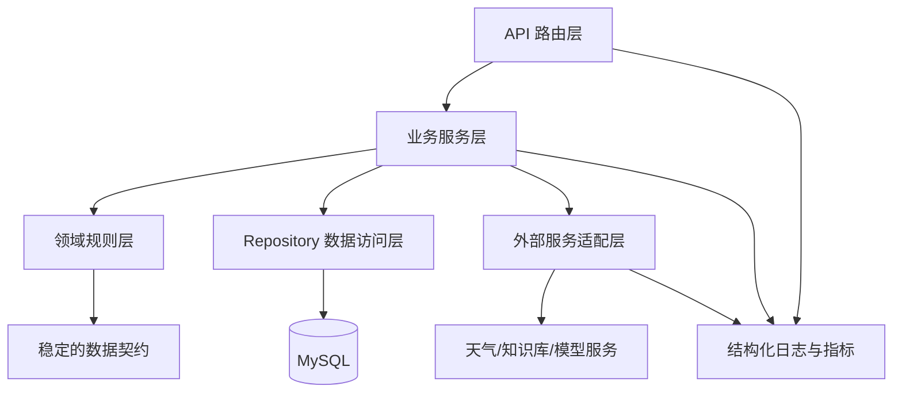

### 6.4 判断工程是否真正收口

可以用以下问题验收：

- 新增一个图表类型，是否只需增加模板和协议，而不用改聊天主流程？
- 新增一个站点模型，是否只需注册模型，不用复制预测代码？
- 更换 MySQL 查询实现，是否不用改 Agent 工具和前端？
- 一个外部 API 超时，是否能返回明确错误码而不是内部异常文本？
- 服务重启后，等待用户确认的任务是否能恢复？
- 新开发者能否仅按照 README 在空环境启动？
- CI 是否能证明核心接口、权限、流式协议和图表快照没有回归？

如果这些问题都能回答“是”，才算完成了工程收口。

## 七、目标架构和阶段路线

### 7.1 推荐目标架构：模块化单体优先

当前不建议立刻拆微服务。更适合先做模块化单体，把边界建立起来：

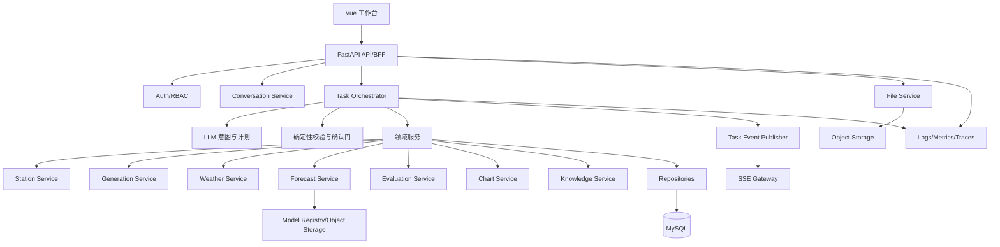

核心原则：

- LLM 负责理解、规划和解释。
- 后端确定性代码负责权限、参数校验和状态转换。
- 领域服务负责真实查询、模型推理和数据写入。
- 前端负责状态展示和模板渲染。
- 所有重要动作必须产生任务事件和审计记录。

### 7.2 分阶段路线

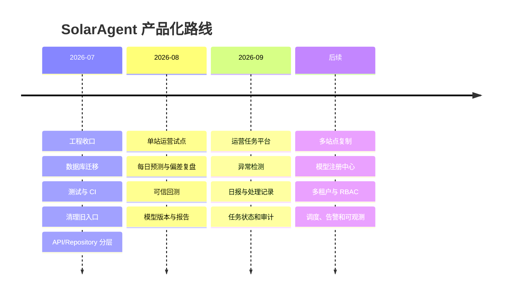

## 八、待开发业务的模块化拆分

### 8.1 后端待开发模块

| 模块 | 主要职责 | 关键数据 |
|---|---|---|
| 会话与任务中心 | 正式会话、任务状态、取消、恢复 | session、task、task_step |
| 模型注册中心 | 站点、模型版本、特征版本和指标 | model_version、artifact |
| 生产回测 | 保存预测时点和天气预报快照 | forecast_snapshot、prediction_batch |
| 数据质量中心 | 缺失、重复、异常突增检测 | data_quality_issue |
| 异常分析服务 | 偏差检测、规则和证据聚合 | anomaly、evidence |
| 报告服务 | 日报、周报和导出 | report、report_item |
| 文件资产服务 | 上传、权限、扫描、生命周期 | file_asset |
| 审计与观测 | 请求、工具、确认和写操作审计 | audit_log、trace_id |
| 多租户权限 | 组织、用户、站点、角色权限 | organization、membership、policy |

### 8.2 前端待开发模块

| 模块 | 主要职责 | 关键交互 |
|---|---|---|
| Pinia 状态中心 | 用户、会话、任务和主题状态 | 刷新恢复、跨组件共享 |
| 会话工作台 | 会话列表、搜索、归档、标题 | 分页、深链接、加载态 |
| 执行时间线 | 展示思考、工具、确认和结果 | 折叠、重连、失败重试 |
| 任务详情页 | 展示输入、计划、数据源和版本 | 任务回放、状态变更 |
| 数据质量面板 | 展示缺失、重复和异常数据 | 筛选、确认、修复入口 |
| 预测复盘页 | 预测/实际/偏差/天气对齐 | 区间、指标、导出 |
| 报告中心 | 日报、周报、历史报告 | 预览、下载、分享 |
| 文件中心 | 上传、预览、导入确认 | 进度、错误明细、权限 |
| 站点与权限页 | 站点、组织和角色管理 | 授权、切换、审计 |
| 统一错误体验 | 错误码、重试、断线恢复 | Toast、空态、降级 |

### 8.3 待开发业务主线

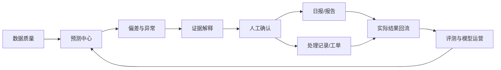

## 九、复盘时应该记住的关键判断

1. 这个项目的价值来自“能源数据 + 预测模型 + Agent 协作 + 可追溯任务”，不是来自聊天 UI。
2. 当前可以作为单站点内部试点，但不能直接宣称多站点生产能力。
3. 预测准确率必须用生产时点天气快照评估，不能只用历史真实天气。
4. Prompt 是协作规则，不是权限系统；高风险操作必须由后端状态机控制。
5. 先做模块化单体和数据契约，不要过早拆微服务。
6. 先把每日预测与偏差复盘做成主闭环，再扩展告警、报告和多租户。
7. 工程收口的最终结果，是新需求可以沿稳定边界扩展，而不是继续往大文件里添加分支。

## 十、待开发业务前后端总图

> 本图放在文档最后，作为后续开发拆分和复盘总览。

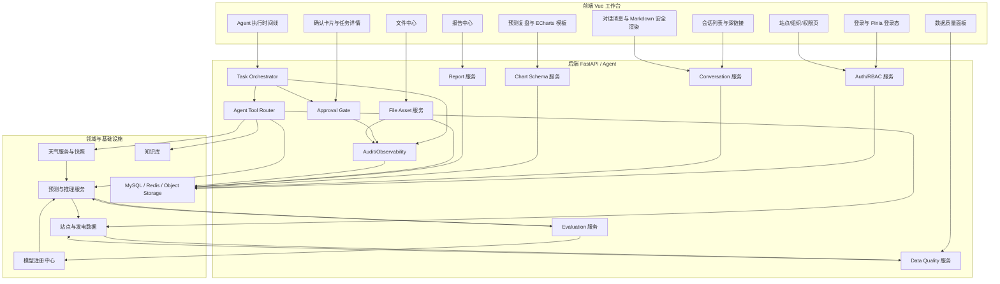