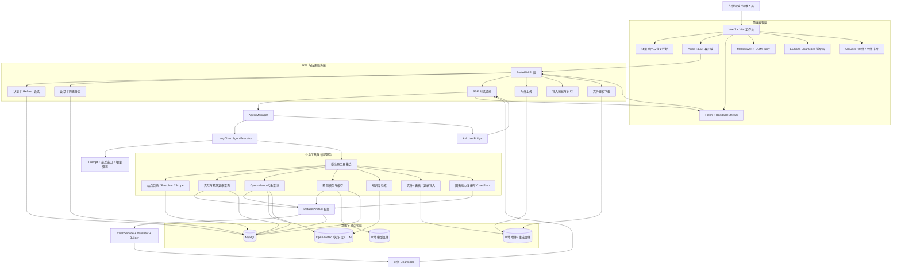
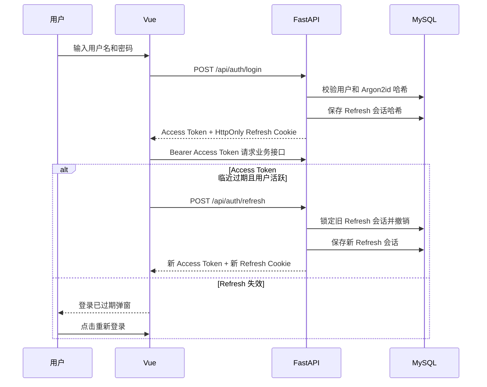
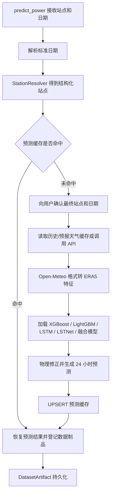
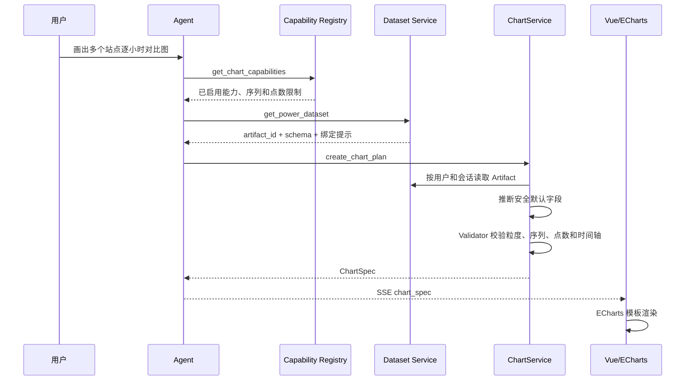
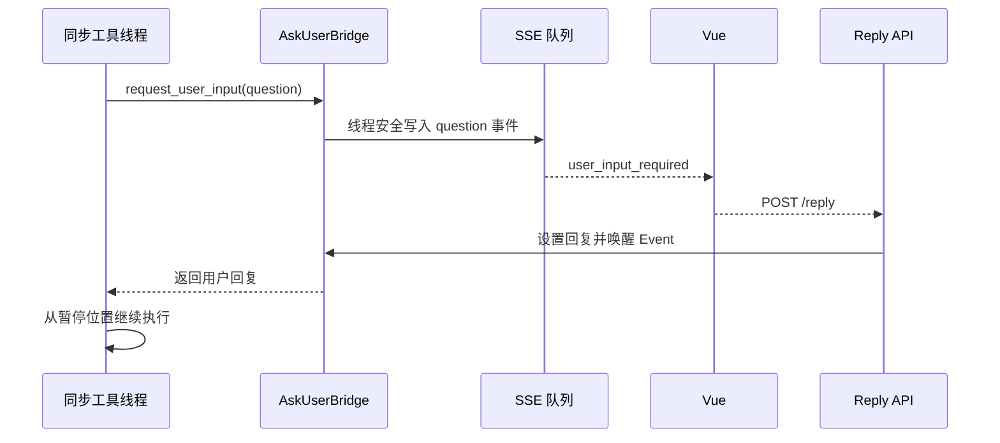
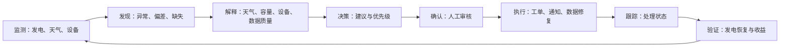
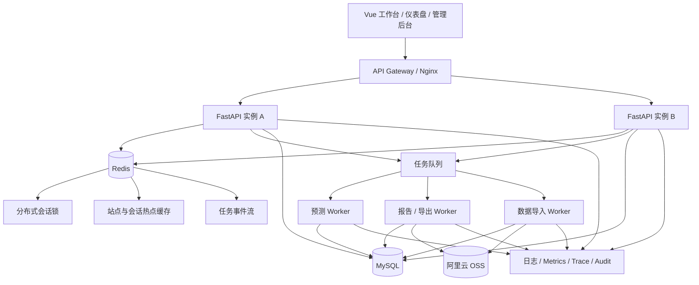

# SolarAgent 项目全景与价值评估

> 评估日期：2026-07-23  
> 评估对象：SolarAgent 当前仓库中的前端、后端、Agent、工具、数据库脚本、测试与工程配置  
> 评估方法：逐目录静态审查、工具注册核对、路由与数据表梳理、核心调用链还原  
> 评估边界：本报告按要求不评价当前单站点预测模型的泛化能力，假设后续会接入可覆盖全部站点的泛化预测模型  
> 重要说明：本报告是源码级架构与产品评估，不等同于生产压测、安全渗透测试或真实电站试运行验收

---

## 一、先给结论

SolarAgent 已经不是一个“把大模型接到聊天框”的普通 Demo，而是一个面向光伏电站运营分析的垂直 Agent 工作台。它已经把以下能力连接成了可运行的业务链路：

```text
自然语言任务
    → Agent 选择真实工具
    → 查询站点、发电量、天气或执行预测
    → 生成统一数据制品
    → 继续分析、绘图或导出
    → SSE 流式展示过程
    → 必要时暂停并等待用户确认
    → 保存会话、图表、文件和结构化上下文
    → 用户在下一轮继续复用“刚才的数据”
```

从项目价值看，它具备明显的工程亮点和真实业务基础，不属于“烂大街的聊天机器人项目”。最有含金量的部分不是预测模型本身，而是：

1. 将大模型的自由决策限制在真实工具、图表能力注册表和后端校验之内；
2. 用 `DatasetArtifact` 统一承接实际发电、预测、天气、对比等结构化结果；
3. 同时解决单次任务记忆、跨轮会话引用、历史恢复和用户隔离；
4. 打通附件上传、数据导入、结果导出、鉴权下载和历史文件卡片；
5. 支持 `ask_user` 暂停执行并在网页中恢复同一条任务；
6. 通过 SSE 将模型输出、工具调用、图表、文件和错误拆成结构化事件。

但当前仍应定位为：

```text
完成度较高的垂直 AI 应用原型
            ↓
可用于内部演示和小范围试点
            ↓ 还需补齐权限、任务、审计、部署和可观测能力
可投标、可规模化交付的生产系统
```

综合判断如下。分数用于表达相对成熟度，不是第三方认证结果。

| 评估维度 | 当前判断 | 说明 |
| --- | ---: | --- |
| 业务方向价值 | 8/10 | 光伏数据查询、预测、可视化、导入导出和复盘都是真实运营场景 |
| AI 应用设计 | 8/10 | 有工具调用、结构化制品、人工确认、流式事件和多层记忆 |
| 产品闭环完整度 | 7/10 | 查询、预测、画图、导出已经闭环，告警和工单闭环尚未形成 |
| 工程成熟度 | 6/10 | 分层已建立，但仍有大文件、内存态组件、测试与部署短板 |
| 生产就绪程度 | 4.5/10 | 缺少多租户权限、任务队列、审计、监控、对象存储和正式交付体系 |
| 当前投标竞争力 | 5.5/10 | 适合作为技术原型或试点方案，不适合直接承诺大规模生产 SLA |
| 简历与面试价值 | 8.5/10 | 能体现垂直 Agent、全栈、数据链路、安全边界和工程取舍 |

---

## 二、源码审查范围与代码基线

### 2.1 当前仓库规模

按 Git 已跟踪的 Python、Vue、JavaScript、CSS、HTML、SQL 和 JSON 文件统计：

- 约 102 个源码或工程配置文件；
- 约 1.66 万行代码，不含文档和 `package-lock.json`；
- 前后端已经完成目录级分离；
- 业务复杂度主要集中在 Agent 流式接口、预测器、表格工具、Memory 和前端主工作台。

当前体量最大的正式源码包括：

| 文件 | 规模 | 主要职责 |
| --- | ---: | --- |
| `frontend/src/App.vue` | 约 1250 行 | 工作台状态、会话、SSE、认证续期、附件、图表和文件卡片 |
| `backend/tools/pv_predictor.py` | 约 1180 行 | 气象适配、模型加载、预测、缓存、确认门和预测数据制品 |
| `backend/tools/table_io_tool.py` | 约 940 行 | 通用数据制品导出、宽表转换、Excel/CSV 读写 |
| `backend/app/routers/chat.py` | 约 700 行 | SSE 流式执行、上下文绑定、事件转换和结果持久化 |
| `backend/tools/import_tool.py` | 约 620 行 | 多 Sheet 解析、数据清洗、站点入库和发电量批量导入 |
| `backend/Agent/memory.py` | 约 580 行 | 最近窗口、增量摘要、消息持久化和用户隔离 |
| `frontend/src/styles.css` | 约 580 行 | 深浅色工作台、登录页、卡片和响应式布局 |
| `backend/tools/power_query_tool.py` | 约 550 行 | 实际、预测、天气和对比数据查询 |
| `backend/tools/chart_plan_tool.py` | 约 500 行 | 图表能力预检、数据集构建和 ChartPlan 提交 |
| `frontend/src/api.js` | 约 500 行 | Axios REST、Fetch SSE、Token 刷新、上传和 Blob 下载 |

这说明项目已经达到需要继续“工程收口”的规模：不能再持续把状态和业务逻辑堆进 `App.vue`、`chat.py` 或单个工具文件。

### 2.2 正式代码、保留代码与测试代码

| 类型 | 当前状态 | 判断 |
| --- | --- | --- |
| `backend/app/` | 正式后端主链路 | FastAPI 路由、服务、图表协议、认证和持久化 |
| `backend/Agent/` | 正式 Agent 主链路 | LLM、Prompt、Memory、工具注册和 AgentExecutor |
| `backend/tools/` | 正式业务工具为主 | 注册工具进入 Agent；另有少量保留的旧工具 |
| `frontend/` | 正式 Vue 工作台 | 登录、会话、对话、图表、附件、导入和下载 |
| `backend/tools/chart_tool.py` | 旧图表实现 | 文件仍保留，但没有进入当前 Agent 工具注册表 |
| `backend/temp/autoPred_英杰_hourly_post_schedule.py` | 老项目定时任务 | 与当前 FastAPI + Vue 主链路无关，按现有决策保留 |
| `backend/temp/*.py` | 实验代码 | 不应作为正式功能或投标能力统计 |
| `backend/tests/` | 已有多类测试源码 | 当前只有少量测试被 Git 跟踪，测试资产管理仍需收口 |
| 根目录 `app/` | 当前无正式源码 | 不属于现有运行入口 |

---

## 三、系统定位与目标用户

### 3.1 产品定位

建议将项目定位为：

> **面向光伏电站运维与运营人员的智能数据分析工作台。系统通过自然语言连接站点台账、实际发电量、天气、预测、可视化和文件处理能力，帮助用户完成查询、预测、对比、复盘和数据交付。**

更适合投标或产品化的名称是：

- 光伏运营智能分析平台；
- 光伏数据分析 Copilot；
- 光伏电站运营决策辅助系统。

不建议现阶段称为“全自动光伏运维平台”，因为系统尚未覆盖告警、工单、设备控制和执行结果验收。

### 3.2 目标用户

| 用户 | 当前可获得的价值 | 当前缺失 |
| --- | --- | --- |
| 电站运维人员 | 查询发电数据、看天气、做预测、画图、导出结果 | 站点权限、设备告警、巡检和工单 |
| 区域运营人员 | 多站点查询、横向对比、区域站点筛选 | KPI 看板、排名、异常归因和批量任务 |
| 数据分析人员 | 数据制品、Excel 导入导出、预测与实际对比 | 数据质量面板、模型版本、指标评测 |
| 系统管理员 | 用户登录和基础角色字段 | 用户管理页面、权限策略、审计日志 |
| 管理层 | 可读图表和分析结果 | 管理驾驶舱、收益指标和月报体系 |

---

## 四、系统总体架构

### 4.1 全景架构图



### 4.2 分层职责

| 层级 | 主要目录 | 职责 |
| --- | --- | --- |
| 前端表现层 | `frontend/src/` | 登录、会话、流式过程、Markdown、图表、附件、导入、下载 |
| API 层 | `backend/app/routers/` | REST/SSE 协议、鉴权依赖、参数校验、错误映射 |
| 应用服务层 | `backend/app/services/` | 会话状态、数据制品、文件产物、站点解析、Token 会话 |
| Agent 编排层 | `backend/Agent/` | LLM、Prompt、Memory、AgentExecutor、工具注册 |
| 领域工具层 | `backend/tools/` | 站点、发电、天气、预测、图表、文件、表格、知识库 |
| 图表协议层 | `backend/app/charting/` | 能力注册、计划校验、模板构建、ChartSpec |
| 数据持久层 | `backend/sql/` 与 MySQL | 业务事实、缓存、会话、摘要、制品、附件和文件元数据 |
| 外部资源层 | Open-Meteo、LLM、知识库、模型文件 | 外部气象、推理、知识检索和预测模型 |

---

## 五、源码模块全景

### 5.1 Agent 层

| 文件 | 作用 | 当前判断 |
| --- | --- | --- |
| [`agent.py`](../backend/Agent/agent.py) | 组装 LLM、工具、Prompt 和 Memory，创建 `AgentExecutor` | 主执行入口，最大 20 次迭代 |
| [`llm.py`](../backend/Agent/llm.py) | 创建兼容 OpenAI 协议的模型客户端 | 供应商细节被封装 |
| [`prompt.py`](../backend/Agent/prompt.py) | 约束任务拆分、工具调用、站点、图表、附件和导出行为 | 仍属于软约束，不能代替代码校验 |
| [`memory.py`](../backend/Agent/memory.py) | 最近三轮原文、增量摘要、MySQL 消息和用户隔离 | 已形成较完整的持久化记忆 |
| [`tools.py`](../backend/Agent/tools.py) | 定义正式提供给 Agent 的工具集合 | 是判断“正式能力”的真实入口 |

当前正式注册了 24 个工具，覆盖：

- 站点查询：单站点、全部站点、地区站点；
- 日期和当前时间；
- 天气范围和天气记录；
- 发电预测、实际发电、预测缓存、实际与预测对比；
- 文件读写与校验；
- 表格导出与读取；
- 知识库检索；
- 用户确认；
- 图表能力、数据集和 ChartPlan；
- 发电数据导入。

### 5.2 FastAPI 路由层

| 路由模块 | 主要接口 | 作用 |
| --- | --- | --- |
| [`auth.py`](../backend/app/routers/auth.py) | 注册、登录、刷新、退出 | Access Token + 旋转 Refresh Token |
| [`chat.py`](../backend/app/routers/chat.py) | `/api/chat/stream`、`/api/chat`、`/reply` | SSE 对话、非流式兼容、AskUser 回复 |
| [`sessions.py`](../backend/app/routers/sessions.py) | 会话增删改查、历史分页 | 标题、游标分页、消息与卡片恢复 |
| [`attachments.py`](../backend/app/routers/attachments.py) | 对话附件上传 | 保存文件并返回 `attachment_id` |
| [`files.py`](../backend/app/routers/files.py) | 生成文件下载 | 校验用户归属后返回文件流 |
| [`import_data.py`](../backend/app/routers/import_data.py) | 导入预览、确认入库 | 独立于 Agent 的传统数据导入入口 |

### 5.3 应用服务层

| 服务 | 主要作用 |
| --- | --- |
| `AgentManager` | 按会话缓存 Agent、Bridge 和会话锁 |
| `AskUserBridge` | 将同步工具线程的等待转换为异步 SSE 问题事件 |
| `SessionContextService` | 持久化 `active_station`、`active_attachment`、`active_dataset`、`active_chart` |
| `DatasetArtifactService` | 创建、保存、恢复和校验统一数据制品 |
| `ChartSnapshotStore` | 保存最终图表快照，供历史会话恢复展示 |
| `AttachmentService` | 附件元数据、路径解析、归属校验和安全上下文 |
| `FileArtifactService` | 生成文件登记、消息绑定、历史卡片和鉴权下载 |
| `StationCatalogService` | 从 MySQL 读取站点目录并执行名称/地区匹配 |
| `StationResolver` | 在单次任务内缓存已解析站点，歧义时只询问一次 |
| `StationScopeResolver` | 区分单站点、多站点和地区站点范围 |
| `RefreshTokenService` | Refresh Token 服务端会话、轮换和撤销 |
| `SummaryTaskManager` | 每个会话最多保留一个异步摘要任务 |

### 5.4 图表协议层

| 文件 | 作用 |
| --- | --- |
| `registry.py` | 图表能力白名单、序列数和点数限制 |
| `schemas.py` | `DatasetArtifact`、`ChartPlan`、`ChartSpec` 等 Pydantic 合同 |
| `service.py` | 安全默认值推断、归属读取、Validator 和 Builder 调度 |
| `validators.py` | 字段、粒度、序列、时间轴、点数和视图校验 |
| `builders.py` | 单折线、多折线和汇总柱状图模板 |
| `context.py` | 单次任务预检状态和最多两次 ChartPlan 尝试 |
| `artifact_store.py` | 进程内热缓存，MySQL 是跨轮恢复的持久层 |

当前启用三类图表能力：

| 能力 ID | 图表 | 场景 | 限制 |
| --- | --- | --- | --- |
| `time_series_trend` | 单折线 | 单序列逐小时趋势 | 1 条序列，最多 744 点 |
| `time_series_compare` | 多折线 | 预测/实际或多站点逐小时对比 | 2～4 条序列，每序列最多 744 点 |
| `period_aggregate` | 柱状图 | 单/多站点日总量趋势或快照 | 1～4 条序列，每序列最多 50 点 |

### 5.5 领域工具层

| 工具模块 | 主要能力 | 是否产生数据制品 |
| --- | --- | --- |
| `station_query_tool.py` | 站点列表、详情、位置、地区查询 | 否，返回站点结构化事实 |
| `power_query_tool.py` | 实际、预测、天气记录、预测与实际对比 | 是 |
| `weather_fetcher_tool.py` | Open-Meteo 历史和预报气象 | 是 |
| `pv_predictor.py` | 24 小时预测、确认门、缓存、实际对比 | 是 |
| `chart_plan_tool.py` | 构造图表数据集并提交受限计划 | 是 |
| `table_io_tool.py` | 数据制品导出、宽表转换、多 Sheet 读取 | 消费制品并产生文件 |
| `file_io_tool.py` | 文本/Markdown 文件生成、读取、校验 | 产生文件产物 |
| `import_tool.py` | Excel 预览、清洗、站点更新和电量入库 | 写入业务表 |
| `knowledge_base_tool.py` | 外部知识库检索 | 否 |
| `ask_user_tool.py` | 通用人工确认 | 否 |
| `cache_manager.py` | 预测和天气缓存读写 | 为预测、天气工具复用 |

### 5.6 前端层

| 文件或组件 | 主要职责 |
| --- | --- |
| [`App.vue`](../frontend/src/App.vue) | 欢迎页、会话、SSE、上下文状态、附件、图表、文件卡片和认证续期 |
| [`api.js`](../frontend/src/api.js) | Axios REST、Fetch 流式请求、刷新令牌、上传与 Blob 下载 |
| [`router.js`](../frontend/src/router.js) | `/login` 与 `/workspace` 的轻量路由守卫 |
| `LoginView.vue` | 独立登录页面 |
| `MarkdownMessage.vue` | Markdown 渲染、DOMPurify 清洗、下载链接移除 |
| `PowerChart.vue` | 将后端 ChartSpec 映射为 ECharts 配置 |
| `AskUserCard.vue` | 展示问题、提交回复、恢复 Agent 执行 |
| `ConversationAttachmentPicker.vue` | 输入框附件选择 |
| `ImportDataDialog.vue` | 文件预览、清洗摘要和确认入库 |

---

## 六、当前已实现的功能闭环

### 6.1 登录与会话认证

系统使用：

- Argon2id 保存密码哈希；
- 短时 Access Token 放在前端本地存储；
- Refresh Token 放在 `HttpOnly` Cookie；
- 数据库只保存 Refresh Token 哈希；
- Refresh Token 每次使用都会旋转，旧令牌被撤销；
- 前端检测 401 后只重试一次，刷新失败则弹窗要求重新登录；
- 前端根据页面可见性、焦点和用户输入判断是否处于活跃状态。



### 6.2 会话列表与历史消息

已实现：

- 登录后进入欢迎页，不强制选中历史会话；
- 首条消息才创建实际会话；
- 会话名称从首条消息截取，也支持手动重命名；
- 会话列表使用 `(last_message_at, session_id)` 游标分页；
- 历史消息使用 `before_id` 向前分页；
- 前端对同一会话、相同参数的请求进行 Promise 去重；
- 历史消息同时恢复图表快照、文件卡片和 Token 用量。

### 6.3 多层记忆

系统没有把“所有历史消息”每次全部塞给模型，而是拆成三层：

```text
最近 3 轮完整消息
    +
早期消息的增量摘要
    +
active_station / active_dataset / active_attachment / active_chart
```

其中：

- 完整消息存入 `message_store`；
- 摘要存入 `agent_summary_store`；
- 摘要使用消息 ID 游标，仅处理未摘要消息；
- 摘要每累计 8 条待处理消息触发一次，单批最多 16 条；
- 摘要通过后台线程执行，不阻塞当前对话响应；
- `summary_version` 与游标共同避免并发摘要覆盖；
- 会话上下文只保存短引用，不把图表数组或大数据复制进 Prompt。

### 6.4 站点结构化解析

站点处理分为：

1. 单站点：解析名称，歧义时使用 `ask_user`；
2. 明确多站点：逐个解析，只询问真正有歧义的项；
3. 地区站点：根据省、市、地址或站点名模糊查询，最多 20 个；
4. 指代复用：用户下一轮说“它”“刚才那个站点”时使用 `active_station`。

单次任务中，站点对象保存在 `StationResolutionContext`，同一个模糊名称不会被多个工具重复询问。任务成功后，用户明确选择的站点会保存到 `chat_session.context_json`，用于下一轮指代。

### 6.5 发电量与天气查询

已接入：

- 单站点单日实际发电量；
- 单站点日期范围实际发电量；
- 预测缓存读取；
- 实际与预测逐小时对比和误差指标；
- 历史或预报天气；
- 天气缓存；
- 多站点和地区站点元数据查询。

实际发电量来源于 `power_generation`，站点来源于 `solar_station`，天气来源于 Open-Meteo 并落入历史/预报缓存。

### 6.6 预测执行与确认门

预测工具内部，而不是仅靠 Prompt，完成以下流程：



这个设计保证“必须确认后才能预测”由工具内部逻辑控制，而不是完全依赖模型记住 Prompt。

### 6.7 统一数据制品

当前实际、预测、天气、对比和图表数据集都可以进入统一结构：

```text
DatasetArtifact
├── artifact_id
├── artifact_type
├── owner_user_id
├── session_id
├── schema（字段类型、角色、标签、单位）
├── rows
└── metadata（站点、日期、粒度、来源工具等）
```

它同时写入：

- 进程内热缓存：提升当前进程内访问速度；
- MySQL `dataset_artifact_store`：用于重启后和跨轮会话恢复；
- 当前任务 `DatasetExecutionContext`：记录本轮产生和当前激活的制品；
- 会话 `active_dataset`：只保存最近数据制品的轻量引用。

数据制品解决了一个关键问题：

> 用户可以先查询或预测，之后再说“把刚才的数据画图”或“导出刚才的数据”，后端根据制品 ID 找到同一份真实数据，而不是让模型从回答文字中重新拼数组。

### 6.8 受控图表生成



Agent 只能提交“计划”，不能提交：

- 原始 JavaScript；
- 任意 ECharts formatter；
- HTML Tooltip；
- 绕过注册表的图表类型；
- 不属于当前用户或会话的数据制品。

这比让模型直接生成 ECharts 配置更安全、更容易测试，也更符合生产系统的可控性要求。

### 6.9 SSE 流式对话与 AskUser

流式接口会把 Agent 事件转换为：

- `token`：模型输出片段；
- `usage`：累计 Token 用量；
- `tool_start`：工具开始；
- `tool_end`：工具结果摘要；
- `chart_spec`：可信图表协议；
- `user_input_required`：需要用户输入；
- `error`：结构化异常；
- `done`：最终结果。

AskUser 的特殊点是：LangChain 工具是同步等待，而 FastAPI 和浏览器是异步的。项目通过 `AskUserBridge` 连接二者：



### 6.10 文件上传、导入、导出和下载

文件分成两个资源概念：

- `attachment_id`：用户上传给系统的文件；
- `file_id`：Agent 或工具生成、供用户下载的文件。

#### 上传和导入

```text
前端上传文件
    → FastAPI 校验扩展名、大小和会话归属
    → 本地保存文件
    → file_attachment 保存元数据
    → 返回 attachment_id
    → active_attachment 保存短引用
    → Agent 调用 read_file / read_table / import_power_data
```

数据导入支持：

- `.xlsx` / `.xls`；
- 遍历多个 Sheet；
- 单个 Sheet 只解析一次，再拆出站点标题、表头和数据；
- 日期解析、零值和异常数据清洗；
- 站点新增或更新；
- 发电量批量写入且避免重复记录；
- 独立预览确认流程和 Agent 附件导入流程。

#### 导出和下载


下载只走文件卡片，不把真实服务器路径或可点击下载链接暴露给 Agent 文本。历史会话重新打开时，后端按 `message_id` 恢复对应文件卡片。

---

## 七、数据库与数据边界

### 7.1 主要数据表

| 数据域 | 表 | 作用 |
| --- | --- | --- |
| 用户 | `user_info` | 用户、角色、密码哈希和状态 |
| 站点 | `solar_station` | 站点名称、容量、地址和经纬度 |
| 实际发电 | `power_generation` | 站点逐小时发电量 |
| 预测缓存 | `prediction_cache` | 逐小时预测结果、天气类型和数据模式 |
| 天气缓存 | `weather_forecast_cache` | 预报天气 |
| 天气缓存 | `weather_archive_cache` | 历史天气 |
| 会话 | `chat_session` | 标题、最近消息时间和结构化上下文 |
| 消息 | `message_store` | LangChain 用户与助手消息 |
| 摘要 | `agent_summary_store` | 增量摘要、游标和版本 |
| 图表 | `chart_snapshot_store` | 历史图表快照 |
| 登录 | `auth_refresh_session` | Refresh Token 哈希、轮换和撤销 |
| 用户上传 | `file_attachment` | 附件元数据和真实存储位置 |
| 系统生成文件 | `file_artifact` | 下载文件、校验哈希和消息绑定 |
| 数据制品 | `dataset_artifact_store` | 统一 schema、rows 和 metadata |

### 7.2 重要数据边界

系统目前做对了以下边界：

- Agent 不接触附件和生成文件的真实磁盘路径；
- 数据制品必须校验 `user_id + session_id`；
- 图表快照用于恢复展示，数据制品用于图表、分析和导出；
- 会话上下文只存短引用，不存大数组；
- Refresh Token 原文不落库，只保存 SHA-256 哈希；
- 文件下载必须走后端鉴权接口；
- 前端 Markdown 经过 DOMPurify 清洗。

---

## 八、项目最值得写进简历的亮点

### 8.1 亮点一：统一数据制品，而不是让工具互相硬调用

传统 Agent 项目常见问题是：

```text
查询工具返回一段文本
    → 图表工具重新查询
    → 导出工具再查询一次
    → 多轮对话无法确定“刚才的数据”
```

本项目改成：

```text
任意数据工具
    → DatasetArtifact
    → 图表 / 导出 / 后续分析统一消费
```

这是很好的泛化设计。以后新增设备告警、PR、辐照度、功率曲线等数据，只需将结果标准化成数据制品，不必改写所有下游功能。

### 8.2 亮点二：Agent 负责选择，后端负责裁决

图表系统没有允许模型随意生成 ECharts，而是使用：

```text
Capability Registry
    + ChartPlan
    + Pydantic Contract
    + Validator
    + Builder
    = ChartSpec
```

这体现了 AI 应用中的一个重要工程思想：

> LLM 适合做语义理解和候选选择；权限、数据归属、参数范围和执行正确性必须由确定性代码控制。

### 8.3 亮点三：单次任务和跨轮会话使用不同记忆

项目没有把所有状态都叫作“Memory”，而是分为：

| 状态 | 实现 | 生命周期 |
| --- | --- | --- |
| 当前工具链的站点和制品 | ContextVar | 单次 Agent 执行 |
| 最近完整对话 | MySQL 消息窗口 | 最近三轮 |
| 早期对话 | 增量摘要 | 长期 |
| 当前站点、附件、数据、图表 | `context_json` 短引用 | 跨轮会话 |
| 图表与文件本体 | 独立持久化表/存储 | 历史恢复 |

这个拆分能有效防止并发串话、Prompt 膨胀和大对象重复存储。

### 8.4 亮点四：同步工具与异步 Web 的人机协同

AskUserBridge 让预测确认、歧义站点选择等工具可以：

- 暂停当前调用链；
- 向浏览器推送问题卡片；
- 等待用户回答；
- 从原调用位置继续；
- 保持同一会话锁和任务上下文。

这比“模型输出一句请确认，然后用户重新发一条新消息”更接近真正的可暂停 Agent。

### 8.5 亮点五：完整的文件资源闭环

上传附件和生成文件使用两套不透明 ID，Agent 不接触真实路径；下载经过用户校验；历史会话能恢复文件卡片；未来可将底层本地文件替换为 OSS，而保持工具和前端协议不变。

### 8.6 亮点六：性能优化有明确的数据访问策略

当前已经实现：

- 进程级 SQLAlchemy Engine 和连接池；
- 会话列表键集游标分页；
- 历史消息 `before_id` 分页；
- Agent 只读取最近窗口，而不是全部消息；
- 摘要增量更新且异步执行；
- 前端相同历史请求去重；
- 数据制品进程热缓存 + MySQL 持久化。

这些改动都对应了真实的性能问题，不是为了堆技术名词。

---

## 九、简历写法

### 9.1 项目名称

**SolarAgent｜光伏运营智能分析与决策辅助平台**

### 9.2 一句话项目介绍

基于 FastAPI、Vue 3 和 LangChain 构建面向光伏电站运营场景的智能分析平台，通过自然语言编排站点、气象、发电量、预测、图表和文件工具，支持流式交互、人机确认、跨轮数据复用和结果交付。

### 9.3 技术栈

`Vue 3`、`Vite`、`Axios`、`Fetch SSE`、`ECharts`、`MarkdownIt`、`DOMPurify`、`FastAPI`、`LangChain`、`Pydantic`、`MySQL`、`SQLAlchemy`、`JWT`、`Argon2id`、`Pandas`、`TensorFlow`、`LightGBM`、`XGBoost`

### 9.4 可直接使用的简历要点

- 设计并实现光伏运营垂直 Agent，将站点查询、实际发电量、天气、预测、可视化、附件导入和结果导出接入统一工具链，通过 SSE 向 Vue 前端实时推送模型 Token、工具步骤、图表、文件和异常事件。
- 抽象 `DatasetArtifact` 统一数据制品协议，将实际、预测、天气和对比结果持久化到 MySQL，并通过会话 `active_dataset` 实现“先分析、后画图或导出”的跨轮数据复用，避免工具间重复查询和模型重新拼接数据。
- 构建受控图表生成链路 `Capability Registry → ChartPlan → Validator → ChartSpec → ECharts`，限制图表类型、字段角色、数据粒度、序列数和点数，阻止模型注入任意 JavaScript 或伪造图表数据。
- 实现基于 ContextVar 的单次任务隔离和 MySQL 会话结构化记忆，区分站点解析缓存、最近消息窗口、增量摘要及跨轮站点/附件/数据引用，解决并发串话、重复询问和长会话 Prompt 膨胀问题。
- 实现 `ask_user` 同步工具与异步 SSE 的桥接，支持预测条件确认和歧义站点选择时暂停任务，用户在前端卡片回复后从原执行位置继续。
- 打通附件上传、Excel 多 Sheet 解析、数据清洗入库、数据制品宽表导出、鉴权文件下载和历史文件卡片恢复；通过 `attachment_id` / `file_id` 隐藏真实服务器路径并校验用户归属。
- 实现 Access Token 与旋转 Refresh Token 认证机制，Refresh 原文不落库，结合 HttpOnly Cookie、服务端撤销记录和前端活跃续期处理登录过期。
- 优化会话性能，采用连接池、键集游标分页、`before_id` 消息分页、增量异步摘要和前端请求去重，避免长会话全量加载和重复请求。

### 9.5 面试时的两分钟介绍

> 我做的是一个面向光伏运营人员的智能分析工作台，不是单纯聊天机器人。用户可以用自然语言查询站点、实际发电量和天气，运行预测，做多站点或预测与实际对比，并把结果画图或导出。  
> 
> 项目中我重点解决了三个工程问题。第一，Agent 工具产生的数据不能只作为文本存在，所以我抽象了统一 `DatasetArtifact`，实际、预测、天气和对比结果都进入同一协议，图表和导出只消费制品。第二，图表不能让大模型自由生成 ECharts 配置，我设计了能力注册表、ChartPlan、Validator 和 ChartSpec，让 Agent 只做意图和能力选择，后端做确定性校验。第三，我把单次任务 ContextVar、最近消息窗口、增量摘要和会话 active 状态分开，既避免并发串话，又支持用户下一轮继续说“把刚才的数据导出来”。  
> 
> 此外，系统还实现了 SSE 流式过程、AskUser 暂停恢复、附件导入、鉴权文件下载、Refresh Token 轮换和历史图表/文件恢复。目前它适合内部试点，下一步会补齐权限、任务队列、审计、部署和可观测能力。

### 9.6 面试官可能追问

| 追问 | 回答重点 |
| --- | --- |
| 为什么不用模型直接生成 ECharts？ | 不可控、难校验、有注入风险；Agent 只交计划，后端生成协议 |
| 数据制品和图表快照有什么区别？ | 制品是可复用数据事实；快照是最终展示结果 |
| ContextVar 为什么不能代替数据库？ | ContextVar 只在单次执行内隔离；跨轮和重启必须持久化 |
| AskUser 怎么让同步工具暂停？ | `threading.Event` 阻塞工具线程，SSE 队列通知前端，Reply API 唤醒 |
| 为什么用游标分页？ | 避免 OFFSET 越翻越慢，排序字段和游标形成稳定范围扫描 |
| 怎么防止用户读取别人的文件和制品？ | 每次按 `user_id + session_id + opaque id` 校验归属 |
| 当前最大短板是什么？ | 还缺少生产级任务调度、权限、审计、监控和部署体系 |

---

## 十、专业投标视角的价值判断

### 10.1 项目有没有价值？

**有价值，而且方向不是普通的功能堆叠。**

光伏运营系统通常存在以下实际问题：

- 数据分散在站点台账、发电量表、天气服务和 Excel；
- 运营人员需要反复筛选、导出、画图和写分析；
- 预测结果与实际结果缺少统一复盘入口；
- 多站点分析依赖数据人员，响应速度慢；
- 传统系统查询条件固定，无法覆盖临时分析问题。

SolarAgent 的价值在于用自然语言作为统一任务入口，同时保留真实工具、确定性校验和文件交付链路。它有机会减少临时取数、重复制表和简单复盘的人工成本。

### 10.2 它是不是“功能堆出来的”？

项目确实已经积累了较多功能，但不能简单判断为功能堆积，因为目前已经出现了几项跨模块抽象：

- 所有数据结果向 `DatasetArtifact` 收口；
- 所有图表向 `ChartPlan / ChartSpec` 收口；
- 所有站点识别向 `StationResolver / StationScope` 收口；
- 所有生成文件向 `file_artifact` 和下载卡片收口；
- 会话级业务引用向 `context_json` 收口；
- API 错误向统一异常码收口。

真正还没有收口的是：

- 长任务执行状态；
- 事实证据与分析结论的统一追踪；
- 用户、角色、租户和站点权限；
- 文件、数据制品和会话删除时的生命周期；
- 生产部署、日志、指标和审计；
- 前端和部分大型工具文件的模块边界。

因此，更准确的判断是：

> 项目已经从功能积累进入架构收口阶段，但尚未完成生产级工程收口。

### 10.3 当前适合怎样投标？

适合：

- 光伏数据智能分析试点；
- 运营人员智能助手 PoC；
- 现有能源管理平台的 AI 分析插件；
- 多站点预测与复盘工作台的原型项目；
- 企业内部数据查询和报告生成试点。

不适合直接承诺：

- 无人值守的自动运维；
- 大规模并发和高可用 SLA；
- 设备控制或安全生产闭环；
- 完整多租户 SaaS；
- 已满足等保、审计和数据安全合规；
- 已覆盖全部站点和全部设备协议。

### 10.4 投标评委会重点质疑什么？

| 质疑点 | 当前情况 | 需要补充的证据 |
| --- | --- | --- |
| 能否规模化部署？ | AgentManager、Bridge 和锁主要在单进程内 | Redis、分布式锁、任务队列和横向扩容方案 |
| 如何保证回答真实？ | 部分事实有工具保护，图表有强校验 | 通用证据账本、工具调用审计和引用来源 |
| 权限怎么控制？ | 有用户隔离和角色字段 | 组织、租户、站点 ACL 和管理员后台 |
| 系统失败如何恢复？ | 会话和数据制品可恢复 | 持久化任务状态、幂等步骤和断点续跑 |
| 文件安全吗？ | 有 ID、归属校验和路径限制 | OSS、短时签名 URL、病毒扫描和生命周期 |
| 是否可验收？ | 功能已有，但缺少系统化指标 | 准确率、响应时间、成功率、并发和可用性报告 |
| 如何对接现有系统？ | 当前主要使用 MySQL 和 Excel | 标准数据接口、SCADA/EMS 适配器和数据字典 |
| 如何运维？ | 基础日志 | 指标、链路追踪、告警、审计和运行手册 |

### 10.5 投标价值结论

如果把它当作“完整商业产品”，当前价值中等；如果把它当作“垂直 Agent 技术底座和内部试点系统”，价值较高。

最合适的商业定位不是替代所有传统光伏系统，而是：

```text
传统站点台账 / SCADA / 数据仓库
                +
SolarAgent 智能任务与分析层
                =
自然语言查询、预测、复盘和结果交付
```

---

## 十一、当前工程风险与缺陷

### 11.1 P0：影响生产可用性的缺口

#### 1. 长任务仍主要依赖一次 AgentExecutor 调用

地区批量预测、多个数据源分析、绘图和导出可能经历多个工具步骤。当前没有持久化任务状态机、任务队列和步骤幂等机制。服务重启或 SSE 断开后，任务可能无法从中间步骤恢复。

#### 2. 事实保护层覆盖不完整

`chat.py` 已对“查询全部站点”强制检查 `list_all_stations`，天气也在 Prompt 中要求调用工具，但站点、天气、预测、发电量和知识结论尚未统一进入通用证据约束层。模型仍可能在没有调用对应事实工具时给出分析性文字。

#### 3. 权限模型不完整

认证中有 `role`，但尚未形成：

- 用户管理页面；
- 管理员与运维人员的接口权限；
- 用户可访问站点列表；
- 组织/租户数据隔离；
- 操作审计。

#### 4. 单进程内状态限制横向扩展

以下状态主要在当前 FastAPI 进程内：

- Agent 实例；
- `asyncio.Lock`；
- AskUserBridge；
- ContextVar；
- 数据制品热缓存。

MySQL 能恢复消息和制品，但当请求切换到另一实例时，正在等待的 AskUser 和会话锁无法自动迁移。

#### 5. 文件和制品生命周期未闭环

当前删除会话主要删除消息、摘要、会话和图表快照，没有统一清理：

- 用户上传附件；
- 生成文件元数据和本地文件；
- 数据制品；
- 预测/天气临时结果。

需要软删除、保留周期、后台清理和审计策略。

### 11.2 P1：影响维护效率的缺口

#### 1. 前端主组件过大

`App.vue` 同时承担：

- 会话状态；
- SSE 事件；
- 附件；
- 导入；
- Token；
- 登录续期；
- 图表；
- 文件下载；
- UI 渲染。

建议拆分为 Pinia Store、Composable 和领域组件。

#### 2. 后端大型工具文件职责过重

`pv_predictor.py`、`table_io_tool.py`、`import_tool.py`、`power_query_tool.py` 都同时包含参数解析、数据库、业务规则、格式化和工具包装。应逐步拆成：

```text
薄 Tool
    → Application Service
    → Repository / Adapter
    → Domain Logic
```

#### 3. 数据库访问方式不完全统一

多数代码使用共享 SQLAlchemy Engine，但 `user_service.py` 仍直接创建 PyMySQL 连接，绕过统一连接池和错误治理。

另外，当前仓库的初始化 SQL 没有完整包含 `user_info` 建表定义。已有数据库可以运行，但新环境无法只靠仓库脚本一次性初始化全部认证依赖，这是交付时必须补齐的基础设施缺口。

#### 4. 数据制品使用 LONGTEXT 存整行 JSON

第一阶段简单有效，但在大数据量下会造成：

- MySQL 表膨胀；
- 读取和 JSON 解析成本上升；
- 备份和清理困难。

后续应根据数据量将大制品迁移到对象存储或列式文件，MySQL 只保存索引和元数据。

#### 5. 测试资产没有完全纳入版本控制

仓库中已经存在图表、Token、站点、错误、文件和导出测试，但目前只有少量测试被 Git 跟踪，`.gitignore` 对整个 `backend/tests/` 的规则会让测试无法稳定进入 CI。

#### 6. 前端包体仍偏大

ECharts 等依赖进入主包，Vite 构建已提示大于 500 kB。应使用路由或组件动态导入、ECharts 更细粒度引入和 `manualChunks`。

### 11.3 P2：产品体验缺口

- “最近结果”仍是静态占位；
- 图表卡片中的导出按钮仍是占位，真实导出需通过 Agent；
- 没有传统条件查询和站点仪表盘；
- 没有图表/文件/任务结果中心；
- 没有管理员后台；
- 没有异常告警、工单和处理结果追踪；
- 没有模型版本、预测批次和评测看板；
- 暂未支持任意多个已有 Artifact 的通用组合派生。

---

## 十二、产品经理视角的优化路线

### 12.1 优先级原则

下一阶段不应继续无序增加工具，而应围绕三个闭环建设：

1. **可信闭环**：每个事实结论能追溯到数据、工具、时间和版本；
2. **任务闭环**：长任务能保存步骤、失败原因、重试点和最终状态；
3. **运营闭环**：发现问题后能生成任务、跟踪处理并验证效果。

### 12.2 第一阶段：从“原型”升级为“稳定内部试点”

目标：已有查询、预测、图表和文件闭环能够稳定交付。

| 优先级 | 工作 | 结果 |
| --- | --- | --- |
| P0 | 建立通用事实证据层 | 站点、发电、预测、天气和知识结论都记录来源工具与制品 |
| P0 | 建立持久化任务记录 | 每个任务有状态、步骤、输入、输出、错误和重试次数 |
| P0 | 补齐用户、角色和站点 ACL | 运维人员只能访问授权站点，管理员可以配置用户 |
| P0 | 测试目录纳入 Git 并接入 CI | 每次提交自动验证认证、会话、图表、制品、附件和导出 |
| P0 | 会话删除与资源清理 | 附件、文件、数据制品和快照拥有统一生命周期 |
| P1 | 拆分 `App.vue` | 降低维护成本，避免状态相互影响 |
| P1 | 统一 Repository 与连接池 | 消除 PyMySQL/SQLAlchemy 混用 |
| P1 | 增加操作审计 | 记录谁在何时查询、预测、导出和下载了什么 |

完成标准：

- 核心流程自动化测试覆盖；
- 一次长任务失败后能看到具体步骤和原因；
- 用户不能访问未授权站点和文件；
- 每个回答中的关键事实可追溯；
- 会话删除不会留下失控文件。

### 12.3 第二阶段：从“试点”升级为“可部署产品”

| 模块 | 建议 |
| --- | --- |
| Redis | 缓存站点目录、会话热点、分布式锁和任务事件 |
| 任务队列 | 使用 Celery、Dramatiq 或 RQ 承接批量预测、报告和导出 |
| 对象存储 | 将附件、生成文件和大数据制品迁移到阿里云 OSS |
| 部署 | Docker、Nginx、HTTPS、环境配置、迁移命令和回滚方案 |
| 可观测 | 结构化日志、Prometheus 指标、链路追踪和告警 |
| 高可用 | 多实例部署、幂等任务、断点续跑和超时补偿 |
| 数据接入 | 建立 SCADA/EMS/数据仓库适配器和统一数据字典 |
| 前端 | 增加站点仪表盘、任务中心、结果中心和管理员后台 |

### 12.4 第三阶段：形成真正的光伏运营产品闭环

建议围绕运营流程扩展，而不是只增加更多问答工具：



优先产品能力：

1. 多站点 KPI 与单位容量发电量对标；
2. 预测偏差、天气影响和设备异常归因；
3. 数据缺失、异常突变和低效站点检测；
4. 告警转工单、负责人、截止时间和处理结果；
5. 日报、周报、月报自动生成与审批；
6. 模型版本、预测批次和误差看板；
7. 管理驾驶舱：发电量、可利用率、PR、损失电量和收益；
8. 可配置规则与企业知识库。

### 12.5 第四阶段：形成商业差异化

真正能拉开与普通 Agent 项目差距的不是“工具数量”，而是：

- 面向光伏的语义数据模型；
- 多站点基准和行业指标；
- 预测、实际、天气、告警和工单的统一证据链；
- 能量损失和收益影响量化；
- 可审计的人机协同决策；
- 可嵌入企业现有系统的标准接口。

---

## 十三、建议的目标架构



---

## 十四、最终判断

### 14.1 对项目本身

SolarAgent 有真实价值。它已经表现出以下特点：

- 不是只做自然语言包装，而是连接真实数据和业务工具；
- 不只是返回文字，而是能暂停、画图、导入、导出和历史恢复；
- 不只是依赖 Prompt，而是逐步建立数据制品、注册表和后端校验；
- 不只是完成单轮问答，而是处理单次任务状态和跨轮业务引用；
- 不只是模型项目，也包含完整的 Web、数据库、认证和文件工程。

当前最大问题不是项目普通，而是已经有了亮点，但缺少将亮点转化为“可验证生产能力”的最后一段路。

### 14.2 对简历和面试

这个项目非常适合应聘：

- AI 应用工程师；
- Agent 工程师；
- Python 后端工程师；
- AI 全栈工程师；
- 能源数字化产品或技术岗位。

面试时不要把重点放在“我接了多少工具”，而要讲清楚：

1. 为什么要有统一数据制品；
2. 为什么 Agent 只能提交计划；
3. 怎么区分单次任务状态和跨轮记忆；
4. 怎么暂停并恢复工具调用；
5. 怎么保证文件、图表和数据属于当前用户；
6. 当前系统为何还不能直接高并发生产部署；
7. 下一阶段怎么用任务队列、Redis、审计和对象存储完成收口。

### 14.3 对产品下一步

下一阶段最重要的不是再加十个工具，而是优先完成：

```text
事实证据
    + 持久化任务
    + 权限审计
    + 测试部署
    + 资源生命周期
```

完成这些后，SolarAgent 才会从“有亮点的个人项目”升级为“可以拿去做内部试点、投标演示和持续产品化的系统”。

---

## 附录 A：正式主链路速查

```text
frontend/src/main.js
    → router.js
    → LoginView.vue / App.vue
    → api.js
    → FastAPI routers
    → AgentManager
    → AgentExecutor
    → Tool Registry
    → Business Tools
    → DatasetArtifact / ChartSpec / FileArtifact
    → SSE / REST
    → Vue 卡片与 ECharts
```

## 附录 B：当前正式工具注册表

```text
站点：
  get_station_location
  get_station_info
  list_all_stations
  get_stations_by_region

时间：
  get_current_datetime
  parse_date

天气：
  get_weather_by_range
  get_weather_records

预测与发电量：
  predict_power
  get_actual_power
  get_actual_power_by_range
  get_predicted_power
  get_power_comparison

文件与表格：
  write_file
  read_file
  verify_file
  export_table
  read_table
  import_power_data

知识与交互：
  search_knowledge_base
  ask_user

图表：
  get_chart_capabilities
  get_power_dataset
  create_chart_plan
```

## 附录 C：本次审查发现的优先行动清单

### 必须优先

- [ ] 通用事实证据层；
- [ ] 持久化任务和失败恢复；
- [ ] 用户、角色、租户与站点 ACL；
- [ ] 测试目录纳入 Git 和 CI；
- [ ] 会话、附件、文件、快照和数据制品的级联生命周期；
- [ ] 统一数据库访问和连接池；
- [ ] 审计日志。

### 随后完成

- [ ] 拆分 `App.vue`；
- [ ] 拆分大型后端工具；
- [ ] Redis、任务队列和分布式锁；
- [ ] OSS 与短时签名下载；
- [ ] Docker/Nginx/HTTPS；
- [ ] 指标、日志、Trace 和告警；
- [ ] 站点仪表盘、任务中心和结果中心；
- [ ] 数据质量、异常检测和工单闭环；
- [ ] 大数据制品从 MySQL JSON 迁移到对象存储。
