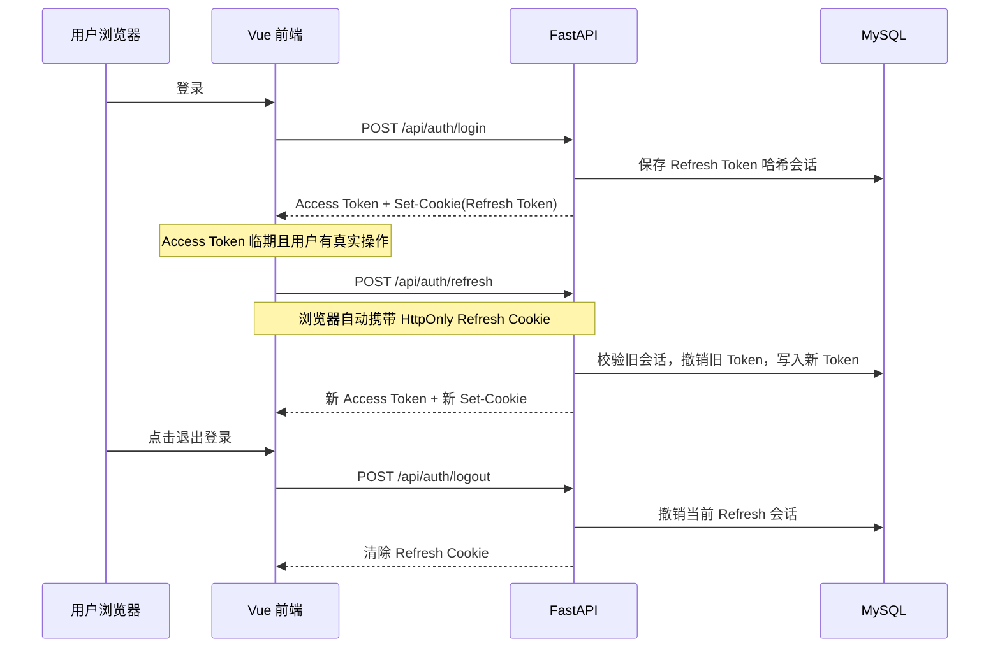

# SolarAgent：JWT 刷新令牌与活跃续期

> 本文对应当前 SolarAgent 的 FastAPI + Vue 实现，重点回答：为什么不能只续期 Access Token、Refresh Token 如何轮换、7 天与 30 分钟分别控制什么，以及前端如何避免“用户没有操作也一直续期”。

## 1. 先给结论

SolarAgent 将登录凭证拆为两类：

| 凭证 | 用途 | 存储位置 | 有效期 | 能否直接调用业务接口 |
| --- | --- | --- | --- | --- |
| Access Token | 查询、会话、预测等业务鉴权 | 当前前端兼容性方案：`localStorage` | 短期，正式建议 15 分钟 | 可以 |
| Refresh Token | 仅用于换取新的 Access Token | `HttpOnly` Cookie | 首次登录起最长 7 天 | 不可以 |

两类 Token 的 `type` 始终不变：

```json
// Access Token
{ "type": "access", "exp": "短期截止时间" }

// Refresh Token
{ "type": "refresh", "jti": "唯一编号", "exp": "首次登录后的固定截止时间" }
```

刷新不是把 Refresh Token 改成 Access Token，而是同时创建两张新的同类型凭证：

```text
旧 Access Token(type=access)   → 新 Access Token(type=access)
旧 Refresh Token(type=refresh) → 新 Refresh Token(type=refresh)
```

## 2. 为什么不能只用 Access Token 无限续期

如果后端允许一个快过期的 Access Token 直接换取新的 Access Token，链路会变成：

```text
被盗的 Access Token
  → 换新 Access Token
  → 再换更新的 Access Token
  → 无限延长攻击者的访问时间
```

这样 Access Token 的“短期”安全边界就没有意义。

Refresh Token 的价值是把“业务访问权”和“长期会话续期权”拆开：

```text
Access Token
  → 权限小：可访问业务接口
  → 生命周期短：泄露后的可用窗口有限

Refresh Token
  → 权限窄：只可访问 /api/auth/refresh
  → 浏览器脚本不可读：HttpOnly Cookie
  → 服务端可撤销、可轮换、可检测旧 Token 重放
```

可以把它理解为：Access Token 是当天的门禁卡；Refresh Token 是仍有效的身份会话凭证。门禁卡不能无限复制自己，必须由受控的长期会话凭证申请一张新的门禁卡。

## 3. “动态轮换”与“7 天绝对有效期”

Refresh Token 的内容每次都变，但最终截止时间不变。

```text
7 月 21 日 10:00 登录
  Refresh Token A，jti=A，exp=7 月 28 日 10:00

7 月 21 日 10:15 刷新
  Refresh Token B，jti=B，exp=7 月 28 日 10:00
  Token A 立即撤销

7 月 23 日 14:00 刷新
  Refresh Token C，jti=C，exp=7 月 28 日 10:00
  Token B 立即撤销
```

这叫 **Token Rotation（令牌轮换）**。其目的不是延长 7 天，而是让每次续期后的旧 Token 立即失效。

| 时间规则 | 当前建议 | 解决的问题 |
| --- | ---: | --- |
| Access Token | 15 分钟 | 缩短业务凭证泄露后的风险窗口 |
| 空闲超时 | 30 分钟 | 用户离开后不继续保持登录态 |
| Refresh Token 绝对上限 | 7 天 | 即使持续使用，也会定期重新验证身份 |

因此：30 分钟控制“用户是否仍在使用”；7 天控制“这次登录最晚能持续到什么时候”。

## 4. 登录、刷新、注销的完整链路



### 4.1 登录：`POST /api/auth/login`

入口在 `backend/app/routers/auth.py` 的 `login()`：

```text
login_user()
  → _issue_auth_response()
      → create_access_token()
      → create_refresh_token()
      → create_refresh_session()
      → response.set_cookie()
```

`_issue_auth_response()` 同时完成两件事：

1. 将新 Access Token 放进 JSON 响应，前端调用 `saveAuth()` 覆盖本地旧 Access Token。
2. 将 Refresh Token 作为 `HttpOnly + SameSite=Lax + path=/api/auth` Cookie 下发；JavaScript 不能读取它的原文。

### 4.2 刷新：`POST /api/auth/refresh`

入口在 `refresh()`，内部依次执行：

```text
Cookie 中的 Refresh Token
  → decode_refresh_token()
  → get_user_by_id()
  → create_refresh_token(expires_at=旧 exp)
  → rotate_refresh_session()
  → create_access_token()
  → Set-Cookie 覆盖旧 Cookie
```

关键代码思想是复用旧 `exp`：

```python
expires_at = datetime.fromtimestamp(int(payload["exp"]), timezone.utc)
new_refresh_token, new_token_id, _ = create_refresh_token(
    user,
    expires_at=expires_at,
)
```

它确保新 Refresh Token 使用新的 `jti`，但不会把到期时间重新计算为“现在 + 7 天”。

### 4.3 轮换：`rotate_refresh_session()`

实现在 `backend/app/services/refresh_token_service.py`，通过共享 SQLAlchemy Engine 的连接池取得连接，并在同一数据库事务内完成：

```text
SELECT ... FOR UPDATE 锁定旧会话
  → 校验用户、是否撤销、是否过期
  → UPDATE 旧记录：写 revoked_at、replaced_by_token_id
  → INSERT 新记录：新 token_id、新 token_hash、原 expires_at
  → 事务提交
```

数据库永远不保存原始 Refresh Token，只保存：

| 字段 | 作用 |
| --- | --- |
| `token_id` | JWT 中的 `jti`，定位一次 Token 会话 |
| `token_hash` | Token 原文的 SHA-256 哈希，用于匹配且避免泄露原文 |
| `user_id` | 会话所属用户 |
| `expires_at` | 绝对截止时间 |
| `revoked_at` | 旧 Token 是否已失效 |
| `replaced_by_token_id` | 轮换关系，便于审计 |

### 4.4 注销：`POST /api/auth/logout`

注销不只是删除前端 `localStorage`。后端还会：

```text
根据 Cookie 解析 jti
  → revoke_refresh_session()
  → response.delete_cookie()
```

因此同一浏览器中被盗用的旧 Refresh Token 也会被服务端拒绝。

## 5. 当前前端如何判断“用户活跃”

### 5.1 只有真实交互会记录活动

当前 `frontend/src/App.vue` 只将这些事件计为活跃：

- `pointerdown`：鼠标点击、触控笔等真实按下操作。
- `keydown`：键盘输入、按 Enter 发送消息等。
- `touchstart`：移动端触摸。
- 页面确实经历过失焦/隐藏后，再次聚焦/可见。

以下行为 **不会** 算作活跃：

- 登录成功。
- 自动加载会话列表。
- 前端自动发起的 Axios 请求。
- SSE 流式连接刚建立。
- 鼠标移动、滚动。

这是为了防止系统自己的初始化请求把“离开电脑的用户”误判为持续工作。

### 5.2 续期资格

```text
hasExplicitActivity = 用户发生过一次真实交互
lastAuthActivityAt = 最近一次真实交互时间

满足以下条件才允许刷新：
  1. hasExplicitActivity 为真
  2. 当前时间 - lastAuthActivityAt <= 30 分钟
  3. Access Token 已进入提前刷新窗口
```

30 分钟内没有新的真实交互时，前端空闲计时器会主动清理本地登录态并展示“重新登录”弹窗。

### 5.3 为什么测试 Token 只有 10 秒也不会无限刷新

提前刷新时间不是固定 60 秒，而是：

```text
min(60 秒, Token 生命周期的 20%)，且至少 1 秒
```

| Access Token 有效期 | 提前刷新时间 |
| ---: | ---: |
| 15 分钟 | 60 秒 |
| 10 秒（本地测试） | 2 秒 |

所以 10 秒 Token 仅在第 8 秒进入刷新窗口；若用户没有发生真实操作，则不会刷新，并会在第 10 秒触发重新登录。

## 6. 前端并发保护与失败处理

`frontend/src/api.js` 用 `refreshPromise` 作为单例锁：

```text
会话列表请求 ─┐
图表请求     ├─→ 发现 Token 临期 → 共用同一个 refreshPromise
SSE 请求      ┘
```

这样多个请求不会同时调用 `/api/auth/refresh`，也不会因并发轮换造成一个请求刚使用旧 Token、另一个请求已经撤销它。

若业务请求返回 401：

1. Axios 会尝试刷新一次，并重放原请求一次。
2. 流式 SSE 请求会刷新一次，并重新建立一次流连接。
3. Refresh 失败时，前端清理 Access Token 并弹出重新登录窗口。

## 7. 配置与本地测试

本地可以使用短 Token 快速验证：

```env
JWT_ACCESS_TOKEN_EXPIRE_SECONDS=10
JWT_REFRESH_TOKEN_EXPIRE_SECONDS=604800
JWT_REFRESH_COOKIE_SECURE=false
```

正式 HTTPS 环境建议：

```env
JWT_ACCESS_TOKEN_EXPIRE_SECONDS=900
JWT_REFRESH_TOKEN_EXPIRE_SECONDS=604800
JWT_REFRESH_COOKIE_SECURE=true
```

测试步骤：

1. 重启 FastAPI，退出后重新登录一次，确保浏览器获得新的 Refresh Cookie。
2. 登录后不操作：10 秒测试配置下不应请求 `/api/auth/refresh`，而应出现重新登录弹窗。
3. 登录后在第 8 秒前点击或输入：应看到一次 `/api/auth/refresh`，并继续保留工作台。
4. 在浏览器开发者工具中查看：Refresh Cookie 应标记为 `HttpOnly`，前端 `localStorage` 中不应存在 Refresh Token。

## 8. 后续安全演进

- 将 Access Token 从 `localStorage` 转为纯内存，进一步降低 XSS 风险。
- 增加 Refresh 会话清理任务，定期删除已过期记录。
- 加入设备信息、IP、User-Agent、会话列表和“强制下线其他设备”。
- 对已撤销 Refresh Token 的再次使用增加安全审计与全设备下线策略。
- 若前后端未来跨站部署，结合 CSRF 防护与更严格的 Cookie 域策略。
