# SolarAgent 当前架构梳理与产品演进路线图

> 文档状态：基于当前代码梳理，更新日期 2026-07-14。  
> 读者：产品负责人、后端 / Agent 开发者、未来 Vue 前端开发者。  
> 定位：这是一份“系统说明书 + 产品路线图”，不是历史交接文档的简单复制。当前源码已完成 JWT、Argon2id 和 AskUser 会话隔离；交接文档中相应的旧风险记录仅作为历史背景。

## 1. 产品是什么：从“模型问答”到“光伏运营助手”

SolarAgent 是一个面向光伏站点运营场景的 AI Agent。用户不需要记住数据库字段、报表路径或模型参数，只需用自然语言表达任务，例如：

- “查询哲丰一车间 5 月 1 日的实际发电量。”
- “预测英杰站明天的发电量。”
- “导出某站 6 月份实际发电量 Excel。”
- “把这个发电量文件导入系统。”
- “预测与实际差异为什么这么大？”

产品的价值不在于“能调用大模型”，而在于把一个光伏运营任务变成可靠闭环：

```text
自然语言提出任务
    → 识别站点、日期、意图
    → 查询 / 预测 / 导入 / 导出等工具执行
    → 不确定或高风险时请求用户确认
    → 返回可解释结果、文件或图表数据
    → 记住本会话的重要上下文，便于连续追问
```

### 1.1 当前阶段的产品边界

当前是“可交付的单体 Agent 服务基础版”，已经具备用户隔离、对话、工具调用与人工确认；尚不是完整的企业级光伏运营平台。

| 已经具备 | 暂未形成完整产品能力 |
| --- | --- |
| JWT 登录、用户会话隔离 | 刷新令牌、管理员后台、完整 RBAC |
| 流式聊天与工具调用过程展示 | Vue 正式前端与移动端体验 |
| 站点 / 实际发电量 / 气象 / 预测 | 看板、告警中心、任务中心 |
| Excel 导入前确认、数据导出 | 文件上传下载的完整 Web 工作流 |
| AskUser 人工确认 | 可断线恢复、跨机器的审批状态机 |
| MySQL 持久化记忆与对话摘要 | 评测集、可观测平台、审计后台 |

这个边界要清楚写在简历与答辩中：**当前不是大而全，而是在一个清晰业务场景内验证了 Agent 产品最关键的闭环。**

---

## 2. 业务能力地图：系统现在能做什么

当前 `backend/Agent/tools.py` 中注册了 **20 个工具**。工具不是面向用户的菜单，而是 Agent 完成任务时可调用的“业务能力单元”。

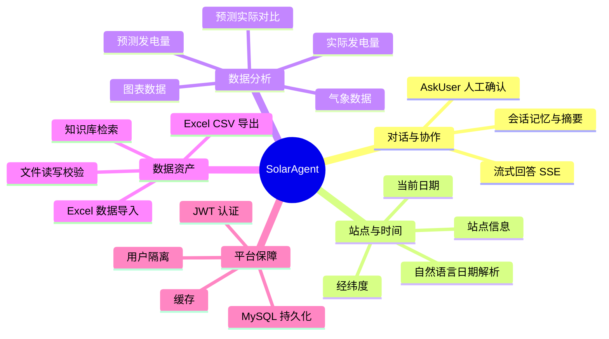

| 业务域 | 用户任务 | 当前工具 / 模块 | 交付物 |
| --- | --- | --- | --- |
| 站点定位 | 查询站点资料、经纬度 | `get_station_info`、`get_station_location` | 站点名、容量、地址、经纬度 |
| 时间理解 | 处理“今天”“5 月 1 日”等表达 | `get_current_datetime`、`parse_date` | 标准 `YYYY-MM-DD` 日期 |
| 实际数据查询 | 查单日 / 范围发电量 | `get_actual_power`、`get_actual_power_by_range` | 汇总与逐时数据 |
| 气象查询 | 查历史 / 预测气象 | `get_weather_records`、`get_weather_by_range` | 气象记录与摘要 |
| 发电预测 | 预测未来某日发电量 | `predict_power` | 24 小时预测、天气类型、模型对比 |
| 效果复盘 | 比较预测和实际 | `get_predicted_power`、`get_power_comparison` | 偏差分析基础数据 |
| 可视化 | 绘制发电曲线 | `get_power_chart_data` | 前端可直接消费的 JSON |
| 文件资产 | 导出 / 读取 / 验证文件 | `export_table`、`read_table`、`write_file`、`read_file`、`verify_file` | Excel、CSV、文本文件 |
| 数据治理 | Excel 发电数据入库 | `import_power_data` | 幂等导入结果与清洗摘要 |
| 知识辅助 | 查询光伏领域资料 | `search_knowledge_base` | 知识库检索结果 |
| 人工协作 | 消歧、确认、补参数 | `ask_user` | 用户选择 / 确认答案 |

---

## 3. 系统架构图：从浏览器到模型、数据和工具

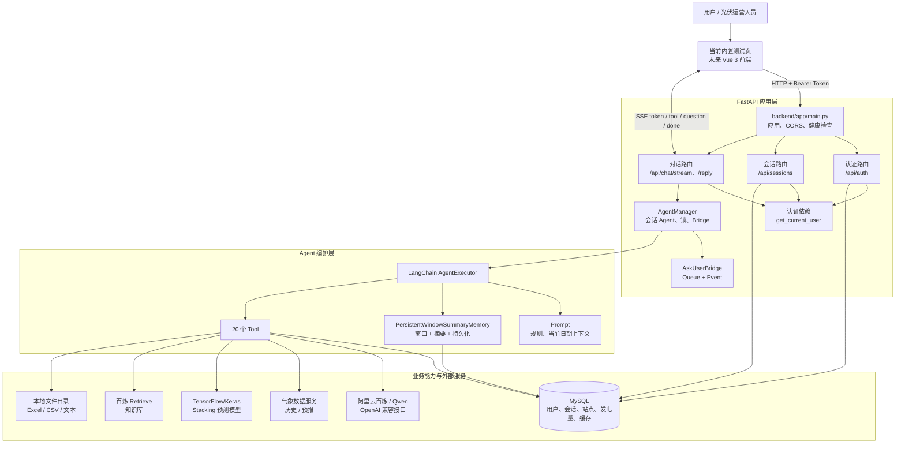

### 3.1 分层职责

| 层 | 目录 / 组件 | 回答的问题 | 不应该承担的职责 |
| --- | --- | --- | --- |
| 前端层 | 当前 `backend/app/main.py` 内置 HTML；未来 Vue | 用户如何登录、提问、看到流和弹窗 | 可信身份判定、数据库权限判断 |
| API 路由层 | `backend/app/routers/` | 哪个接口接收什么请求，返回什么状态 | 写复杂预测算法、直接编排所有工具细节 |
| 认证与服务层 | `backend/app/dependencies/`、`backend/app/services/` | 当前是谁、会话属于谁、如何管理 Bridge / Agent | 把业务数据硬编码在内存里 |
| Agent 编排层 | `backend/Agent/` | 如何选工具、带哪些上下文、如何记忆 | 直接暴露 HTTP、相信用户输入的身份 |
| 工具层 | `backend/tools/` | 如何真正查询、预测、导入、导出 | 处理浏览器 UI 状态 |
| 基础设施层 | MySQL、LLM、气象、模型、知识库、文件 | 数据与外部能力从哪里来 | 决定产品交互文案 |

这个分层是未来改 Vue 的关键：**前端可以整体替换，但 API、认证、Agent 和工具层尽量不需要推倒重来。**

---

## 4. 核心功能链路图

### 4.1 登录与可信身份链路

产品目标：用户不需要每次显式传 `user_id`，系统也不能相信前端声称的身份。

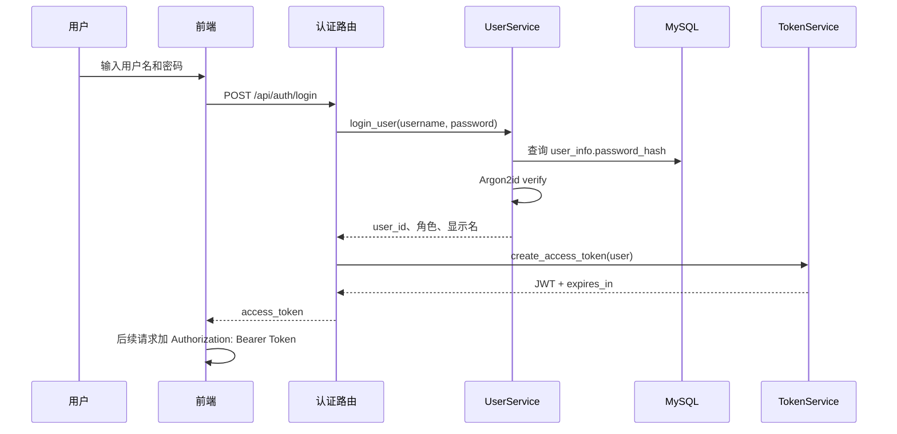

后续受保护接口都由 `get_current_user` 统一解析 Token。它先验签，再取得 `sub`（用户 ID），再由会话路由校验用户是否拥有目标会话。

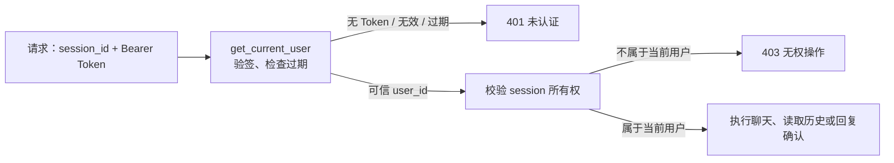

**产品设计启示**：认证不是“登录页面”，而是所有数据隔离和权限策略的地基。以后加入企业、多租户、管理员时，应从这个身份链路扩展，而不是在前端隐藏按钮。

### 4.2 流式聊天与 Agent 工具调用链路

产品目标：用户能看到系统正在思考、正在调用什么能力，而不必面对长时间白屏。

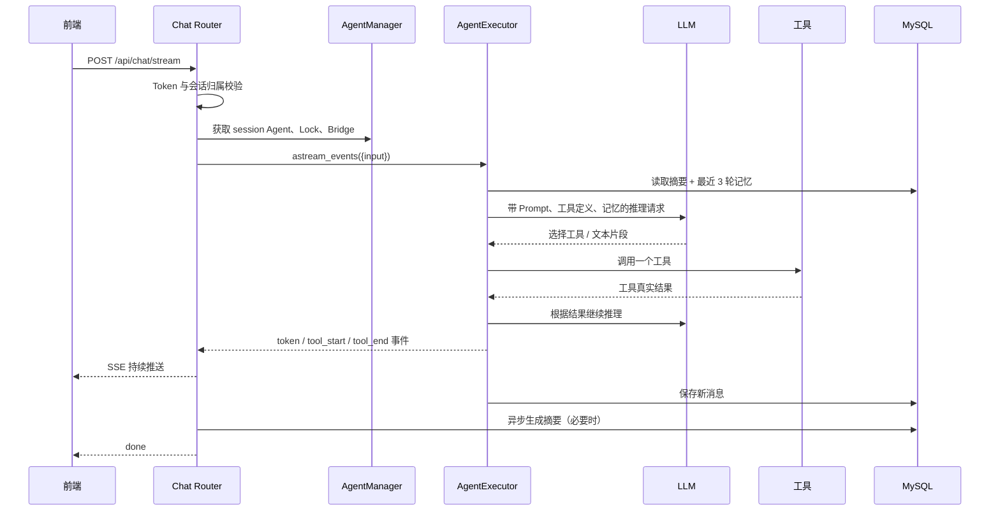

当前 SSE 事件协议：

| 事件 | 含义 | 前端建议呈现 |
| --- | --- | --- |
| `token` | 模型生成的一小段回答 | 逐字 / 逐段追加到回答气泡 |
| `tool_start` | 开始调用工具 | 显示“正在查询站点 / 预测中”状态 |
| `tool_end` | 工具已返回结果 | 以可折叠的执行记录展示摘要 |
| `user_input_required` | Agent 需要用户选择或确认 | 弹出明确的确认卡片 / 输入框 |
| `error` | 本次执行发生异常 | 友好错误提示 + 重试入口 |
| `done` | 本轮流程结束 | 收起加载状态，刷新会话列表 |

### 4.3 AskUser 人工确认链路

产品目标：系统不擅自猜测关键业务条件；用户能在智能体运行中补信息或确认高风险动作。

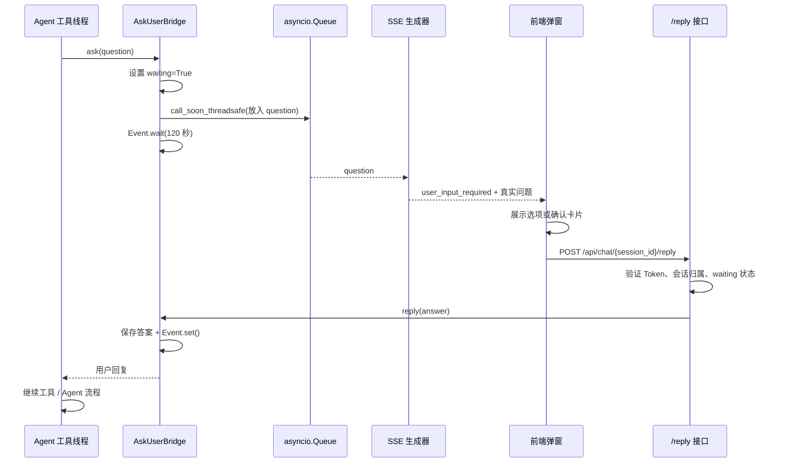

AskUser 的使用边界：

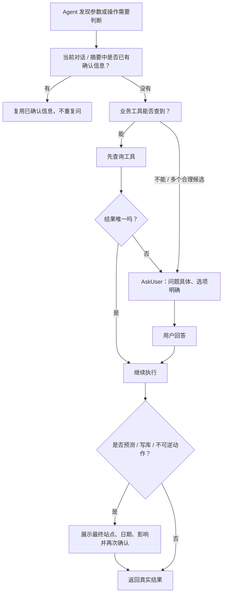

这是系统从“能回答”走向“可信协作”的核心。尤其预测和导入：错误答案只是体验问题，错误预测或错误写库会造成业务风险，因此必须人为确认。

### 4.4 预测发电量链路

产品目标：把“预测”包装成可理解的业务流程，而不是直接抛出一个模型数值。

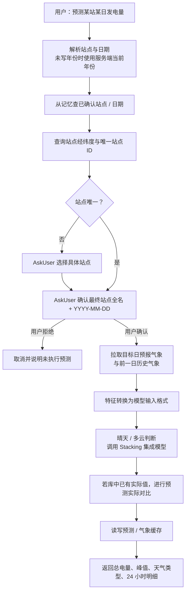

当前 `predict_power` 内部具备站点定位、日期解析、气象获取、特征转换、模型预测和实际值对比能力。系统 Prompt 额外要求模型在预测前 AskUser 确认站点与日期，这是 Agent 产品层的风控规则，不是单纯模型代码规则。

### 4.5 实际发电量查询与导出链路

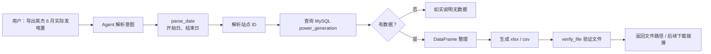

现阶段导出能力已能生成文件并验证。对正式 Vue 产品而言，下一步应增加受认证保护的下载接口与文件元数据表，而不是把本地绝对路径直接暴露给用户。

### 4.6 Excel 导入链路：数据治理而不只是“上传文件”

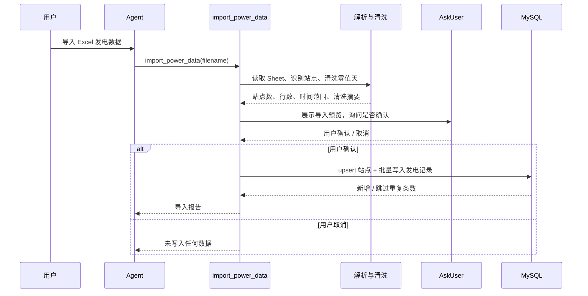

这个链路体现了一个成熟的产品意识：**导入不是一个按钮，而是一段包含预览、清洗、确认、幂等写入和结果回执的数据治理流程。**

---

## 5. 数据架构与状态管理

### 5.1 主要数据实体

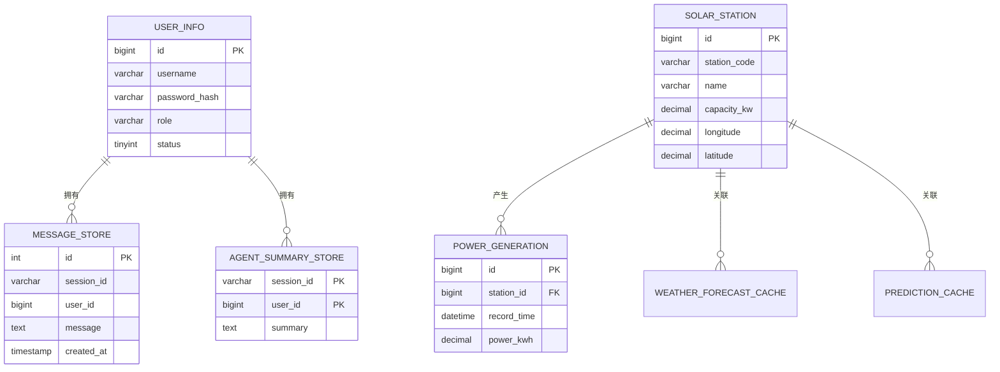

### 5.2 对话记忆设计

`PersistentWindowSummaryMemory` 采用“最近窗口 + 旧消息摘要 + MySQL 持久化”的折中设计。

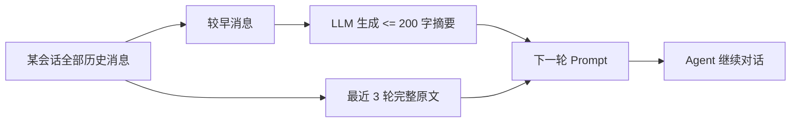

这样做的产品意义：

- 连续对话能记住“用户最终选的是哲丰一车间”。
- Prompt 不会随着对话无限膨胀，成本和延迟更可控。
- 服务重启后可从数据库恢复上下文。
- `user_id` 与 `session_id` 共同参与查询，避免记忆跨用户混用。

当前参数为最近 3 轮保留原文，超过窗口加阈值后异步摘要。后续要用真实对话数据调整，不应凭感觉永久固定。

---

## 6. 当前工程设计亮点与限制

### 6.1 已具备的生产基础

| 能力 | 当前实现 | 对产品的价值 |
| --- | --- | --- |
| 身份可信 | JWT Bearer Token，后端从 Token 推导用户身份 | 防止前端伪造 `user_id` |
| 密码安全 | Argon2id，仅接受 Argon2 哈希 | 降低密码泄露风险 |
| 资源授权 | 每次会话操作校验所有权 | 防止跨用户读写 |
| 同会话并发保护 | session 级 `asyncio.Lock` | 避免同会话消息、记忆、确认乱序 |
| 人在回路 | AskUser + SSE + Bridge | 消歧和高风险确认可控 |
| 对话可恢复 | MySQL 消息与摘要 | 降低重启造成的上下文丢失 |
| 输出可见 | SSE 展示 token 与工具状态 | 建立用户信任、便于排障 |
| 可验证性 | 阶段一契约测试 | 防止关键安全约束被回归破坏 |

### 6.2 当前限制及产品影响

| 限制 | 影响 | 建议演进 |
| --- | --- | --- |
| 内置 HTML 与后端同文件 | UI 可维护性和迭代效率低 | Vue 3 前后端分离 |
| Access Token 单令牌 | Token 过期后用户需重新登录 | Refresh Token 轮换 + HttpOnly Cookie |
| Agent / Bridge 保存在进程内存 | 多 worker / 多机时 AskUser 无法天然路由 | 持久化 interaction + Redis / 工作流 checkpoint |
| AskUser 使用线程等待 | 长时间等待会占执行资源 | 状态机式 Human-in-the-loop 恢复 |
| 文件只有本地路径 | 真实用户无法安全下载 | 文件元数据、对象存储、下载授权接口 |
| `sessions.py` 直接写 SQL | 业务规则与数据访问耦合 | Repository 层或 SQLAlchemy ORM |
| LLM 网络偶发连接失败 | 用户看到技术错误，体验中断 | 配置超时、退避重试、友好 SSE 错误、链路追踪 |
| 缺少评测集和业务指标 | 无法量化 Agent 是否变好 | 构建典型问题集与线上埋点 |

这里有一个重要的架构判断：不要因为未来可能多机部署，就立刻引入 Redis、Celery、Kubernetes。个人项目更好的路线是：**先用单体方案跑通真实用户闭环，再在“状态可持久化、接口有边界”的前提下演进。**

---

## 7. 后续阶段规划：以产品价值驱动技术投入

### 阶段二：Vue 前后端分离与核心体验闭环

**目标**：让系统从开发验证页面，成为真实用户可持续使用的 Web 产品。

| 方向 | 具体交付 | 产品验收标准 |
| --- | --- | --- |
| Vue 3 前端 | 登录、会话列表、聊天、流式回答、AskUser 确认卡片 | 用户无需理解工具名，也能完成查询和预测 |
| 预测工作台 | 站点选择、日期选择、预测确认、结果图表 | 预测前明确显示“站点 + 日期”，确认后才执行 |
| 图表能力 | ECharts 消费 `get_power_chart_data` | 可看出逐时曲线、预测和实际差异 |
| 文件体验 | 导出记录、受保护下载、导入预览 | 用户不接触服务器绝对路径 |
| API 契约 | OpenAPI / 前端类型、统一错误码 | 前后端可独立迭代，不靠口头同步 |

建议先做的最小闭环页面：

```text
登录 → 新建会话 → 输入“预测英杰明天发电量”
→ 确认卡片（站点、日期）→ 流式执行过程 → 预测曲线与总电量
→ 一键导出结果
```

这是最适合作为作品集演示的“黄金路径”。

### 阶段三：Agent 可靠性、评测与可观测性

**目标**：把“偶尔能正确回答”变成“可测量、可解释、可持续优化”。

| 方向 | 实现设想 | 关键指标 |
| --- | --- | --- |
| 场景评测集 | 收集 30~50 条典型问题：日期、歧义站点、预测、导入、异常 | 工具选择准确率、任务完成率 |
| 任务追踪 | 为每轮请求生成 `request_id`，串联 session、工具、LLM 调用 | 平均耗时、失败原因分布 |
| LLM 稳定性 | 显式超时、指数退避、有限重试、友好降级文案 | API 连接失败率、重试成功率 |
| Guardrails | 日期、站点、预测确认的结构化校验 | 幻觉率、错误参数拦截率 |
| 用户反馈 | 回答有用 / 无用、纠错入口 | 用户满意度、人工介入率 |

产品经理视角的原则：模型回答得“像对的”不等于任务完成。要把成功定义为“用户拿到了正确站点、正确日期、可验证数据或可下载结果”。

### 阶段四：Human-in-the-loop 工作流产品化

**目标**：从线程内等待升级为可恢复、可审计的任务状态机。

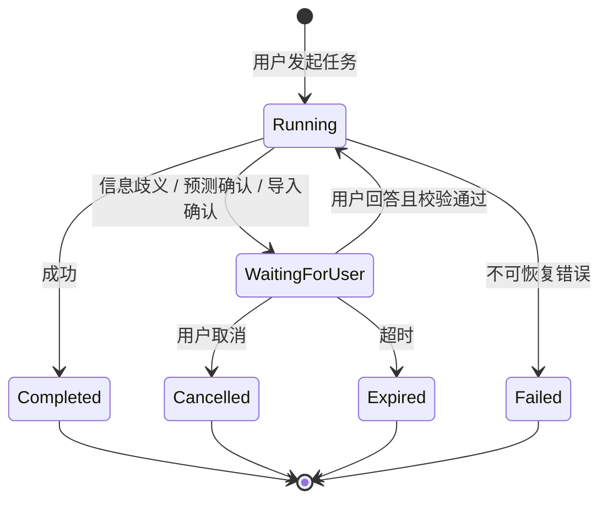

建议新增 `agent_interactions` / `agent_runs` 等状态表，记录 `interaction_id、session_id、user_id、question、status、answer、expires_at`。这样可以支持：

- 用户刷新页面后重新看到待确认事项。
- 多实例部署时不依赖某个 Python 进程的内存。
- 导入、预测等关键操作可审计“谁在什么时候确认了什么”。
- 可统计 AskUser 触发率、超时率和用户取消率，反推流程是否设计得太复杂。

### 阶段五：运营平台与企业能力

**目标**：把 Agent 接入真实的光伏运营工作流。

- 多租户：组织 → 用户 → 站点的数据权限模型。
- RBAC：运营人员、站长、管理员、数据管理员的功能权限。
- 告警与订阅：低发电、预测偏差、气象风险、数据缺失。
- 数据质量：导入异常检测、缺失小时、重复数据、异常突增。
- 模型运营：按站点维护模型版本、训练数据版本、预测评估报告。
- 审计与合规：下载、导入、管理员操作、人工确认均可追溯。

---

## 8. 优先级建议：接下来具体先做什么

用“用户价值 × 风险 × 技术学习价值”排序，而不是按“哪个功能看起来酷”排序。

| 优先级 | 任务 | 为什么现在做 | 可写入简历的能力点 |
| --- | --- | --- | --- |
| P0 | Vue 3 前后端分离 + 核心预测页面 | 让后端能力真正面向用户交付 | 前后端分离、SSE 流式 AI 交互 |
| P0 | 文件下载与导入 UI 闭环 | 让数据资产能力可用而非停在路径文本 | 文件安全、数据导入导出产品化 |
| P0 | LLM 超时 / 重试 / 友好错误 | 当前已有偶发网络连接风险 | AI 服务稳定性、错误恢复 |
| P1 | 评测集 + 调用日志 + 指标看板 | 让优化有依据 | Agent Evaluation、Observability |
| P1 | AskUser 状态持久化设计 | 解决刷新页面、多实例、长等待问题 | Human-in-the-loop 工作流 |
| P1 | RBAC 与用户管理 | 平台化的权限基础 | 企业级权限模型 |
| P2 | 多租户与告警 | 需要真实组织与运营需求验证 | SaaS 架构、运营平台能力 |
| P2 | 模型训练和版本管理 | 需要足够数据与明确建模责任边界 | MLOps、模型治理 |

**下一步建议的产品决策**：阶段二先聚焦“预测工作台”还是“数据导入导出工作台”？

- 若想突出 AI Agent 与前端体验：先做预测工作台。
- 若想突出真实业务数据闭环：先做导入导出工作台。

两条路都合理，但第一个正式版本建议只选一条做深，避免页面很多、每个功能都停在演示级。

---

## 9. 版本验收与指标：怎样判断不是“做完了”，而是“能交付”

### 9.1 阶段二最小可交付标准

| 维度 | 验收问题 | 通过标准 |
| --- | --- | --- |
| 可用性 | 新用户能否独立完成一次预测？ | 从登录到结果不需要开发者介入 |
| 正确性 | 日期、站点是否会错？ | 未提供年份时正确使用服务端当前年份；多站点必须澄清 |
| 安全性 | 用户能否访问他人会话或文件？ | 认证、会话校验、下载授权均覆盖 |
| 透明度 | 用户知道系统在做什么吗？ | 能看到工具状态、确认项、失败原因 |
| 稳定性 | 上游 LLM 短暂失败会怎样？ | 有有限重试和明确可操作提示，不泄露堆栈 |
| 可验证性 | 团队如何判断改动没有破坏核心流程？ | 自动化接口 / 契约测试覆盖黄金路径 |

### 9.2 建议从第一天开始采集的指标

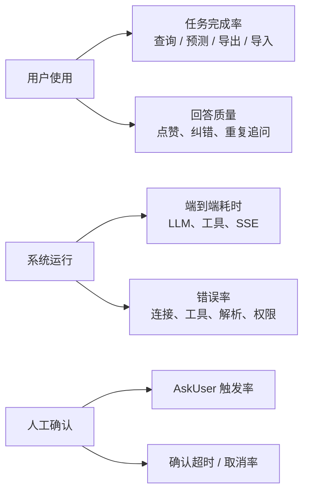

指标不是为了“做数据看板”，而是帮助做产品决策。例如：

- AskUser 超时率高：问题可能写得不清楚，或确认时机太晚。
- 同一问题反复追问：答案表达或图表不够清楚。
- 预测任务失败集中在模型调用：优先投入连接重试，不要急着换 UI 颜色。
- 用户经常导出后再询问：应将常用统计做成可视化卡片。

---

## 10. 架构演进原则（避免越做越乱）

1. **先定义用户任务，再选择技术。** 不要为了使用某个 Agent 框架而增加没有业务价值的功能。
2. **把不确定性显式化。** 站点歧义、日期歧义、预测确认都应有状态和交互，而不是让模型悄悄猜。
3. **身份、权限、会话三层分开。** 谁登录了、能访问什么、当前在做哪件任务，分别建模。
4. **工具输出要可追溯。** 真实数据来源、执行时间、站点、日期、文件版本都应能被复盘。
5. **同步单体先跑通，状态要为分布式预留。** 当前内存 Bridge 合理；下一步把 interaction 状态外置，而非过早堆基础设施。
6. **每一个“智能”能力都要有失败路径。** LLM 不可用、无数据、用户不回复、文件解析失败，都要有面向用户的可理解反馈。
7. **每个阶段只完成一个可展示闭环。** 一个顺畅的预测闭环，胜过十个无法验收的工具按钮。

---

## 11. 推荐的阅读与开发顺序

如果要熟悉架构，按下面顺序读代码最省力：

1. [`backend/app/main.py`](../backend/app/main.py)：应用入口、CORS、当前测试页。
2. [`backend/app/routers/auth.py`](../backend/app/routers/auth.py) 与 [`backend/app/dependencies/auth.py`](../backend/app/dependencies/auth.py)：登录和 Token 保护。
3. [`backend/app/routers/chat.py`](../backend/app/routers/chat.py)：SSE 事件、执行锁、AskUser 回复接口。
4. [`backend/app/services/agent_manager.py`](../backend/app/services/agent_manager.py) 与 [`backend/app/services/ask_user_bridge.py`](../backend/app/services/ask_user_bridge.py)：会话级 Agent 和人工交互桥接。
5. [`backend/Agent/agent.py`](../backend/Agent/agent.py)、[`backend/Agent/prompt.py`](../backend/Agent/prompt.py)、[`backend/Agent/tools.py`](../backend/Agent/tools.py)：Agent 如何组合。
6. [`backend/Agent/memory.py`](../backend/Agent/memory.py)：窗口、摘要、持久化记忆。
7. `backend/tools/`：按“查询 → 预测 → 导出 → 导入”的业务顺序阅读。
8. [`tests/test_phase1_contract.py`](../tests/test_phase1_contract.py)：理解阶段一哪些安全约束必须始终守住。

## 结语

SolarAgent 当前最有价值的地方，不是工具数量，而是已经把三种常被忽略的能力接起来：

```text
自然语言 Agent 能力
    + 可信身份与数据隔离
    + 人工确认和可恢复的任务过程
```

后续每一次开发都可以用一个问题检验：**这项改动是否让光伏运营用户更快、更准、更放心地完成一件真实任务？** 如果答案是否定的，即使技术很新，也不应抢占当前版本的优先级。
