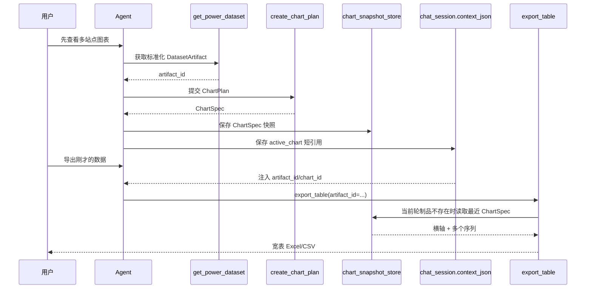

# 图表快照导出与多序列表格复盘

## 1. 本次问题

`get_power_dataset` 为了适配图表校验，返回的是长表：

```text
时间 | 站点 | 数据来源 | 图表序列 | 发电量
```

多站点逐小时数据因此会按时间交替出现。用户导出 Excel 时更希望看到：

```text
时间 | 站点A | 站点B | 站点C
```

## 2. 导出前的宽表整形

`backend/tools/table_io_tool.py` 的 `_artifact_to_dataframe()` 现在会先调用
`_reshape_artifact_for_export()`：

```text
DatasetArtifact.rows（长表）
    ↓ 读取 field_schema 中的时间/日期字段
    ↓ 读取 metadata.series_dimension
    ↓ 读取唯一数值字段
    ↓ pivot_table(index=时间, columns=序列维度)
    ↓
时间 | 序列A | 序列B | 序列C
```

它不绑定站点名称，也不写死四个序列：

- 多站点查询：`series_dimension=station`，每个站点变成一列；
- 单站点实际/预测对比：`series_dimension=source_type`，实际和预测变成两列；
- 单序列或无法安全判断维度：保留原始二维表，避免误透视；
- 序列数量由数据实际内容决定。

## 3. 为什么不再额外持久化 DatasetArtifact

系统已有 `chart_snapshot_store`，图表生成后会保存最终的 `ChartSpec`。其中已经包含：

- `x_axis.data`：时间或日期；
- `series[].name`：站点名或数据来源名；
- `series[].data`：每个序列的完整数值；
- `metadata.artifact_id`：对应的数据制品引用。

因此本阶段采用单一持久化源：

```text
当前轮次：DatasetArtifact（进程内，供 Agent/ChartService 使用）
生成图表：ChartSpec → chart_snapshot_store（MySQL）
下一轮导出：active_chart → ChartSpec → 宽表 → Excel/CSV
```

这样不会把同一份完整序列同时保存成 DatasetArtifact 快照和 ChartSpec 快照。

## 4. 多轮导出链路



`chat_session.context_json` 只保存：

```json
{
  "active_chart": {
    "chart_id": "chart_xxx",
    "artifact_id": "artifact_xxx",
    "title": "英杰与哲丰逐小时发电量对比"
  }
}
```

完整数组仍保存在 `chart_snapshot_store`，不会进入会话上下文或 Prompt。

## 5. 快照恢复源码职责

| 文件 | 作用 |
| --- | --- |
| `backend/app/services/chart_snapshot_store.py` | 持久化和按会话/用户读取最近图表快照 |
| `backend/app/services/session_context_service.py` | 保存 `active_chart` 短引用 |
| `backend/app/routers/chat.py` | 图表完成后保存快照引用；下一轮把引用注入 Agent 输入 |
| `backend/tools/table_io_tool.py` | 优先读取当前 DatasetArtifact；找不到时从 ChartSpec 重建宽表 |
| `backend/app/charting/artifact_store.py` | 只承担当前进程内 DatasetArtifact 的快速读取 |

## 6. 重要边界

快照恢复导出的是“已经渲染到图表中的数据”。如果未来需要导出图表没有展示的原始字段（例如额外气象字段、未选中的中间列），ChartSpec 就不够，需要另行设计数据制品持久化；当前第一阶段不引入这份重复存储。

## 7. 面试表达

> 我把图表和导出统一到同一条数据链路上。当前轮次用 DatasetArtifact 作为内部标准化数据，图表生成后把最终 ChartSpec 持久化到 MySQL，并只在会话上下文保存一个 active_chart 引用。用户下一轮说“导出刚才的数据”时，Agent 不需要重新查询站点或重新拼接数组，后端直接从图表快照恢复横轴和序列，再透视成时间加各站点列的宽表。这样解决了多轮会话、进程重启和多站点导出，同时避免重复保存两份完整数据。
