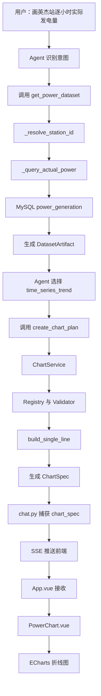
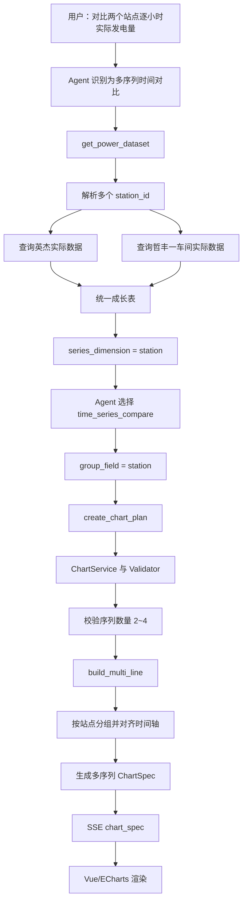
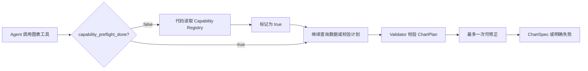
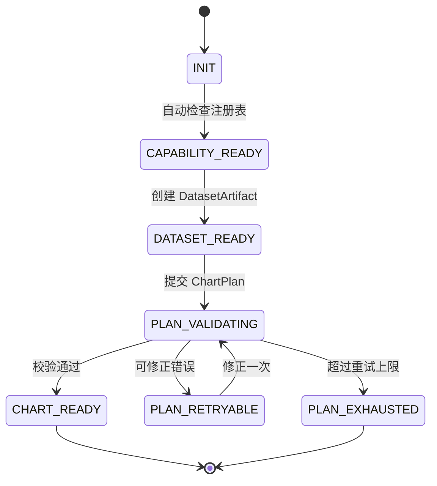

# SolarAgent 图表能力架构报告

## 1. 报告结论

SolarAgent 的可视化能力不是简单地让大模型输出一段 ECharts 配置，而是建立了一条受控的图表生成链路：

```text
用户自然语言
    → Agent 识别业务意图
    → 获取 DatasetArtifact 数据制品
    → Agent 提交 ChartPlan
    → ChartService 校验并编译
    → Builder 生成 ChartSpec
    → SSE 推送 chart_spec
    → Vue ChartAdapter
    → ECharts 渲染
```

这项设计的核心价值是：Agent 负责“理解要画什么”，后端负责“保证数据和协议正确”，前端负责“稳定渲染”。三者职责明确，后续增加数据源或图表能力时，不需要把业务逻辑、模型提示词和前端图表代码全部重新编写。

### 当前版本基线（2026-07-17）

当前版本已经形成“能力注册表 + 数据制品 + ChartPlan + ChartSpec + 前端模板”的完整闭环，并在工具层增加了确定性流程保护：

- 第一版能力范围收敛为三类：单序列时间趋势、多序列时间对比、周期汇总趋势；
- 周期汇总支持**单站点多日趋势**，**多站点多日动态分组柱状图**（序列数量根据实际站点数量生成，最多四条）；
- 多站点查询只允许一种 `source_type`（真实 or 预测发电量），单站点才允许实际/预测双序列对比；
- Agent 可以优先调用 `get_chart_capabilities`，但流程正确性不依赖 Prompt，如果没有优先调用会根据状态判断进行**补救**；
  - 如果图表执行上下文中的 `capability_preflight_done` 为 `false`，工具代码会自动读取注册表并切换为 `true`，然后继续放行（即上一条中**补救的具体措施**）；
  - 如果状态已经为 `true`，则跳过重复读取，直接进入数据查询或 ChartPlan 校验。
  - 因此，当前版本的硬约束位于后端代码、注册表和 Validator 中，Prompt 只承担提示作用。


---

## 2. 当前架构分层

| 层级 | 主要模块 | 主要职责 |
|---|---|---|
| Agent 编排层 | `backend/Agent/prompt.py`、`backend/Agent/tools.py` | 理解用户意图，选择数据来源、粒度和图表能力 |
| Agent 工具层 | `backend/tools/chart_plan_tool.py` | 向 Agent 暴露数据制品和图表计划接口 |
| 数据源适配层 | `backend/app/charting/datasets.py` | 把实际、预测等不同来源转换成统一 DataFrame |
| 业务底层 | `power_query_tool.py`、`cache_manager.py`、`pv_predictor.py` | 查询 MySQL、读取预测缓存、执行预测和写入缓存 |
| 能力注册层 | `backend/app/charting/registry.py` | 注册允许使用的图表能力、序列数量、粒度和模板 |
| 图表流程控制层 | `backend/app/charting/context.py`、`chart_plan_tool.py` | 维护当前图表执行上下文；缺少能力预检时自动补齐注册表读取 |
| 校验层 | `backend/app/charting/validators.py` | 校验字段、时间轴、数据点数量、序列约束和业务规则 |
| 图表服务层 | `backend/app/charting/service.py` | 解析 ChartPlan，选择 Builder，生成 ChartSpec |
| 图表构建层 | `backend/app/charting/builders.py` | 将统一数据制品转换为具体图表协议 |
| SSE 传输层 | `backend/app/routers/chat.py` | 捕获图表事件并通过 `chart_spec` 推送给前端 |
| 前端渲染层 | `frontend/src/App.vue`、`PowerChart.vue` | 接收 ChartSpec，生成 ECharts 配置并渲染 |
| 历史持久化层 | `chart_snapshot_store.py` | 保存和恢复历史对话中的图表快照 |

---

## 3. Agent 到图表的完整调用链

### 3.1 用户意图识别

例如用户提出：

> 画出英杰站 2026-07-17 的逐小时实际发电量图。

Agent 会理解用户的意图，并提取出信息：

```text
站点：英杰
日期：2026-07-17
数据来源：actual
数据粒度：hourly
图表能力：time_series_trend
```

然后调用：

```python
get_power_dataset(
    station_name="英杰",
    target_date="2026-07-17",
    source_types=["actual"],
    granularity="hourly",
)
```

提示词只负责帮助 Agent 进行意图绑定，最终限制由注册表、Pydantic 模型、流程状态保护和 Validator 执行，不能只依赖 Prompt。

### 3.2 获取数据制品

`get_power_dataset` 负责参数解析、数据源选择和标准化，不负责决定折线图还是柱状图。

它内部会执行：

```text
检查 capability_preflight_done
    → false：读取 Capability Registry 并标记为 true
    → true：跳过重复预检
_station_targets()
    → _resolve_station_id()
    → parse_flexible_date()
    → load_power_source() 或 load_power_source_range()
    → 生成 DatasetArtifact
    → artifact_store.save()
    → 返回 artifact_id 和字段提示
```

### 3.3 Agent 提交 ChartPlan

获得数据制品后，Agent 再调用：

```json
{
  "capability_id": "time_series_trend",
  "artifact_id": "artifact_xxx",
  "x_role": "time",
  "series_mode": "single"
}
```

Agent 只提交“绘图计划”，不提交原始数据数组，也不提交 JavaScript、HTML 或 ECharts formatter。

### 3.4 ChartService 编译 ChartSpec

`ChartService.create_chart()` 会执行：

```text
读取当前用户和会话上下文
    → 按 artifact_id 获取数据制品
    → 校验用户和会话归属
    → 查询 Capability Registry
    → 自动推断安全默认字段
    → Validator 校验 ChartPlan
    → 选择对应 Builder
    → 生成 ChartSpec
```

最终输出的是前后端统一的渲染协议：

```json
{
  "chart_type": "line",
  "title": "英杰站逐小时发电量",
  "x_axis": {
    "role": "time",
    "data": ["2026-07-17 06:00", "2026-07-17 07:00"]
  },
  "y_axis": {
    "label": "发电量",
    "unit": "kWh"
  },
  "series": [
    {
      "name": "实际发电量",
      "data": [14.2, 52.8],
      "unit": "kWh"
    }
  ]
}
```

---

## 4. 复用的已有业务函数

### 4.1 站点解析

图表数据工具复用了：

```text
power_query_tool._resolve_station_id()
    → _query_station_by_name()
    → weather_fetcher_tool._match_station()
```

因此图表查询和普通问答使用同一套站点匹配逻辑，不会出现“普通查询能找到站点，但图表查询找不到”的两套规则。

### 4.2 实际发电量

单日实际数据：

```text
datasets._load_actual()
    → power_query_tool._query_actual_power()
    → MySQL power_generation 表
```

周期实际数据：

```text
datasets._load_actual_range()
    → power_query_tool._query_actual_power_range()
    → MySQL power_generation 表
```

这里没有直接调用 `get_actual_power`，因为公开工具返回的是给大模型阅读的文本摘要，而图表需要结构化 DataFrame。图表层复用了更底层的查询函数。

### 4.3 预测发电量

预测数据优先从预测缓存读取：

```text
datasets._load_predicted()
    → cache_manager.get_prediction_data_mode()
    → cache_manager.read_prediction_cache()
    → prediction_cache 表
```

如果缓存不存在，图表工具不会伪造数据，而是把“预测数据不存在”反馈给 Agent。Agent 再按预测业务链路执行：

```text
predict_power
    → pv_predictor.predict_station_power()
    → 读取天气缓存或调用天气接口
    → ERA5 格式转换
    → 预测模型
    → write_prediction_cache()
    → 重新调用 get_power_dataset(source_types=["predicted"])
```

因此，图表模块不直接复制预测算法，只复用预测缓存作为标准数据源。

### 4.4 日期解析

图表工具复用：

```text
date_parser_tool.parse_flexible_date()
```

所以“7月17日”“2026-07-17”“7.17”等自然日期表达可以沿用系统原有规则。

---

## 5. DatasetArtifact 的统一格式

不同数据源最终都会被转换成统一的长表：

```json
{
  "timestamp": "2026-07-17 12:00:00",
  "station": "宁波海曙英杰250KW光伏",
  "source_type": "actual",
  "series_key": "actual",
  "value_kwh": 168.2
}
```

同时携带字段定义：

```text
timestamp    时间字段
station      站点字段
source_type  数据来源字段
series_key   图表序列字段
value_kwh    发电量字段
```

统一格式带来的好处是：Builder 不需要知道数据来自 MySQL、预测缓存还是未来的新数据源，只需要处理“时间、序列和值”。

---

## 6. 单序列图表链路

示例：

> 画出英杰站 2026-07-17 的逐小时实际发电量图。



对应注册能力：

```text
capability_id = time_series_trend
template_id   = single_line
chart_type    = line
series_mode   = single
```

预测逐小时图与实际逐小时图共用同一能力。区别只在：

```text
source_types = ["actual"]
或
source_types = ["predicted"]
```

这就是“同一种图表能力，不同数据来源”的泛化。

---

## 7. 多序列图表链路

示例：

> 对比英杰站和哲丰一车间 2026-07-17 的逐小时实际发电量。

Agent 调用：

```python
get_power_dataset(
    station_names=["英杰", "哲丰一车间"],
    target_date="2026-07-17",
    source_types=["actual"],
    granularity="hourly",
)
```



此时每条数据会带有：

```text
series_key = 站点名称
series_dimension = station
```

Builder 会按照站点分组，生成两条折线。

### 单站点预测/实际对比

同一个多序列模板也能支持：

```python
get_power_dataset(
    station_name="英杰",
    target_date="2026-07-17",
    source_types=["actual", "predicted"],
    granularity="hourly",
)
```

此时：

```text
series_dimension = source_type
series_key = actual / predicted
```

最终生成：

```text
实际发电量 → 一条折线
预测发电量 → 一条折线
```

### 多站点业务限制

第一阶段规定：

```text
多站点 + actual       允许
多站点 + predicted    允许
多站点 + actual/predicted 混合  拒绝
```

这是为了避免图表语义混乱，也避免序列数量失控。Validator 会抛出 `MULTI_STATION_SOURCE_MIXED`，而不是依赖 Agent 自己遵守。

---

## 8. 周期汇总图表

单站点一段时间内的日总发电量：

```text
get_power_dataset(
    station_name="英杰",
    start_date="2026-07-01",
    end_date="2026-07-10",
    source_types=["actual"],
    granularity="daily_total"
)
```

内部流程：

```text
查询时间范围内的逐小时数据
    → 按日期 groupby
    → 每日 sum(value_kwh)
    → 生成 daily_aggregate DatasetArtifact
    → Agent 选择 period_aggregate
    → build_aggregate_bar
    → 生成柱状图 ChartSpec
```

多站点单日总发电量也可以复用该能力，此时将 X 轴角色设置为 `station`；周期趋势使用 `date` 作为 X 轴角色。

---

## 9. 图表能力注册表

当前版本启用三种能力：

| capability_id | 业务含义 | 模板 | 限制 |
|---|---|---|---|
| `time_series_trend` | 单序列时间趋势 | `single_line` | 1 条序列，逐小时 |
| `time_series_compare` | 多序列时间对比 | `multi_line` | 2~4 条序列，逐小时 |
| `period_aggregate` | 周期汇总趋势 | `aggregate_bar` | `single/group`；`daily_total`；最多 4 条序列、200 个总数据点 |

注册表同时约束：

- 允许的图表类型；
- X 轴角色；
- 序列组织方式；
- 最小和最大序列数量；
- 单序列最大点数；
- 允许的数据粒度；
- 对应的 Builder 模板。

后续增加图表能力时，目标是增加注册项和对应 Builder，而不是在 `App.vue`、Prompt 和业务查询函数中继续堆积条件分支。

### 9.1 注册表预检与流程状态保护

图表预检目前采用布尔状态作为最小可用实现：

```text
capability_preflight_done = false
        │
        ├─ get_power_dataset / create_chart_plan 进入
        │       ↓
        │  代码自动读取 get_enabled_capabilities()
        │       ↓
        │  mark_capability_preflight()
        │       ↓
capability_preflight_done = true
        │
        └─ 后续图表工具直接放行，避免重复读取
```

这是一种“状态机思想的第一步”：当前只保留 `未预检 → 已预检` 两个状态，后续可以自然扩展为 `能力已检查 → 数据已就绪 → 计划校验中 → 图表已生成 → 计划耗尽` 等显式状态。重要原则是不把流程正确性寄托在 Prompt 上，而是让工具入口在状态不满足时自动执行对应动作。

---

## 10. 前端渲染和历史恢复

实时链路：

```text
create_chart_plan 返回 ChartSpec
    → chat.py 识别 on_tool_end
    → 转换为 chart_spec SSE 事件
    → frontend/src/api.js 解析 SSE
    → App.vue 更新 assistantMessage.charts
    → PowerChart.vue normalizeChartData
    → ECharts.setOption()
```

历史链路：

```text
Agent 执行结束
    → save_chart_snapshot()
    → chart_snapshot_store 表

再次打开会话
    → GET /sessions/{session_id}/messages
    → load_chart_snapshots()
    → 根据 message_id 合并 charts
    → PowerChart.vue 重新初始化 ECharts
```

这样图表不会只存在于一次 SSE 请求的内存中。

---

## 11. 安全性和工程封口

### 11.1 Agent 不生成前端代码

Agent 只能输出受限的 ChartPlan，不能输出：

- JavaScript 函数；
- HTML；
- 任意 ECharts formatter；
- 原始大数组；
- 任意颜色和动画策略。

### 11.2 后端进行确定性校验

Validator 会检查：

- capability 是否启用；
- chart_type 和 template 是否匹配；
- X 轴字段是否存在；
- 数值字段是否为 number；
- 是否存在 NaN 或 Infinity；
- 时间轴是否重复或乱序；
- 序列数量是否超过 4；
- 数据点数量是否超限；
- 多站点是否混用了实际和预测来源。

此外，图表工具入口会检查当前执行状态：能力预检状态为 `false` 时自动完成注册表读取，为 `true` 时直接放行；只有能力、字段或数据本身不符合注册规则时，才返回结构化拒绝结果。

### 11.3 数据制品权限隔离

`DatasetArtifact` 保存了：

```text
owner_user_id
session_id
artifact_id
```

`ArtifactStore.get()` 会校验用户和会话归属，防止一个会话读取另一个用户的数据制品。

---

## 12. HR 可能的追问与项目回答

### 问题一：这是不是只写死了三个图表？

回答：

> 第一阶段确实只开放三种注册能力，但这是有意做的能力封口。图表类型不是散落在业务代码里的 if/else，而是通过 Capability Registry 统一注册。新增能力时，只需要增加能力定义、数据绑定规则和 Builder，不需要重新修改 Agent、SSE 和 Vue 渲染链路。

### 问题二：为什么不让大模型直接生成 ECharts 配置？

回答：

> 大模型适合做意图识别和参数选择，不适合直接生成 JavaScript 或任意 ECharts 配置。我的设计是让 Agent 输出受限 ChartPlan，后端使用 Pydantic、注册表和 Validator 生成 ChartSpec。这样可以避免 XSS、非法字段、超大数据量和不可控 formatter，同时保证前端协议稳定。

### 问题三：预测和实际数据是怎么统一的？

回答：

> 实际数据来自 `power_generation`，预测数据来自 `prediction_cache`。两者通过数据源适配器转换为统一的 DatasetArtifact。单站点预测/实际对比时，把 `source_type` 作为序列维度；多站点对比时，把 `station` 作为序列维度。因此图表模板不需要分别编写“预测版”和“实际版”。

### 问题四：多站点同时展示预测和实际怎么办？

回答：

> 第一阶段主动限制多站点只能选择一种数据来源，避免序列数量过多和语义混乱。单站点可以展示预测/实际双序列，多站点只能统一使用 actual 或 predicted。这条规则由后端 Validator 执行，而不是依赖模型自觉。

### 问题五：这套架构能否直接支撑生产？

回答：

> 当前图表链路已经形成完整闭环，但 ArtifactStore 目前是进程内存储，适合单进程第一阶段验证。正式部署多 Worker 时，需要迁移到 Redis、数据库或对象存储，并增加 TTL、权限校验和版本管理。历史图表快照已经独立持久化，临时数据制品存储是后续工程化重点。

### 问题六：旧 chart_tool 还在，架构是否不干净？

回答：

> 旧 chart_tool 作为兼容路径保留，新图表任务已经统一走 `get_power_dataset → create_chart_plan`。后续会逐步减少旧工具的 Agent 暴露范围，避免新旧协议长期并存。这是项目从旧功能迁移到统一图表协议的工程收口过程。

### 问题七：这个亮点对光伏运维有什么实际价值？

回答：

> 运维人员不需要学习图表参数，只需要提出业务问题。例如“对比英杰和哲丰一车间今天的发电情况”，Agent 会自动识别站点、时间粒度和数据来源，选择受限图表能力并渲染结果。这可以用于预测复盘、站点横向比较和周期趋势分析，减少人工整理数据和重复开发图表的成本。

---

## 13. 当前不足与后续方向

当前需要诚实说明的工程问题：

1. `ArtifactStore` 仍是进程内存储，多 Worker 部署时需要迁移。
2. 旧版 `chart_tool` 仍在工具列表中，需要逐步下线或隔离。
3. 第一阶段只开放折线图和柱状图，暂不支持饼图、散点图、地图和混合图。
4. 多站点混合实际/预测被主动限制，后续需要重新设计多维序列能力。
5. 图表协议已经统一，但还需要补充更多单元测试、权限测试和异常数据测试。

这些不是设计失败，而是第一阶段为了完成闭环而进行的范围控制。工程化的下一步是把临时存储、旧工具迁移和能力扩展逐项收口。

---

## 14. 面试中的一句话总结

> 我为 SolarAgent 设计了一套受限的图表协议。Agent 不直接生成前端图表代码，而是根据自然语言选择数据来源和 ChartPlan；后端通过数据制品、能力注册表和确定性校验器生成 ChartSpec；前端只负责标准协议渲染。这样既保留了自然语言交互的灵活性，又保证了图表生成的安全性、可维护性和可扩展性。

---

## 15. 按代码入口梳理真实调用关系

下面按照一次真实请求的执行顺序说明每个模块，而不是只按照目录结构介绍。

### 15.1 Agent 工具注册

`backend/Agent/tools.py` 的 `ALL_TOOLS` 将图表相关工具注册给 Agent：

```text
get_chart_capabilities
get_power_dataset
create_chart_plan
```

旧版工具目前仍然存在：

```text
get_power_chart_data
get_power_chart_data_by_range
```

它们属于兼容路径。新图表任务应该走：

```text
get_power_dataset → create_chart_plan
```

这样做的原因是旧工具直接生成接近前端的数据，而新流程先生成数据制品，再由后端统一编译图表协议。

### 15.2 `get_power_dataset` 的具体职责

文件：`backend/tools/chart_plan_tool.py`

这个函数不是纯粹的“薄转发”，它包含四类编排工作：

1. 规范 Agent 传入的站点、日期、来源和粒度参数。
2. 调用底层函数得到结构化数据。
3. 把多来源、多站点数据组合成长表。
4. 创建 `DatasetArtifact` 并返回 `artifact_id`。

它不应该承担以下职责：

- 判断应该画折线图还是柱状图；
- 生成 ECharts option；
- 处理颜色、tooltip 或动画；
- 让大模型直接传入原始数据数组。

### 15.3 `datasets.py` 的职责

`backend/app/charting/datasets.py` 是数据源适配层。它提供两种调用方式：

```python
load_power_source(source_type, station_id, target_date)
load_power_source_range(source_type, station_id, start_date, end_date)
```

内部通过 `POWER_SOURCE_REGISTRY` 做分发：

```text
actual     → _load_actual / _load_actual_range
predicted  → _load_predicted / _load_predicted_range
```

未来增加新的数据来源，例如“修正预测”“人工录入”“设备实时功率”，应该新增一个源定义和 loader，而不是修改三个 Builder。

### 15.4 `create_chart_plan` 的职责

`create_chart_plan` 是 Agent 的第二个入口。它做的事情很少：

```text
接收 Agent 参数
    → 构造 Pydantic ChartPlan
    → 调用 chart_service.create_chart()
    → 返回 accepted 或 rejected
```

真正的业务判断不应该写在这个 Tool 里，而应该放在：

```text
registry.py       能力允许什么
validators.py     当前请求是否合法
service.py        如何编译
builders.py       如何生成某种图表
```

这就是“工具薄封装、业务逻辑下沉到 Service”的体现。

---

## 16. 核心对象之间的关系

### 16.1 DatasetArtifact：数据制品

它代表“已经查好的、可以被图表引用的数据”，主要字段为：

```python
DatasetArtifact(
    artifact_id="artifact_xxx",
    artifact_type="hourly_series",
    owner_user_id=当前用户,
    session_id=当前会话,
    schema={...},
    rows=[...],
    metadata={...},
)
```

它解决了三个问题：

1. Agent 不需要重复携带大段原始数据。
2. ChartPlan 可以只引用一个短小的 `artifact_id`。
3. 后端能够基于用户和会话校验数据归属。

### 16.2 ChartPlan：绘图计划

ChartPlan 是“想怎么画”的声明，不是最终渲染配置：

```json
{
  "schema_version": "1.0",
  "capability_id": "time_series_compare",
  "artifact_id": "artifact_xxx",
  "x_role": "time",
  "series_mode": "group",
  "group_field": "station",
  "value_field": "value_kwh",
  "title": "两个站点逐小时发电量对比"
}
```

它可以表达：

- 使用哪一种注册能力；
- 使用哪个数据制品；
- X 轴是什么角色；
- 序列按什么维度分组；
- 使用哪个数值字段。

它不能表达任意前端代码。

### 16.3 ChartSpec：渲染协议

ChartSpec 是后端生成的稳定接口，前端只消费它：

```text
ChartPlan 是意图层
ChartSpec 是渲染层
```

这种分离可以让未来的前端从 ECharts 换成其他图表库，而不需要改变 Agent 和数据查询逻辑。

### 16.4 `series_dimension`：泛化的关键

当前数据制品会声明：

```text
series_dimension = source_type
```

或：

```text
series_dimension = station
```

它把“多序列”从具体业务词汇中抽象出来：

```text
单站点 actual + predicted → 按 source_type 分组
多站点 actual             → 按 station 分组
```

Builder 不需要分别实现“预测/实际对比 Builder”和“多站点 Builder”，同一个 `build_multi_line` 即可处理。

---

## 17. 四类业务的参数映射

### 17.1 单站点单日实际逐小时折线

```text
station_name = 英杰
target_date  = 2026-07-17
source_types = [actual]
granularity  = hourly
```

映射到：

```text
capability_id = time_series_trend
template_id   = single_line
x_role        = time
series_mode   = single
```

### 17.2 单站点单日预测逐小时折线

只改变数据源：

```text
source_types = [predicted]
```

图表能力和 Builder 不变。若缓存不存在，先进入预测生成链路，再重新获取数据制品。

### 17.3 单站点预测/实际逐小时对比

```text
station_name = 英杰
source_types = [actual, predicted]
granularity  = hourly
```

映射到：

```text
capability_id   = time_series_compare
series_mode     = group
group_field     = source_type
value_field     = value_kwh
series_dimension = source_type
```

### 17.4 多站点单日逐小时对比

```text
station_names = [英杰, 哲丰一车间, 海曙春飞]
source_types  = [actual]
granularity   = hourly
```

映射到：

```text
capability_id   = time_series_compare
series_mode     = group
group_field     = station
value_field     = value_kwh
series_dimension = station
```

由于当前注册表最大支持 4 条序列，所以 Agent 不能无限制地把所有站点都放进一张图。

### 17.5 单站点周期日总发电量柱状图

```text
station_name = 英杰
start_date   = 2026-07-01
end_date     = 2026-07-10
source_types = [actual]
granularity  = daily_total
```

映射到：

```text
capability_id = period_aggregate
template_id   = aggregate_bar
x_role        = date
series_mode   = single
```

### 17.6 多站点单日日总发电量柱状图

```text
station_names = [英杰, 哲丰一车间, 海曙春飞]
target_date   = 2026-07-17
source_types  = [actual]
granularity   = daily_total
```

映射到：

```text
capability_id = period_aggregate
x_role        = station
```

同一个柱状图模板，通过 X 轴角色不同覆盖“日期汇总”和“站点快照”两种场景。

---

## 18. 从原始数据到 ChartSpec 的具体转换

### 18.1 单序列输入

底层查询结果可能是：

```text
record_time          power_kwh
2026-07-17 06:00     14.2
2026-07-17 07:00     52.8
2026-07-17 08:00     94.0
```

数据适配器统一成：

```json
[
  {
    "timestamp": "2026-07-17 06:00:00",
    "station": "宁波海曙英杰250KW光伏",
    "source_type": "actual",
    "series_key": "actual",
    "value_kwh": 14.2
  },
  {
    "timestamp": "2026-07-17 07:00:00",
    "station": "宁波海曙英杰250KW光伏",
    "source_type": "actual",
    "series_key": "actual",
    "value_kwh": 52.8
  }
]
```

`build_single_line` 再生成：

```json
{
  "chart_type": "line",
  "x_axis": {
    "role": "time",
    "data": ["2026-07-17 06:00", "2026-07-17 07:00"]
  },
  "series": [
    {
      "name": "实际发电量",
      "data": [14.2, 52.8],
      "unit": "kWh"
    }
  ]
}
```

### 18.2 多序列输入

多站点长表为：

```text
timestamp          station       source_type  value_kwh
06:00              英杰           actual       14.2
06:00              哲丰一车间     actual       20.5
07:00              英杰           actual       52.8
07:00              哲丰一车间     actual       68.1
```

`build_multi_line` 会执行：

```text
按照 group_field 分组
    → 收集每个分组的时间点
    → 对齐共同 X 轴
    → 生成一条 ChartSeries
    → 为每条序列分配展示颜色
```

最终得到：

```json
{
  "series": [
    {
      "name": "英杰",
      "data": [14.2, 52.8]
    },
    {
      "name": "哲丰一车间",
      "data": [20.5, 68.1]
    }
  ]
}
```

### 18.3 数据点缺失时

如果某个站点缺少某个小时的数据，Builder 会在对齐后的序列中放入 `null`，而不是把其他时间点错位：

```text
X 轴：06:00, 07:00, 08:00
英杰：14.2, 52.8, null
```

这比直接按数组下标拼接更安全，因为不会把 07:00 的数据错误地画到 08:00。

---

## 19. 异常分支和用户体验

### 19.1 站点不存在

```text
_resolve_station_id
    → _match_station 返回 None
    → ToolException
    → Agent 解释可用站点或继续询问用户
```

### 19.2 实际数据不存在

```text
_query_actual_power 返回空 DataFrame
    → DatasetSourceError
    → get_power_dataset 返回失败信息
    → Agent 告知数据库暂无数据
```

### 19.3 预测缓存不存在

```text
read_prediction_cache 返回 None
    → Agent 得知预测数据制品不存在
    → 调用 predict_power
    → 预测门确认或等待用户输入
    → 写入 prediction_cache
    → 重新获取数据制品
```

### 19.4 ChartPlan 不合法

例如 Agent 选择了未注册能力：

```json
{
  "status": "rejected",
  "error": {
    "code": "CAPABILITY_NOT_ENABLED"
  }
}
```

前端不应该把错误当作图表渲染，而应将其显示为工具执行结果，由 Agent 继续解释或修正计划。

### 19.5 多站点混合来源

```text
英杰 actual
哲丰一车间 predicted
```

会触发：

```text
MULTI_STATION_SOURCE_MIXED
```

这个错误是业务约束，不是技术限制。后续如果业务真的需要“多站点预测/实际同时比较”，应该注册新的多维能力，而不是偷偷放开当前规则。

---

## 20. 实时 SSE 链路的细节

`backend/app/routers/chat.py` 在 AgentExecutor 的 `astream_events()` 中监听事件：

```text
on_chat_model_stream → token
on_tool_start        → tool_start
on_tool_end          → tool_end 或 chart_spec
ask_user             → user_input_required
执行异常              → error
任务完成              → done
```

当工具名称为 `create_chart_plan` 时，后端会解析工具返回值：

```text
status = accepted
    → 取出 chart_spec
    → 放入队列
    → SSE event = chart_spec
```

前端 `streamChat()` 只负责解析 SSE 协议，不理解业务数据来源。`App.vue` 收到 `chart_spec` 后，将其放入当前 Agent 消息的 `charts` 数组，`PowerChart.vue` 才负责具体渲染。

这种设计可以保证：

- 文本 token 和图表事件可以同时流式到达；
- 图表不需要等待 Agent 最终文本全部结束；
- 工具过程可以在前端显示；
- 图表协议和普通 Markdown 文本互不污染。

---

## 21. 历史图表恢复的细节

实时图表和历史图表是两条不同的生命周期。

### 实时生命周期

```text
ChartSpec 在内存中生成
    → SSE 发给浏览器
    → Vue 响应式状态保存
    → ECharts 渲染
```

### 持久化生命周期

```text
Agent 执行结束
    → chat.py 收集本轮 chart_specs
    → save_chart_snapshot()
    → chart_snapshot_store 表
```

### 恢复生命周期

```text
用户重新打开会话
    → sessions.py 查询消息
    → load_chart_snapshots()
    → 根据 message_id 找到对应 Agent 消息
    → 注入 charts 字段
    → PowerChart.vue 重新 setOption
```

这里特别保留 `message_id`，是为了避免一个会话中多张图表全部挂到最后一条消息上。

---

## 22. 测试和验证重点

### 22.1 数据适配层测试

- actual 单日数据是否转换为 `timestamp/value_kwh`；
- predicted 缓存是否只读取有效记录；
- 日期范围是否正确聚合为每日总量；
- 无数据时是否返回明确错误；
- 多站点是否生成正确的 `series_key`。

### 22.2 注册表测试

- 未注册的 capability 必须拒绝；
- `time_series_trend` 只能有一条序列；
- `time_series_compare` 不能超过四条序列；
- `period_aggregate` 只能使用 `daily_total`；
- 不支持的 chart_type 必须拒绝。

### 22.3 数据质量测试

- NaN 和 Infinity 必须拒绝；
- 时间点重复必须拒绝；
- 时间轴乱序必须拒绝；
- 某一序列缺失时间点时不能错位；
- 超过最大数据点数量必须拒绝。

### 22.4 权限和会话测试

- 用户 A 不能读取用户 B 的 artifact；
- 会话 A 不能引用会话 B 的 artifact；
- 不存在或过期的 artifact 必须返回稳定错误；
- 历史快照只能返回当前用户的数据。

### 22.5 前端测试

- `chart_spec` SSE 事件能被正确解析；
- 单折线、双折线和柱状图均能渲染；
- Tooltip 能显示时间和发电量；
- 深色/浅色模式切换后图表颜色正确；
- 历史消息恢复后 ECharts 会重新初始化；
- 后端返回错误时不应误渲染空图表。

---

## 23. 这项设计为什么比“功能堆叠”更有工程价值

普通功能堆叠通常是：

```text
用户说一句话
    → 新增一个 if
    → 新增一个查询函数
    → 新增一个前端分支
    → 图表能显示
```

这种方式短期见效快，但会产生：

- 预测图和实际图各自一套逻辑；
- 多站点图和单站点图互相复制；
- Agent、后端和前端字段互相耦合；
- 任何新需求都要继续修改 `App.vue`；
- 无法限制模型生成危险配置。

当前方案的工程化路径是：

```text
数据源注册
    → 统一数据制品
    → 图表能力注册
    → 计划校验
    → 模板构建
    → 统一渲染协议
```

这体现的是“抽象业务变化点”，而不是单纯增加功能数量。

---

## 24. 当前方案的边界

### 已经覆盖

- 单站点实际逐小时折线；
- 单站点预测逐小时折线；
- 单站点预测/实际逐小时对比；
- 多站点同日逐小时实际对比；
- 多站点同日逐小时预测对比；
- 单站点周期日总发电量柱状图；
- 多站点单日日总发电量柱状图；
- 实时 SSE 图表事件；
- 历史会话图表恢复；
- 序列数量、数据点和来源混用限制。

### 暂不覆盖

- 多站点同时展示实际和预测的四维组合图；
- 任意混合图；
- 饼图、散点图、地图和 3D 图；
- Agent 自定义颜色、formatter 和 JavaScript；
- 任意用户自定义数据变换；
- 跨多个会话共享数据制品。

这些限制是第一阶段的产品边界，不代表系统最终能力上限。

---

## 25. 后续工程化路线

### 阶段一：完成当前闭环

目标：

```text
实际/预测数据
    → DatasetArtifact
    → 三种注册能力
    → ChartSpec
    → SSE
    → Vue/ECharts
```

重点是补齐测试、统一中文提示、清理旧图表调用入口。

### 阶段二：稳定数据制品

目标：

- 将进程内 `ArtifactStore` 替换为 Redis、数据库或对象存储；
- 增加 TTL；
- 增加数据制品版本；
- 增加来源、查询条件和创建时间；
- 支持多 Worker 和服务重启后的安全恢复。

### 阶段三：扩展数据源

可新增：

- 修正后的预测数据；
- 设备实时功率；
- 气象辐照度；
- 设备故障指标；
- 人工导入数据。

这些数据源只需实现统一 loader 和字段映射，不直接修改图表 Builder。

### 阶段四：扩展图表能力

按实际业务注册：

- 类别对比柱状图；
- 占比图；
- 预测误差分布；
- 多维站点矩阵；
- 设备异常时间轴。

每新增一种能力，都要同时补充：

```text
注册定义
→ ChartPlan 约束
→ Validator 规则
→ Builder
→ 前端适配
→ 单元测试
→ 面试可解释的业务场景
```

---

## 26. HR 深度追问清单

### 追问一：Agent 为什么不直接查询数据库？

回答：

> Agent 不应该直接接触数据库连接和 SQL。业务工具负责站点解析、权限范围和查询，图表工具再把结果转换为受控数据制品。这样可以避免模型产生任意 SQL，也便于替换底层数据库。

### 追问二：为什么要有 DatasetArtifact，直接把 DataFrame 返回给 Agent 不行吗？

回答：

> DataFrame 不是稳定的跨进程协议，也不适合作为模型上下文传递。DatasetArtifact 使用 artifact_id、字段定义、数据行和元数据组成明确契约，Agent 只引用 ID，后端再根据当前用户和会话获取真实数据。

### 追问三：多序列数据怎么保证时间对齐？

回答：

> 多序列采用长表存储。Builder 先收集统一时间轴，再按序列映射数据。缺失点用 null 表示，避免按照数组下标粗暴拼接导致数据错位。Validator 还会检查重复时间点和乱序时间点。

### 追问四：如果模型给了错误字段怎么办？

回答：

> ChartPlan 通过 Pydantic 限制结构，ChartService 会根据 Artifact schema 和字段角色校验字段是否存在、是否为正确类型。错误不会进入 ECharts，而是返回结构化 rejected 结果。

### 追问五：为什么限制最多四条序列？

回答：

> 这是可读性和业务范围的限制。第一阶段重点是小规模站点横向比较，超过四条后图例和 Tooltip 会迅速变得拥挤。能力注册表将这个限制固化在后端，后续可以针对大规模站点比较注册专门的排序或分页能力。

### 追问六：你如何证明图表不是演示功能？

回答：

> 图表不是静态 Mock。实际数据来自 MySQL，预测数据来自预测缓存，缺少缓存时会触发真实预测流程；生成后的 ChartSpec 通过 SSE 实时传输，并在数据库中保存快照，历史会话重新打开仍然可以恢复。

### 追问七：这套架构最难的地方是什么？

回答：

> 难点不是画一条折线，而是让不同数据源、不同站点数量和不同业务语义共用一套契约，同时防止 Agent 输出不可控配置。我通过数据源注册、长表制品、能力注册表、确定性校验和前后端 ChartSpec 协议解决了这个问题。

### 追问八：如果不用大模型，这套架构还成立吗？

回答：

> 成立。大模型只是 ChartPlan 的一个生成者，也可以换成规则引擎、表单或 API。数据制品、注册表、校验器和 Builder 都是确定性后端能力，因此核心图表系统不会被某个模型厂商绑定。

### 追问九：如何监控图表生成质量？

回答：

> 可以记录 capability_id、artifact_id、数据点数量、序列数量、校验失败码、生成耗时和前端渲染错误。这样能区分是数据没有、Agent 计划错误、后端校验失败，还是浏览器渲染失败。

### 追问十：下一步最值得做什么？

回答：

> 我会先完成工程收口，而不是继续堆图表类型：替换进程内 ArtifactStore、隔离旧 chart_tool、补齐契约测试和权限测试，再根据真实运维场景注册新能力。这样能证明系统可以持续演进，而不是只完成一次 Demo。

---

## 27. 项目介绍的 30 秒版本

> SolarAgent 的可视化模块采用了“数据制品 + 图表能力注册 + ChartPlan/ChartSpec 协议”的设计。用户只需要用自然语言描述业务问题，Agent 会选择站点、日期、数据来源和图表能力。后端复用现有的实际发电量查询、预测缓存和预测模型，生成统一数据制品，再通过校验器和 Builder 编译成安全的 ChartSpec，最后通过 SSE 推送给 Vue/ECharts。这样预测、实际、单站点和多站点场景都可以复用同一条图表链路，同时对序列数量、数据点和数据来源进行后端封口。

## 28. 项目介绍的 90 秒版本

> 我在 SolarAgent 中没有采用让大模型直接生成 ECharts 配置的方案，因为这种方式很难控制字段、数据量和前端执行风险。我把图表生成拆成了几个层次：首先由数据源适配层复用原有的 MySQL 实际发电量查询、预测缓存读取和预测脚本；然后把它们统一转换成 DatasetArtifact。Agent 不传原始数据，只根据用户意图提交 ChartPlan，例如选择单序列趋势或多序列对比。后端通过 Capability Registry 和 Validator 检查能力是否启用、字段是否存在、序列是否超过四条、多个站点是否混用了实际和预测来源。校验通过后，Builder 生成稳定的 ChartSpec，通过 SSE 推送到前端，Vue 组件只负责按协议渲染。这样“单站点预测图”“实际/预测对比图”“多站点横向对比图”和“周期汇总图”都能复用同一条链路。后续新增图表能力时，只需增加注册项、校验规则和 Builder，不需要把业务逻辑继续堆进 Agent Prompt 或 App.vue。

---

## 29. 术语表

| 术语 | 含义 |
|---|---|
| DatasetArtifact | 已经查询并标准化、可被图表引用的数据制品 |
| ChartPlan | Agent 提交的绘图意图和字段绑定计划 |
| ChartSpec | 后端编译后供前端消费的标准渲染协议 |
| Capability Registry | 图表能力白名单及其限制规则 |
| Builder | 将某类数据制品转换成 ChartSpec 的纯构建函数 |
| source_type | 数据来源，例如 actual、predicted |
| series_dimension | 多序列的业务维度，例如 station、source_type |
| artifact_id | 数据制品的唯一引用 ID |
| SSE | 后端向前端持续推送执行事件的通信方式 |
| 工程收口 | 将临时实现、重复逻辑和隐式约定整理成稳定模块、协议、测试和边界 |

---

## 30. 版本演进与本次改动链路

本节统一记录从第一版到当前版本的改动过程。前文只描述当前版本的架构和边界，历史变化集中放在这里，便于复盘和面试时说明工程收口过程。

### 30.1 第一版：场景化图表工具

最初的图表能力以业务场景为中心，工具内部直接拼装某一种图表数据，返回字符串或临时 JSON。典型问题是：预测、实际、范围查询和对比图各有一套分支，前端需要猜测文本中是否包含图表数据，模型输出稍有变化就无法渲染。

### 30.2 第二版：结构化图表事件

后端开始通过 `tool_end`/`chart_spec` 事件返回结构化数据，Vue 使用 ECharts 统一渲染，并将图表快照保存到数据库。实时展示和历史恢复因此拥有同一份协议基础。

### 30.3 第三版：统一数据制品和计划协议

将图表链路拆成三个稳定对象：

```text
业务查询/预测
    → DatasetArtifact
    → Agent 提交 ChartPlan
    → ChartService 校验并生成 ChartSpec
```

业务工具只负责查询和标准化，Agent 只负责表达绘图意图，后端负责确定性校验和构建，前端只负责协议渲染。

### 30.4 第四版：能力注册表和动态序列

通过 Capability Registry 对图表类型、数据粒度、字段角色、序列上限和模板进行统一注册。第一版能力范围收敛为三项，并补齐了多站点多日 `daily_total` 的动态分组柱状图：

```text
实际分组数 = 2  → 生成 2 条序列
实际分组数 = 4  → 生成 4 条序列
实际分组数 > 4  → 后端拒绝并说明限制
```

序列不再写死为四条，前端颜色也按序列固定映射，保证同一站点在一张图中颜色稳定。

### 30.5 当前版本：代码级预检和有限重试

本次改动解决了日志中的问题：Agent 因上下文较长跳过 `get_chart_capabilities` 后，`get_power_dataset` 不再直接抛出 `CAPABILITY_PREFLIGHT_REQUIRED`。

当前执行方式是：



这层保护的意义是：Prompt 可以帮助模型走推荐顺序，但流程正确性由代码保证。`get_chart_capabilities` 仍然作为公开工具保留，用于让 Agent 获取能力说明；如果模型漏调，数据工具和计划工具会通过底层注册表完成幂等补偿。

### 30.6 后续状态机演进（已记录，后续实现）

当前先保留布尔值，后续再将其扩展成显式状态机：



后续状态机实现仍然遵循当前原则：当状态不满足时，由代码执行对应的补偿动作，而不是把错误抛给用户；只有真实业务数据、权限、协议或能力边界不满足时，才进入明确失败状态。

---

## 31. 面试口述版：从用户意图到 ECharts

下面这段可以作为面试时对本项目图表能力的完整介绍。建议先讲主线，再根据面试官追问展开细节。

### 31.1 一段完整的项目介绍

> 我在 SolarAgent 中没有让大模型直接生成 ECharts 配置，而是设计了一套“数据制品—图表计划—渲染协议”的可视化链路。
>
> 用户提出“画出英杰站 2026 年 7 月 17 日逐小时实际发电量图”后，Agent 首先识别站点、日期、数据来源、数据粒度和图表能力。随后它调用 `get_power_dataset` 获取数据。这个工具只负责参数解析、调用实际发电量查询或预测缓存读取，并把结果标准化成 `DatasetArtifact`，不负责决定使用折线图还是柱状图。
>
> `DatasetArtifact` 中包含标准化数据、字段结构和业务元数据。Agent 拿到 `artifact_id` 后，再提交一个 `ChartPlan`，例如选择 `time_series_trend`、使用时间字段作为横轴、采用单序列模式。Agent 提交的是绘图意图和字段绑定，不包含原始数据数组、JavaScript 或 ECharts formatter。
>
> 后端的 `ChartService` 会根据当前用户和会话获取数据制品，校验数据归属，读取图表能力注册表，并验证图表类型、字段角色、数据粒度、序列数量和数据点数量是否符合限制。校验通过后，由对应的 Builder 把 `ChartPlan` 编译成统一的 `ChartSpec`。
>
> 最终，后端通过 SSE 推送 `ChartSpec`，Vue 前端的 ChartAdapter 按照统一协议调用 ECharts 渲染。这样实际发电、预测发电、单站点趋势和多站点对比都可以复用同一条链路。后续新增图表能力时，只需要增加注册项、校验规则和 Builder，不需要继续堆叠 Prompt 或前端业务分支。

### 31.2 调用链路


### 31.3 各模块职责

| 模块 | 主要职责 | 不负责的内容 |
|---|---|---|
| Agent | 理解用户意图，选择候选能力，提交 ChartPlan | 不生成 JavaScript 和原始 ECharts 配置 |
| `get_power_dataset` | 查询实际/预测数据，统一字段，生成 DatasetArtifact | 不决定折线图还是柱状图 |
| DatasetArtifact | 保存标准化 rows、字段 schema 和业务元数据 | 不负责渲染 |
| Capability Registry | 声明允许的图表类型、粒度、序列数和模板 | 不查询业务数据 |
| Validator | 校验 ChartPlan 与数据制品是否匹配 | 不修改业务数据 |
| Builder | 将合法计划转换成 ChartSpec | 不处理用户意图 |
| SSE | 持续推送执行过程和最终图表协议 | 不负责图表业务判断 |
| Vue/ECharts | 按 ChartSpec 展示图表和交互 | 不直接调用数据库或预测模型 |

### 31.4 为什么要设计成这条链路

传统做法是让 Agent 直接输出 ECharts 配置，容易出现字段不存在、序列数量失控、数据格式不一致和前端执行风险。

当前方案把职责拆开：

```text
Agent       负责“想画什么”
数据工具    负责“拿到什么数据”
后端服务    负责“是否允许这样画”
Builder     负责“如何编译成标准协议”
前端        负责“如何展示”
```

因此，系统既保留了 Agent 的自然语言理解能力，又通过后端代码保证了可控性、可维护性和安全性。

### 31.5 面试中的一句话总结

> 我把 Agent 可视化从“模型直接生成前端代码”，改造成了“模型提交受限的绘图计划，后端根据注册能力和标准数据制品编译成 ChartSpec，前端只负责协议渲染”。这样既能支持实际、预测、单站点和多站点等业务变化，又能通过代码级校验避免模型自由发挥导致的格式失控。
