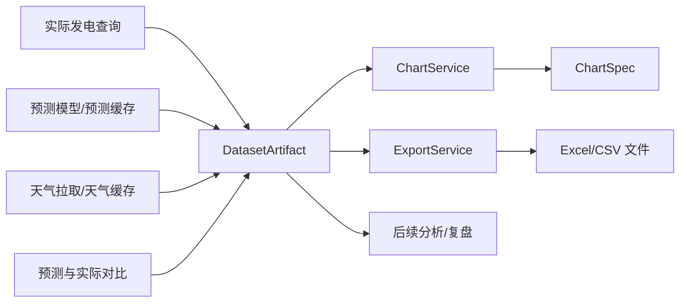
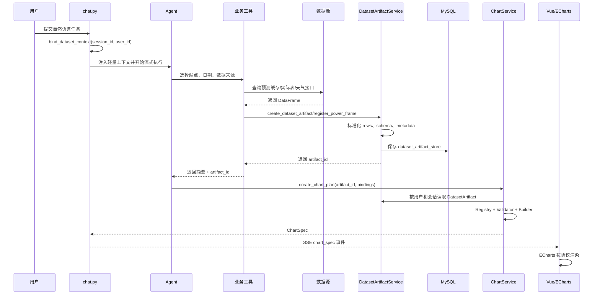
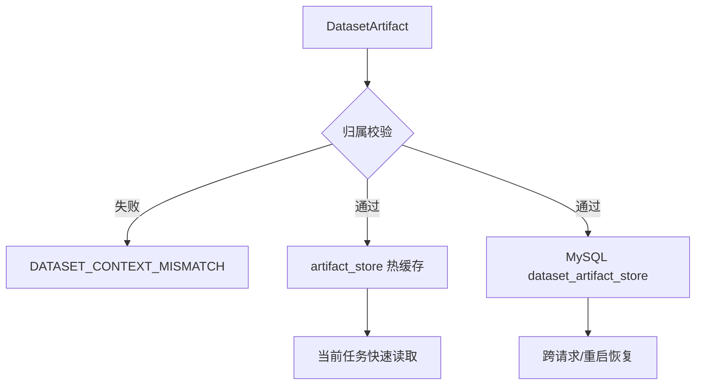
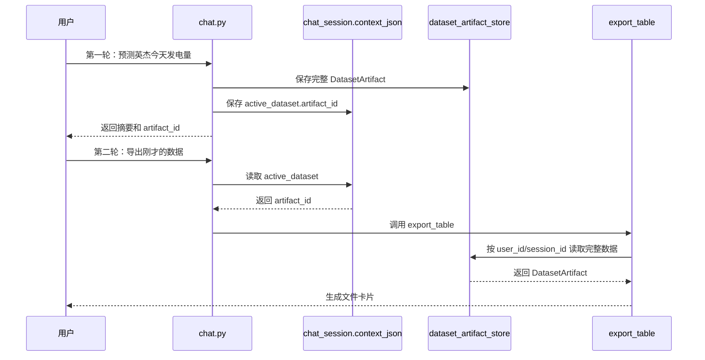
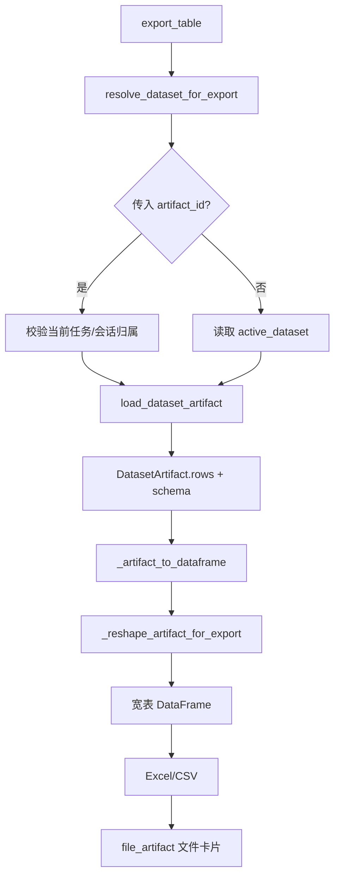
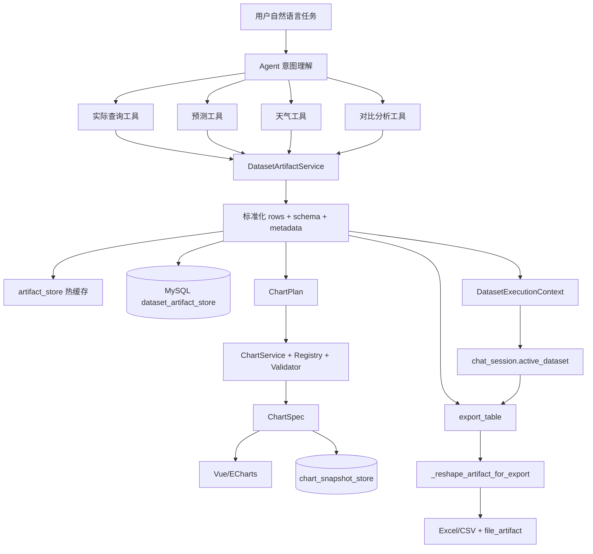

# SolarAgent 数据制品统一链路与跨模块复用

> 本文记录当前版本的数据制品架构：实际发电、预测、天气、对比分析等结果统一生成 `DatasetArtifact`，图表、文件导出和后续分析复用同一份结构化数据。

---

## 1. 先记住一句话

SolarAgent 现在不是“查询一次、图表保存一份、导出再重新查询”，而是：

```text
业务工具产生结构化结果
        ↓
统一登记为 DatasetArtifact
        ↓
图表、Excel/CSV 导出、后续分析都引用 artifact_id
```

`DatasetArtifact` 可以理解为：已经被业务工具查好、清洗好、标注好字段含义，并且可以被多个下游功能复用的数据结果。

它不是图表，也不是文件，而是位于“业务数据”和“图表/文件”之间的标准数据层。

## 2. 为什么要做这次改造

### 2.1 旧链路的问题

早期导出逻辑容易出现以下耦合：

```text
用户查询/预测
    ↓
只有画图时才生成数据制品
    ↓
图表生成 ChartSpec
    ↓
导出工具从 ChartSpec 或图表快照中反推数据
```

这会导致：

1. 用户只要求“预测并导出”，没有画图时导出失败。
2. 用户先画站点 A，再导出站点 B 时，旧图表快照可能被误用。
3. 天气查询、实际发电查询没有统一的 `artifact_id`。
4. 导出工具不断增加 `station_name`、`data_type`、`target_date` 等固定参数。
5. 多站点数据导出时可能按时间交替排列，不符合用户阅读习惯。

### 2.2 当前链路



改造的核心不是增加更多业务分支，而是增加一个稳定的数据契约层。

## 3. `DatasetArtifact` 是什么

### 3.1 源码位置

```text
backend/app/services/dataset_artifact_service.py
backend/app/charting/schemas.py
```

核心模型：

```python
DatasetArtifact(
    artifact_id="artifact_xxx",
    artifact_type="hourly_series",
    owner_user_id=3,
    session_id="session_xxx",
    schema={...},
    rows=[...],
    metadata={...},
)
```

### 3.2 字段含义

| 字段 | 作用 |
| --- | --- |
| `artifact_id` | 数据制品唯一 ID，Agent 和下游工具传递它，不传大数组 |
| `artifact_type` | 数据形态：`hourly_series`、`daily_aggregate`、`tabular` |
| `owner_user_id` | 数据所属用户，防止跨用户读取 |
| `session_id` | 数据所属会话，防止跨会话读取 |
| `schema` | 字段类型、角色、显示名称和单位 |
| `rows` | 标准化后的数据行 |
| `metadata` | 来源工具、数据类型、时间范围、序列维度等元数据 |

### 3.3 多站点制品示例

内部统一使用长表：

```json
{
  "artifact_id": "artifact_abc123",
  "artifact_type": "hourly_series",
  "owner_user_id": 3,
  "session_id": "session_001",
  "schema": {
    "timestamp": {"type": "datetime", "role": "time", "label": "时间"},
    "station": {"type": "category", "role": "category", "label": "站点"},
    "source_type": {"type": "category", "role": "category", "label": "数据来源"},
    "value_kwh": {"type": "number", "role": "measure", "label": "发电量", "unit": "kWh"}
  },
  "rows": [
    {
      "timestamp": "2026-07-24 08:00:00",
      "station": "宁波海曙英杰250KW光伏",
      "source_type": "predicted",
      "series_key": "宁波海曙英杰250KW光伏",
      "value_kwh": 52.4
    },
    {
      "timestamp": "2026-07-24 08:00:00",
      "station": "哲丰新材料九号机新增",
      "source_type": "predicted",
      "series_key": "哲丰新材料九号机新增",
      "value_kwh": 61.2
    }
  ],
  "metadata": {
    "source_tool": "get_power_dataset",
    "data_type": "predicted",
    "granularity": "hourly",
    "series_dimension": "station"
  }
}
```

`series_dimension` 是泛化的关键：

```text
单站点 actual + predicted → source_type
多站点同一种数据       → station
```

模板不需要分别实现“预测版”“实际版”“四站点版”，只需要知道按哪个维度拆分序列。

## 4. 一次请求的完整生命周期

以用户输入“预测英杰和哲丰九号机今天的逐小时发电量，并画对比图”为例：



Agent 不携带完整数据数组，也不能自行生成 ECharts JavaScript。

## 5. 数据制品如何创建

### 5.1 `create_dataset_artifact()`：通用入口

源码：

```text
backend/app/services/dataset_artifact_service.py
```

典型调用：

```python
dataset = create_dataset_artifact(
    frame,
    artifact_type="tabular",
    source_tool="get_weather_records",
    metadata={
        "data_type": "weather_archive",
        "period_start": "2026-07-24",
        "period_end": "2026-07-24",
        "granularity": "hourly",
    },
)
```

内部顺序：

```text
1. 检查当前是否绑定 DatasetExecutionContext
2. 复制 DataFrame，统一列名
3. 将 pandas/numpy/datetime 转为 JSON 安全类型
4. 生成 DatasetArtifact、schema 和 metadata
5. 调用 save_dataset_artifact 持久化并登记当前任务
```

### 5.2 `_json_safe()` 为什么需要

pandas/numpy 中的 `Timestamp`、`numpy.int64`、`numpy.float64` 和 `NaN` 不能直接作为稳定的 MySQL JSON 协议。`_json_safe()` 会做：

```text
时间 → ISO 字符串
numpy 数值 → Python int/float
NaN → null
```

这样才能跨请求、跨进程恢复。

### 5.3 `register_power_frame()`：电量数据便捷封装

实际和预测数据先通过 `make_power_frame()` 统一成：

```text
timestamp | station | source_type | series_key | value_kwh
```

再调用：

```python
dataset = register_power_frame(power_frame)
```

这是“通用层 + 领域封装”的分层：

```text
通用层：create_dataset_artifact()
电量领域：make_power_frame() + register_power_frame()
```

## 6. 数据制品如何持久化

### 6.1 `save_dataset_artifact()` 的职责

源码函数：

```text
backend/app/services/dataset_artifact_service.py
save_dataset_artifact()
```

执行顺序：

```text
DatasetArtifact
    ↓
校验 owner_user_id 和 session_id
    ↓
写入 artifact_store 热缓存
    ↓
写入 MySQL dataset_artifact_store
    ↓
登记 DatasetExecutionContext.produced_artifact_ids
```

进程内存只是当前请求的快速读取缓存，不是唯一来源。跨请求、服务重启后的恢复依赖 MySQL。



### 6.2 数据库表

迁移文件：

```text
backend/sql/migrations/012_dataset_artifact_store.sql
```

| 字段 | 作用 |
| --- | --- |
| `artifact_id` | 主键 |
| `user_id`、`session_id` | 数据归属隔离 |
| `artifact_type` | 数据制品类型 |
| `source_tool` | 产生数据的工具 |
| `schema_json` | 字段结构和业务角色 |
| `rows_json` | 标准化数据行 |
| `metadata_json` | 时间范围、站点、粒度等信息 |
| `created_at` | 创建时间 |

部署前必须执行迁移脚本，否则会提示：

```text
DATASET_PERSISTENCE_FAILED
数据制品持久化失败，请确认已执行 012_dataset_artifact_store.sql
```

### 6.3 为什么不是保存两份相同的快照

当前区分两个不同层次：

```text
DatasetArtifact：业务数据源，服务图表、导出和分析
ChartSpec 快照：渲染结果，服务历史图表恢复
```

数据制品可以重新选择字段、重新透视和再次分析；图表快照只代表当时已经渲染出的图表。因此它们不是无意义的重复保存。

## 7. 一次任务内的记忆：`DatasetExecutionContext`

### 7.1 为什么需要任务上下文

一次任务可能产生多个制品：

```text
查实际数据       → artifact_actual
查天气           → artifact_weather
生成预测         → artifact_predicted
预测实际对比     → artifact_comparison
```

如果只依赖 Agent 的文字记忆，模型可能忘记 ID，或者把旧站点结果带进来。服务层因此使用：

```python
DatasetExecutionContext(
    session_id="session_xxx",
    user_id=3,
    active_dataset_artifact_id="artifact_latest",
    produced_artifact_ids=[...],
)
```

### 7.2 `ContextVar` 的作用

```text
chat.py 开始 Agent 执行
    ↓ bind_dataset_context()
工具调用期间都能读取当前 session_id/user_id
    ↓ 工具登记 artifact
Context 记录本轮 produced_artifact_ids
    ↓ finally
reset_dataset_context()
```

源码位置：

```text
backend/app/routers/chat.py
backend/app/services/dataset_artifact_service.py
```

它只负责一次请求内的记忆，不能替代数据库。

### 7.3 当前任务防串数据

`resolve_dataset_for_export()` 的逻辑是：

```text
传入 artifact_id：必须属于当前任务产生的制品，或是当前会话 active_dataset
未传 artifact_id：使用当前 DatasetExecutionContext.active_dataset_artifact_id
```

如果 Agent 传入旧图表 ID 或其他任务 ID，会返回：

```text
EXPORT_DATASET_NOT_CURRENT
```

这就是把“不要拿旧数据”从 Prompt 软约束变成后端代码校验。

### 7.4 对应源码：绑定和清理必须成对出现

`backend/app/routers/chat.py` 在流式和非流式入口都会绑定：

```python
dataset_context_token = bind_dataset_context(
    req.session_id,
    user_id,
    active_dataset_artifact_id=active_dataset_id,
)
```

请求完成后，无论成功还是异常，都会在 `finally` 中清理：

```python
finally:
    reset_dataset_context(dataset_context_token)
```

这两个动作必须成对出现。只绑定不清理，会导致后续请求误读上一次任务的数据；只保存数据库而不绑定，则当前工具无法知道当前用户和会话。

## 8. 跨多轮对话的记忆：`active_dataset`

### 8.1 为什么 ContextVar 不够

`ContextVar` 只覆盖当前请求：

```text
请求结束 → ContextVar reset → 它不再负责跨轮记忆
```

用户下一轮说“把刚才预测的数据导出来”时，需要从数据库恢复最近制品的引用。

### 8.2 会话只保存轻量引用

`save_active_dataset()` 位于：

```text
backend/app/services/session_context_service.py
```

会话上下文保存：

```json
{
  "active_dataset": {
    "artifact_id": "artifact_predicted_123",
    "artifact_type": "hourly_series",
    "source_tool": "predict_power",
    "data_type": "predicted",
    "stations": ["宁波海曙英杰250KW光伏"],
    "period_start": "2026-07-24",
    "period_end": "2026-07-24",
    "granularity": "hourly",
    "row_count": 24
  }
}
```

完整数据行不放入 `chat_session.context_json`，而放在 `dataset_artifact_store` 中。

### 8.3 跨轮次链路



所以对话文本、结构化会话状态、完整数据制品三者分工不同：

```text
对话文本：自然语言上下文
会话状态：准确保存 artifact_id
数据制品表：保存完整数据
```

## 9. 哪些工具会生成数据制品

| 工具 | 数据来源 | 类型 | 作用 |
| --- | --- | --- | --- |
| `get_actual_power` | MySQL `power_generation` | `hourly_series` | 单站点单日实际逐小时 |
| `get_actual_power_by_range` | MySQL `power_generation` | `daily_aggregate` | 单站点周期日总量 |
| `get_predicted_power` | `prediction_cache` | `hourly_series` | 读取预测缓存 |
| `predict_power` | 预测模型 + 天气 | `hourly_series` | 生成新预测并留下结果 |
| `get_weather_records` | 天气缓存表 | `tabular` | 查询天气明细 |
| `get_weather_by_range` | 天气 API/缓存 | `tabular` | 拉取范围天气 |
| `get_power_comparison` | 预测缓存 + 实际表 | `hourly_series` | 预测/实际双序列 |
| `get_power_dataset` | 图表数据源适配器 | `hourly_series`/`daily_aggregate` | 多站点、多来源统一制品 |

下游不再判断“这是预测还是实际”，而是读取：

```text
artifact_type
schema
metadata.data_type
metadata.series_dimension
```

## 10. 图表如何消费数据制品

既定图表链路：

```text
get_chart_capabilities
    ↓
get_power_dataset
    ↓
DatasetArtifact
    ↓
create_chart_plan
    ↓
ChartService
    ↓
ChartSpec
    ↓
SSE chart_spec
    ↓
Vue/ECharts
```

`ChartPlan` 只提交意图，例如：

```json
{
  "capability_id": "time_series_compare",
  "artifact_id": "artifact_abc123",
  "x_role": "time",
  "series_mode": "group",
  "group_field": "station",
  "value_field": "value_kwh"
}
```

Agent 不提交原始数组、任意 ECharts 配置、JavaScript formatter 或未注册图表类型。

`backend/app/charting/service.py` 的处理顺序：

```text
1. 按 artifact_id 读取 DatasetArtifact
2. 校验 user_id/session_id
3. 读取能力注册表
4. 推断/校验 x_field、group_field、value_field
5. Validator 校验粒度、字段角色、序列数量、点数
6. Builder 生成 ChartSpec
```

图表快照只用于历史会话重新打开时恢复图表，不再作为表格导出的数据源。

## 11. 文件导出如何消费数据制品

源码：

```text
backend/tools/table_io_tool.py
```

核心链路：



### 11.1 为什么内部长表、导出宽表

内部长表适合统一处理：

```text
时间 | 站点 | 数据来源 | 图表序列 | 发电量
```

用户导出时更希望看到：

```text
时间 | 站点A | 站点B | 站点C
```

`_reshape_artifact_for_export()` 根据：

```text
field_schema 中的时间/日期字段
metadata.series_dimension
唯一数值字段
```

动态执行 `pivot_table`，不写死站点名称，也不写死四个序列。

### 11.2 多站点示例

```text
DatasetArtifact.rows
    ↓ series_dimension = station
    ↓ index = timestamp
    ↓ columns = station
    ↓ values = value_kwh

时间                  英杰       哲丰九号机       柯瑞
2026-07-24 08:00      52.4       61.2            83.7
2026-07-24 09:00      91.3       102.5           116.8
```

单站点预测/实际对比则使用：

```text
series_dimension = source_type

时间                  预测发电量       实际发电量
2026-07-24 08:00      52.4             48.7
```

因此导出器不需要分别实现“多站点导出”和“预测实际对比导出”。

### 11.3 对应源码：导出入口已经与图表解耦

`backend/tools/table_io_tool.py` 的正式读取入口是：

```python
def _load_export_dataframe(artifact_id: str):
    artifact = resolve_dataset_for_export(artifact_id)
    return _artifact_to_dataframe(artifact), artifact
```

这里不再调用 `chart_snapshot_store`，也不再把 `ChartSpec` 反推成表格。`export_table()` 只需要：

```text
artifact_id
    ↓
DatasetArtifact
    ↓
DataFrame
    ↓
Excel/CSV
```

当用户说“导出刚才的数据”且没有显式传 ID 时，`resolve_dataset_for_export("")` 会读取当前任务或会话的 `active_dataset`。

## 12. 一个完整例子：先预测和画图，再导出

### 12.1 第一轮：预测并画图

用户：

> 预测英杰和哲丰九号机今天的逐小时发电量，并画一张对比图。

工具链：

```text
get_chart_capabilities
    ↓
get_power_dataset(
    station_names=["英杰", "哲丰九号机"],
    source_types=["predicted"],
    target_date="2026-07-24",
    granularity="hourly"
)
    ↓
artifact_id = artifact_abc123
    ↓
create_chart_plan(
    capability_id="time_series_compare",
    artifact_id="artifact_abc123",
    group_field="station",
    value_field="value_kwh"
)
```

后端会分别保存：

```text
dataset_artifact_store：完整业务数据
chart_snapshot_store：最终 ChartSpec
chat_session.context_json：active_dataset 和 active_chart 轻量引用
```

### 12.2 第二轮：导出

用户：

> 把刚才的数据导出成 Excel。

会话上下文中已经有：

```json
{
  "active_dataset": {
    "artifact_id": "artifact_abc123",
    "data_type": "predicted",
    "stations": ["英杰", "哲丰九号机"],
    "granularity": "hourly"
  }
}
```

于是导出调用可以是：

```python
export_table(artifact_id="artifact_abc123", file_format="xlsx")
```

导出器从 `dataset_artifact_store` 读取完整数据，而不是从图表快照反推。

### 12.3 只预测、不画图也能导出

用户：

> 预测英杰今天的发电量，然后导出数据。

链路仍然成立：

```text
predict_power
    ↓
生成 predicted DatasetArtifact
    ↓
保存 active_dataset
    ↓
export_table
```

完全不需要 `ChartSpec`，这正是本次解耦要解决的问题。

## 13. 安全和正确性保护

### 13.1 用户/会话归属

读取时必须同时匹配：

```text
artifact.owner_user_id == 当前 user_id
artifact.session_id == 当前 session_id
```

防止用户 A 读取用户 B 的数据，也防止会话 A 读取会话 B 的数据。

### 13.2 Prompt 只放引用，不放大数组

注入 Agent 的是：

```text
artifact_id、artifact_type、data_type、stations、period、granularity、row_count
```

完整 `rows` 留在后端存储中。这样可以减少输入 Token，也避免模型重新组织或编造数据数组。

### 13.3 错误不静默兜底

```text
EXPORT_DATASET_REQUIRED
    当前没有可导出的数据制品

EXPORT_DATASET_NOT_CURRENT
    指定制品不是当前任务或会话绑定的数据

DATASET_NOT_FOUND
    制品不存在或不属于当前会话

DATASET_PERSISTENCE_FAILED
    数据库表未迁移或写入失败
```

与其导出错误数据，不如明确告诉用户缺少真实数据制品。

## 14. 代码职责地图

| 模块 | 主要职责 |
| --- | --- |
| `dataset_artifact_service.py` | 创建、序列化、保存、加载、归属校验、当前任务绑定 |
| `power_query_tool.py` | 查询实际、预测缓存、天气缓存和对比结果，并登记制品 |
| `pv_predictor.py` | 调用预测流程，生成预测结果制品 |
| `weather_fetcher_tool.py` | 拉取天气并登记天气制品 |
| `chart_plan_tool.py` | 获取图表数据制品、提交 ChartPlan |
| `charting/service.py` | 读取制品、校验计划、生成 ChartSpec |
| `table_io_tool.py` | 读取制品、长表转宽表、生成 Excel/CSV |
| `chat.py` | 绑定一次任务上下文、保存 active_dataset、清理 ContextVar |
| `session_context_service.py` | 保存最近制品的轻量引用 |
| `012_dataset_artifact_store.sql` | 持久化制品的数据库表 |

可以概括为：

```text
工具负责产生数据
Service 负责标准化和持久化
ChartService 负责渲染协议
ExportService 负责文件格式
chat.py 负责任务上下文和会话衔接
```

## 15. 泛化思想：以后新增数据类型怎么做

增加设备状态、告警记录、组件温度等数据时，遵循：


新增数据源只需定义：

1. 数据字段；
2. 字段的时间、日期、分类和数值角色；
3. 序列维度；
4. 数据来源和时间范围。

不需要继续堆叠：

```text
export_weather()
export_alarm()
export_device_status()
```

这是“面向数据契约扩展”，而不是“面向功能名称堆分支”。

### 15.1 泛化的边界

泛化不等于所有数据都强行套成发电量折线图。不同数据仍需拥有正确的：

```text
artifact_type
字段 schema
metadata
图表能力注册项
```

统一的是数据接入协议，不是所有业务语义。

## 16. 当前版本与后续优化

### 当前已经完成

- 实际发电结果生成数据制品；
- 预测缓存和新预测结果生成数据制品；
- 天气查询和天气拉取结果生成数据制品；
- 预测/实际对比生成双序列数据制品；
- 数据制品保存到 MySQL；
- 会话保存 `active_dataset` 引用；
- 图表和导出共同消费数据制品；
- 导出不再依赖图表快照；
- 多序列数据导出前自动转宽表；
- 当前任务和用户/会话归属校验。

### 后续可以继续做

1. 给数据制品增加版本号和生命周期状态；
2. 大数据制品使用对象存储，MySQL 只保存元数据和 URI；
3. Redis 缓存最近访问的数据制品；
4. 增加“本会话最近制品”目录查询；
5. 记录来源链路、模型版本和计算参数；
6. 增加访问日志和导出审计日志。

推荐演进：

```text
第一阶段：MySQL 保存完整 rows，完成闭环
第二阶段：MySQL 保存元数据 + 对象存储保存大数据
第三阶段：Redis 做热点缓存，MySQL/对象存储做最终来源
第四阶段：数据制品目录、版本、血缘和审计
```

## 17. 面试时如何讲

可以这样回答：

> 我在 SolarAgent 中增加了一层统一的数据制品服务。实际发电、预测、天气和预测对比工具不再只返回一段文本，而是把结构化结果标准化为 DatasetArtifact。数据制品包含 artifact_id、字段 schema、数据行、时间范围、数据来源和序列维度，并按照用户和会话归属持久化到 MySQL。Agent 在上下文中只传递 artifact_id，不携带完整数组。图表模块根据 artifact_id 生成 ChartPlan 和 ChartSpec，导出模块则直接读取同一份 DatasetArtifact 并根据 series_dimension 转成用户友好的宽表。这样用户即使只预测不画图，也能直接导出；多站点、预测/实际和天气数据也不需要继续给导出工具增加大量固定参数。图表快照只负责历史图表恢复，数据制品才是业务数据的统一来源。

如果追问“为什么不用图表快照导出”：

> 图表快照只保存已经展示的横轴和序列，属于渲染结果；数据制品保留完整字段、元数据和来源，可以重新选择字段、重新透视和再次分析。将二者分离可以避免导出被图表流程强绑定，也能防止拿旧图表数据误导出。

如果追问“怎么保证安全”：

> 每个数据制品绑定 user_id 和 session_id，读取时由后端校验归属。ContextVar 只维护单次任务中的 produced_artifact_ids 和 active_dataset，跨轮次则把轻量引用写入 MySQL 会话上下文。即使 Agent 传入旧 artifact_id，后端也会通过任务和会话校验拒绝，而不是依赖 Prompt 提醒模型不要这么做。

## 18. 最终复盘图



最终一句话：

> 业务工具负责产生真实数据，DatasetArtifact 负责统一承载和持久化，Agent 只传递数据引用，图表和导出作为不同消费者复用同一份数据制品。
