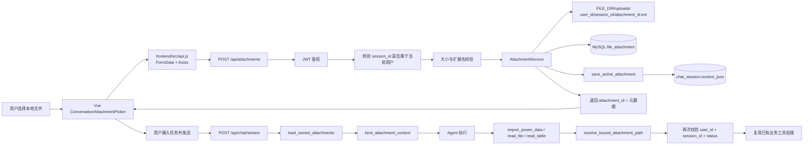

# SolarAgent 文件上传功能实现与泛化设计复盘

> 本文只复盘本次“文件上传/附件引用”改造，不讨论页面视觉，也不把 Prompt 简化改造当成主线。重点是把这次新增和修改的源码、调用链、设计取舍、知识点以及可迁移的泛化方法讲清楚。

## 1. 这次到底实现了什么

本次实现把“文件”从一个只能通过服务端路径访问的对象，改造成了一个可以被前端上传、被会话记住、被 Agent 按权限引用的资源。

核心结果是：

```text
前端选择文件
    → 后端保存文件和元数据
    → 返回 attachment_id
    → 写入当前会话 active_attachment
    → 用户发送“把这个文件导入数据库”
    → Agent 只拿 attachment_id
    → 后端按用户和会话权限解析真实文件
    → 复用既有 import_tool / file_io_tool / table_io_tool
```

这里有一个非常重要的边界：

- “上传附件”只负责保存文件、保存元数据、绑定会话，不自动导入业务数据；
- “导入数据”才负责 Excel 解析、站点识别、数据清洗和 MySQL 入库；
- Agent 不接触 `C:\...` 这样的真实磁盘路径，只能使用 `attachment_id`。

因此，上传和业务处理被解耦了。以后同一个上传文件既可以用于导入，也可以用于读取、统计、生成报告，而不需要重复上传。

## 2. 为什么需要这次改造

旧模式的问题是：

1. 工具参数要求文件名或服务端路径；
2. 前端无法把本地文件直接交给对话任务；
3. Agent 如果直接拿路径，容易越权读取其他用户文件；
4. “这个文件”“上一个文件”没有稳定的会话级引用；
5. 文件导入逻辑和文件读取逻辑容易被重复实现。

本次改造采用“文件本体 + 元数据 + 不透明 ID”的方式解决：

```text
文件本体：本地 uploads 目录（第一阶段）
文件元数据：MySQL file_attachment 表
业务引用：attachment_id
会话最近文件：chat_session.context_json.active_attachment
```

这种设计比直接把路径塞进 Prompt 更安全，也更容易迁移到对象存储。

## 3. 总体架构和数据流



这条链路体现了三个边界：

1. 前端只负责文件选择和上传展示；
2. 附件服务负责存储、权限和路径解析；
3. 业务工具负责导入、读取和分析，不负责重复实现上传。

## 4. 本次涉及的源码文件和职责

| 文件 | 作用 | 本次变化 |
|---|---|---|
| `frontend/src/components/ConversationAttachmentPicker.vue` | 对话框附件选择组件 | 新增隐藏文件输入、文件名展示、移除附件、上传状态展示 |
| `frontend/src/App.vue` | 工作台状态与交互编排 | 新增待发送附件状态、上传处理、会话切换清理、消息附件展示、发送时携带 ID |
| `frontend/src/api.js` | 前端 API 层 | 新增 `uploadAttachment`，扩展 `streamChat` 的 `attachments` 参数 |
| `frontend/src/styles.css` | 全局样式 | 增加附件按钮、附件条和附件消息的样式 |
| `backend/app/routers/attachments.py` | 上传 HTTP 接口 | 新增 `POST /api/attachments` |
| `backend/app/services/attachment_service.py` | 附件核心服务 | 文件名、扩展名、大小、路径、哈希、数据库元数据、归属校验、路径解析 |
| `backend/app/services/attachment_context.py` | Agent 执行期上下文 | 用 `ContextVar` 保存当前任务允许使用的附件元数据 |
| `backend/app/services/session_context_service.py` | 会话级状态 | 保存 `active_attachment`，支持后续“这个文件/上一个文件” |
| `backend/app/routers/chat.py` | 对话入口 | 从请求或会话上下文解析附件，注入 Agent，并在结束时清理上下文 |
| `backend/app/schemas/chat.py` | 请求模型 | 为 `ChatRequest` 增加最多 5 个附件 ID |
| `backend/app/main.py` | FastAPI 组装 | 注册 `attachments.router` |
| `backend/sql/migrations/009_file_attachment_store.sql` | 数据库升级 | 新增 `file_attachment` 附件元数据表及索引 |
| `backend/sql/memory_schema.sql` | 空库初始化 | 同步附件表结构，保证新环境可初始化 |
| `backend/app/errors.py` | 统一错误协议 | 增加附件无效、不存在、无权访问、过期等错误码 |
| `backend/tools/import_tool.py` | 发电量导入业务 | 支持 `attachment_id`，复用附件解析后的安全路径；同时优化 Excel 单次读取 |
| `backend/tools/file_io_tool.py` | 文本文件工具 | `read_file`、`verify_file` 支持附件 ID |
| `backend/tools/table_io_tool.py` | 表格文件工具 | `read_table` 支持附件 ID |
| `backend/Agent/prompt.py` | Agent 工具使用提示 | 告诉 Agent 当前附件使用对应工具和 `attachment_id`，不猜文件路径 |
| `.env.example` | 环境配置示例 | 增加附件目录、大小等配置说明 |

说明：这些文件不是每个都新增了复杂业务。很多文件只承担“接线”职责，把已有业务能力接入新的附件引用协议。

## 5. 前端上传链路：用户点击后发生了什么

### 5.1 选择文件

`ConversationAttachmentPicker.vue` 通过隐藏的 `<input type="file">` 调起浏览器文件选择器，只允许：

```text
.xlsx、.xls、.csv、.txt、.md
```

组件本身不保存文件内容，也不直接调用后端。它只向父组件发出 `select(file)` 事件。

### 5.2 App.vue 接管上传

`handleConversationAttachment(file)` 完成三件事：

1. 确保当前存在会话；
2. 调用 `uploadAttachment(sessionId, file)`；
3. 把后端返回的附件元数据放入 `pendingAttachments`。

用户此时可以继续修改问题或移除附件，附件不会立即触发 Agent 任务。

### 5.3 api.js 使用 Axios 上传

普通 REST 接口统一使用 Axios。上传采用 `FormData`：

```js
formData.append('session_id', sessionId)
formData.append('file', file, file.name)
```

这里不手工把文件转成 JSON，也不把二进制塞进聊天文本。`multipart/form-data` 是浏览器上传文件的标准方式。

发送消息时，前端只把不透明引用传给流式接口：

```json
{
  "session_id": "abc123",
  "message": "把这个文件导入数据库",
  "attachments": [
    {"attachment_id": "att_xxx"}
  ]
}
```

## 6. 后端上传接口：保存什么，校验什么

### 6.1 `POST /api/attachments`

`backend/app/routers/attachments.py` 的职责很薄：

```text
读取当前用户
  → 校验 session_id 归属
  → 读取文件字节
  → 限制大小
  → 调用 AttachmentService 保存
  → 更新 active_attachment
  → 返回安全元数据
```

接口不执行 Excel 导入，也不调用 Agent。这样上传动作是可复用的基础能力。

### 6.2 AttachmentService 的保存逻辑

`save_attachment()` 主要做以下工作：

1. 用 `Path(filename).name` 去除目录部分，阻断 `../` 路径穿越；
2. 校验扩展名白名单；
3. 校验空文件和大小上限；
4. 生成不可预测的 `att_<uuid>`；
5. 按用户和会话隔离目录保存文件；
6. 计算 SHA-256，便于后续去重、审计和完整性校验；
7. 向 `file_attachment` 写入元数据；
8. 数据库写入失败时删除刚保存的文件，避免“磁盘有文件、数据库没有记录”的孤儿文件。

### 6.3 数据库表

迁移文件 `009_file_attachment_store.sql` 新增：

```text
file_attachment
├── attachment_id   主键，业务引用
├── user_id         所属用户
├── session_id      所属会话
├── original_name   用户原始文件名
├── storage_uri     当前存储位置
├── content_type    MIME 类型
├── size_bytes      文件大小
├── sha256          内容摘要
├── status          uploaded / expired / deleted
├── created_at      创建时间
└── expires_at      过期时间
```

`storage_uri` 只存数据库和服务端内部使用，不能原样返回给 Agent 或前端。

## 7. `active_attachment`：为什么“这个文件/上一个文件”能复用

上传成功后，`save_active_attachment()` 会把紧凑的引用写入 `chat_session.context_json`：

```json
{
  "active_attachment": {
    "attachment_id": "att_xxx",
    "filename": "多站点导出.xls",
    "content_type": "application/vnd.ms-excel",
    "size_bytes": 102400,
    "status": "uploaded"
  }
}
```

只保存引用和展示所需元数据，不保存文件内容，也不保存给 Agent 使用的真实路径。

当前请求的附件解析优先级是：

```text
当前消息明确携带的 attachment_id
        ↓
会话 context_json 中的 active_attachment
        ↓
没有可用引用时，才提示用户重新上传或确认
```

“上一个文件”之所以能够工作，是因为每次成功上传都会覆盖会话的 `active_attachment`，它天然表示当前会话最近一次上传的文件。

如果一次消息携带多个附件，后端允许最多 5 个，并按原顺序绑定到本次 Agent 执行上下文。当前版本把选择权交给 Agent 的工具参数；后续如果用户只说“分析这个文件”但同时存在多个候选文件，应增加一个轻量 `AttachmentResolver`，通过 `ask_user` 让用户明确选择，而不是让模型猜。

## 8. Chat 路由如何把附件交给 Agent

`backend/app/routers/chat.py` 在流式和非流式入口都复用相同链路：

```text
ChatRequest.attachments
  → _load_request_attachments()
  → load_owned_attachments()
  → _build_agent_input()
  → bind_attachment_context()
  → executor.astream_events / executor.invoke
  → finally reset_attachment_context()
```

### 8.1 归属校验

`load_owned_attachments()` 会逐个调用 `get_owned_attachment()`，校验：

- `attachment_id` 是否存在；
- `user_id` 是否匹配当前登录用户；
- `session_id` 是否匹配当前会话；
- 状态是否为 `uploaded`，而不是 `expired` 或 `deleted`。

这一步在 Agent 执行前完成，工具内部还会再次校验，形成两层保护。

### 8.2 Prompt 中注入什么

`build_attachment_context()` 注入的是：

```text
attachment_id
filename
content_type
size_bytes
```

它不会注入 `storage_uri`。Agent 只知道“有一个 ID 为 att_xxx 的文件”，然后根据意图选择：

| 用户意图 | 工具 | 参数 |
|---|---|---|
| 导入发电量 Excel | `import_power_data` | `attachment_id` |
| 读取文本内容 | `read_file` | `attachment_id` |
| 查看表格摘要 | `read_table` | `attachment_id` |
| 校验文件是否完整 | `verify_file` | `attachment_id` |

这就是“让 Agent 负责意图选择，让后端负责资源边界”。

### 8.3 为什么要使用 ContextVar

`attachment_context.py` 保存的是一次 Agent 执行期的临时上下文：

```python
AttachmentExecutionContext(
    session_id=..., 
    user_id=..., 
    attachments=(...),
)
```

它不是持久化记忆，任务结束后必须在 `finally` 中 reset。它解决的是：

```text
chat.py 知道当前用户/会话/附件
工具函数只收到 attachment_id
工具不必层层增加 user_id、session_id 参数
```

注意边界：

- `ContextVar`：只负责本次执行内传递上下文；
- `chat_session.context_json`：负责跨请求记住 active_attachment；
- `file_attachment`：负责持久化附件元数据；
- 文件存储：负责保存真实文件本体。

## 9. 既有工具如何复用

本次没有创建“文件分析工具”和“文件读写工具”，因为这些能力已经存在。

### 9.1 `import_tool.py`

它仍然负责完整的业务导入闭环：

```text
文件格式校验
  → Sheet 解析
  → 站点名称和装机容量识别
  → 列结构校验
  → 日期解析
  → 发电量清洗
  → 站点 upsert
  → 发电量批量入库
```

改造点只是增加 `attachment_id` 分支：

```text
attachment_id
  → 当前 Agent 上下文允许性校验
  → AttachmentService.resolve_attachment_path()
  → 得到受授权的本地路径
  → 继续走原来的 parse_excel_preview / execute_import
```

业务代码没有因为“来源是上传文件”而复制一份。

### 9.2 `file_io_tool.py`

`read_file`、`verify_file` 现在同时支持：

- 历史导出文件：使用 `filename`；
- 当前对话附件：使用 `attachment_id`。

两种入口最后都汇聚到“得到一个经过校验的文件路径”，后面的读取和校验逻辑保持一致。

### 9.3 `table_io_tool.py`

`read_table` 支持附件 ID 后，仍然复用既有的 Excel/CSV 读取、列名、前五行和统计摘要逻辑。

这体现了一个工程原则：

> 新增资源入口时，优先改造已有业务服务的输入适配层，不要为了一个新入口复制整套业务逻辑。

## 10. Excel 为什么以前每个 Sheet 读取两次

### 10.1 旧实现

旧代码需要完成两个动作：

```python
raw = pd.read_excel(..., header=None)
# 第一次：不设置表头，读取第 0 行的站点名称

df = pd.read_excel(..., header=1)
# 第二次：把第 1 行作为表头，读取真正的数据
```

因此同一个 Sheet 被 Pandas 解析两遍。文件有多个站点时，每个 Sheet 都重复一次，带来额外的文件扫描、格式解析和内存开销。

### 10.2 当前实现

现在先打开一次 `pd.ExcelFile`，每个 Sheet 只调用一次：

```python
raw = xls.parse(sheet_name=sheet_name, header=None)

title = str(raw.iloc[0, 0]).strip()  # 第 0 行：站点标题
df = raw.iloc[2:].copy()             # 第 1 行是表头，第 2 行起是数据
df = df.dropna(axis=1, how="all")

if len(df.columns) == 2:
    df = df.iloc[:, :2]
elif len(df.columns) >= 3:
    df = df.iloc[:, [0, 2]]

df.columns = ["record_time", "power_kwh"]
```

这里的“第 1 行作为表头”在业务上仍然成立，但代码不再让 Pandas 重新解析一次表头，而是统一转换成系统内部的标准字段：

```text
record_time
power_kwh
```

这样后面的清洗、预览和入库只依赖标准字段，不依赖用户文件里五花八门的原始列名。

### 10.3 业务结果为什么不变

旧逻辑和新逻辑最终都得到：

```text
站点标题 + record_time + power_kwh
```

变化的是读取方式，不是业务规则：

- 第 0 行仍然识别站点；
- 第 1 行仍然作为结构边界；
- 第 2 行以后仍然是发电数据；
- 两列文件取第 0、1 列；
- 三列及以上文件取第 0、2 列；
- 后续仍然走同一套清洗和入库函数。

这属于“性能优化但不改变业务语义”。

## 11. 安全设计：为什么不能让 Agent 直接拿路径

如果 Agent 可以直接拼接路径，就可能出现：

```text
../../其他用户文件
任意服务器配置文件
数据库凭证文件
```

当前设计使用多层保护：

1. **扩展名白名单**：只接受业务允许的格式；
2. **文件名规范化**：只保留文件名，不接受用户传入目录；
3. **大小限制**：默认由 `ATTACHMENT_MAX_UPLOAD_BYTES` 控制，当前默认 20 MB；
4. **用户和会话归属**：查询附件时同时校验 `user_id` 与 `session_id`；
5. **状态校验**：过期或删除的附件不能继续使用；
6. **路径边界校验**：解析后的路径必须位于附件存储根目录内；
7. **ID 隔离**：Agent 只接触 `attachment_id`，不接触 `storage_uri`；
8. **错误码区分**：不存在、无权限、过期、格式错误分别返回不同错误码，便于前端处理和审计。

安全边界可以概括为：

```text
用户输入的文件名 ≠ 文件权限
Agent 拿到的 attachment_id ≠ 磁盘路径
只有 AttachmentService 才能把 ID 解析成路径
```

## 12. 本地存储到 OSS 的泛化设计

当前第一阶段使用：

```text
LocalFileStorage
→ FILE_DIR/uploads/<user_id>/<session_id>/<attachment_id>.ext
```

后续迁移到阿里云 OSS 时，不应该让 Agent 或导入工具感知 OSS SDK。建议抽象成：

```python
class Storage:
    def save(self, attachment_id, content, extension) -> str: ...
    def resolve(self, storage_uri) -> BinaryIO: ...
    def delete(self, storage_uri) -> None: ...


class LocalFileStorage(Storage): ...
class AliyunOSSStorage(Storage): ...
```

业务链路保持：

```text
attachment_id
  → AttachmentService 权限校验
  → storage.resolve(...)
  → import_tool / file_io_tool / table_io_tool
```

切换存储时只替换实现和配置，不修改 Agent Prompt、前端消息协议和导入业务。

注意：当前代码已经把路径解析集中在 `AttachmentService`，但 `Storage` 抽象类尚未真正落地，这是下一阶段的工程封口点。

## 13. 两个具体使用例子

### 例子一：上传后导入数据库

```text
用户选择 多站点导出.xls
  → POST /api/attachments
  → 返回 att_abc
  → chat_session.active_attachment = att_abc

用户：把这个文件导入数据库
  → ChatRequest.attachments 为空
  → chat.py 从 active_attachment 恢复 att_abc
  → Agent 选择 import_power_data(attachment_id="att_abc")
  → AttachmentService 校验归属并解析路径
  → import_tool 解析 Sheet、清洗、upsert 站点、批量写入发电量
```

### 例子二：同一个文件先看摘要，再导入

```text
用户：先分析一下上一个文件
  → active_attachment 仍然是 att_abc
  → Agent 选择 read_table(attachment_id="att_abc")
  → 返回行数、列名、时间范围、异常预览

用户：确认没问题，导入数据库
  → 继续复用 att_abc
  → Agent 选择 import_power_data(attachment_id="att_abc")
```

同一个资源引用可以被不同工具复用，但每个工具仍然只做自己的业务。

## 14. 这次实现体现的泛化思想

### 14.1 用“资源引用”代替“业务函数参数里的路径

不要让每个工具都设计一套：

```text
file_path、upload_path、excel_path、server_filename
```

统一为：

```text
attachment_id
```

资源如何存、如何鉴权、如何读取，由资源服务统一处理。这个思想也适用于：

- 图片：`image_id`；
- PDF：`document_id`；
- 音频：`audio_id`；
- 数据集：`dataset_id`；
- 图表快照：`artifact_id`。

### 14.2 “意图由 Agent 选择，边界由后端决定”

Agent 可以判断用户是想：

- 导入数据；
- 读取文件；
- 看表格摘要；
- 校验文件。

但 Agent 不能决定：

- 读取哪个用户的路径；
- 绕过会话归属；
- 修改附件状态；
- 使用未授权 ID。

这与图表系统的设计一致：Agent 提交 `ChartPlan`，后端 Validator 决定是否允许；Agent 提交 `attachment_id`，后端 AttachmentService 决定是否可访问。

### 14.3 “一次标准化，多个下游复用”

Excel 先标准化为：

```text
站点标题 + record_time + power_kwh
```

之后预览、清洗、入库、统计都消费标准结构，而不是每个功能重新解析 Excel。

这是一种通用的数据管道思想：

```text
原始输入
  → 解析层
  → 标准化数据结构
  → 多个业务消费者
```

### 14.4 “薄路由、厚服务、薄工具适配”

当前分层是：

```text
Router：HTTP 参数、鉴权依赖、状态码
Service：文件存储、权限、路径解析、会话引用
Tool：面向 Agent 的业务入口
业务函数：解析、清洗、入库、读取
```

以后增加“上传 PDF”时，优先新增或扩展资源服务和解析服务，不把所有逻辑塞回 `App.vue` 或一个巨大的 Tool 文件。

### 14.5 “持久化状态”和“执行期状态”分开

```text
MySQL context_json：跨请求的 active_attachment
ContextVar：当前 Agent 执行期间的授权附件列表
MySQL file_attachment：附件元数据
Local/OSS：文件本体
```

这样既能记住用户上一轮上传的文件，又不会把整份文件内容塞进会话上下文或 Prompt。

## 15. 面试时可以怎样讲

可以这样回答：

> 我没有把上传文件直接以服务器路径传给 Agent，而是设计了一个附件资源层。前端上传后，后端先校验用户和会话归属，保存文件和元数据，生成不透明的 attachment_id，并把最近一次附件引用写入会话上下文。用户后续说“这个文件”时，系统可以从 active_attachment 恢复引用。Agent 只负责根据意图选择 import_power_data、read_file 或 read_table，真正的路径解析、权限校验和状态校验都由 AttachmentService 完成。这样上传入口和业务工具解耦，也避免了重复创建文件分析工具。与此同时，我把 Excel 读取从每个 Sheet 两次解析优化为一次读取后拆分站点标题、表头和数据区，减少重复解析但保持清洗和入库结果不变。未来如果从本地磁盘迁移到 OSS，只需要替换存储实现，不需要修改 Agent 和业务工具。

面试官继续追问“为什么不用路径”时，可以补充：

> 路径是存储实现细节，不应该成为 Agent 的业务参数。使用资源 ID 可以隔离权限、隐藏服务器目录，并为本地文件、OSS、对象存储迁移提供稳定的业务协议。

## 16. 当前版本的边界和后续工作

当前已经完成：

- 对话附件上传；
- 文件元数据持久化；
- 当前会话 active_attachment；
- “这个文件/上一个文件”的基础复用；
- Agent 通过 attachment_id 选择既有工具；
- Excel 每个 Sheet 单次读取；
- 附件用户/会话归属校验；
- 统一错误码和前端错误解析。

建议后续按以下顺序完善：

1. 增加多附件歧义解析：多个候选且用户说“这个文件”时调用 `ask_user`；
2. 把 `LocalFileStorage` 抽象成统一 Storage 接口；
3. 接入 OSS，并保留本地实现用于开发环境；
4. 增加文件下载接口和前端生成文件展示；
5. 增加病毒扫描、MIME 魔数校验、用户配额和并发上传限制；
6. 增加过期附件清理任务，处理数据库记录和文件本体生命周期；
7. 对同一 SHA-256 文件做可选去重，但要先明确“跨会话复用”是否允许；
8. 将附件上传、导入、预览状态进一步拆成前端独立模块，避免继续扩大 `App.vue`。

## 17. 最后复盘：这次不是“加了一个上传按钮”

这次真正完成的是一条资源管理闭环：

```text
选择资源
  → 资源入库
  → 资源身份化
  → 会话引用
  → Agent 意图绑定
  → 后端权限解析
  → 既有业务工具复用
  → 结果返回
```

它的可迁移价值在于：以后无论接入 PDF、图片、日志文件还是外部对象存储，都可以沿用同一套“ID 引用、服务解析、工具复用、上下文记忆”的架构，而不是每新增一种文件就重新写一整条业务链路。

## 18. 后续扩展：把表格导出连接到数据制品

### 18.1 旧导出工具的问题

旧版 `export_table` 的参数是：

```python
station_name
target_date
data_type
file_format
filename
end_date
```

这意味着导出器必须自己重新解析“站点 + 日期 + 数据类型”，然后调用 `_fetch_data()`。它只能自然地处理单站点数据，无法直接表达：

- 多站点逐小时对比；
- 多站点日总发电量；
- 实际/预测已经组合好的多序列结果；
- 后续注册的天气、设备或其他标准化数据集。

问题不在 Excel 写入，而在导出工具拿到的输入层级太低。

### 18.2 新的导出入口

现在 `export_table` 优先接受：

```python
export_table(
    artifact_id="artifact_xxx",
    file_format="xlsx",
)
```

调用链变为：

```text
get_power_dataset
  → DatasetArtifact
  → artifact_id
  → export_table
  → artifact_store.get（校验 user_id + session_id）
  → artifact.rows + artifact.schema
  → DataFrame
  → Excel/CSV
```

导出器不再关心数据是实际、预测、天气还是多站点对比，只要上游把数据标准化为 `DatasetArtifact`，就可以导出。

旧的 `station_name + target_date + data_type` 仍然保留，作为兼容兜底，避免历史单站点调用立即失效。

### 18.3 为什么这体现泛化能力

图表系统和导出系统现在共享同一个数据边界：

```text
业务查询工具
    → DatasetArtifact
        ├── create_chart_plan → ChartSpec → ECharts
        └── export_table      → Excel/CSV
```

Agent 只需要先获得一个数据制品，后续可以根据用户意图选择：

- 画图；
- 导出；
- 统计；
- 生成报告。

这比让每个下游工具重新查询一次数据库、重新猜测站点和日期更稳定。

### 18.4 多 Sheet 读取修复

旧版 `read_table` 使用：

```python
pd.read_excel(full_path)
```

Pandas 默认 `sheet_name=0`，所以只会读取第一个 Sheet。

现在通过 `pd.ExcelFile` 遍历：

```python
with pd.ExcelFile(full_path, engine=engine) as workbook:
    sheets = [
        (
            sheet_name,
            workbook.parse(sheet_name=sheet_name),
        )
        for sheet_name in workbook.sheet_names
    ]
```

`read_table`、`read_table_from_bytes` 和 `read_file` 的表格分支都能看到完整工作簿，而不是只返回第一个子表。每个 Sheet 会分别提供：

- 行数和列数；
- 列名；
- 前 5 行预览；
- 数值列统计。

同时限制摘要展开的 Sheet 数量，避免一个超大工作簿直接撑爆 Agent 上下文；这只是展示限制，不会影响 `import_power_data` 的完整导入。

### 18.5 `asyncio.to_thread` 的准确理解

上传接口中的：

```python
attachment = await asyncio.to_thread(
    save_attachment,
    ...,
)
```

可以理解为：把同步的文件写入、哈希计算和 MySQL 操作交给线程池中的工作线程执行，当前 FastAPI 事件循环线程可以继续处理其他异步任务。

但它不是“每次都新建一个线程”。`asyncio.to_thread` 通常使用线程池，线程可以复用；它也不是让 CPU 密集型 Python 代码自动获得并行加速。这个场景适合它，是因为文件 I/O 和数据库等待属于阻塞式 I/O。

### 18.6 更新后的面试表达

> 我为 Agent 增加了一个附件资源层。文件上传后不会把真实路径暴露给 Agent，而是生成 attachment_id，并将最近一次附件写入会话上下文。Agent 根据用户意图选择导入、读取或表格分析工具，后端服务负责权限校验和路径解析，底层业务工具继续复用原有能力。同时，我把 Excel 每个 Sheet 的双重解析优化为单次读取和标准化拆分，在不改变业务结果的情况下减少重复解析。后来我又把表格导出和 DatasetArtifact 连接起来：业务查询先生成标准化数据制品，图表和 Excel/CSV 导出都消费同一个 artifact_id，因此多站点、多序列和未来新增的数据类型不需要继续给导出工具堆叠 station_name、data_type 等固定参数。未来如果从本地磁盘迁移到 OSS，只需要替换存储实现，不需要修改 Agent 和业务工具。
