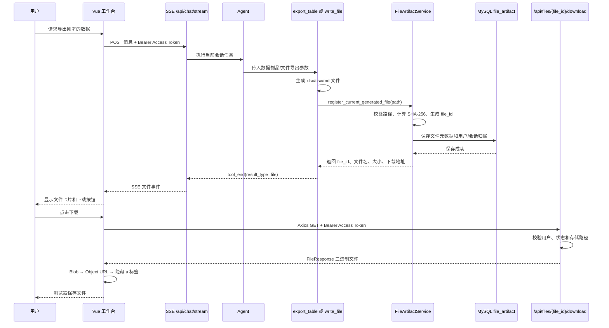

# SolarAgent 文件下载功能与 Blob 机制

## 1. 这次实现解决了什么问题

SolarAgent 的 Agent 可以通过 `file_io_tool` 或 `table_io_tool` 生成 Markdown、CSV、Excel 等文件。此前文件虽然生成在后端磁盘中，但前端没有统一的安全下载入口，用户也不应该看到服务器真实路径。

本次实现增加了“文件产物层”：

```text
生成文件
  → 登记 file_artifact 元数据
  → 只返回 file_id 和文件元数据
  → SSE 推送文件事件
  → Vue 展示文件卡片
  → Axios 携带 Bearer Token 下载 Blob
```

设计原则是：Agent 和前端只接触 `file_id`，后端负责权限、路径和文件状态校验。

## 2. 完整执行链路

### 2.1 用户任务示例

用户先让 Agent 对比多个站点，随后提出：

> 把刚才的多站点数据导出成 Excel。

Agent 根据当前会话中的数据制品或图表快照引用，调用现有的 `export_table` 工具。文件下载不是重新实现一套业务查询，而是复用已经得到的数据结果。

### 2.2 链路图



### 2.3 文件事件链路

后端工具返回的不是服务器路径，而是结构化结果：

```json
{
  "result_type": "file",
  "message": "文件已生成，可以下载",
  "file": {
    "file_id": "file_abc123",
    "filename": "多站点日发电量.xlsx",
    "content_type": "application/vnd.openxmlformats-officedocument.spreadsheetml.sheet",
    "size_bytes": 18342,
    "status": "ready"
  }
}
```

`backend/app/routers/chat.py` 的 `_process_agent_event()` 将工具结果转换成 `tool_end` SSE 事件；`frontend/src/App.vue` 收到事件后，把 `file` 放入当前助手消息的 `files` 数组，渲染成文件卡片。

注意：结构化文件结果不再包含 `download_url`。Agent 文本也不负责生成下载链接，用户只能从文件卡片点击下载。这样可以避免模型输出服务器路径、旧链接或不可控的 Markdown 链接。

即使旧工具结果中残留 `download_url` 或 `storage_uri`，`_process_agent_event()` 也会对文件对象做白名单投影，只把 `file_id`、文件名、类型、大小和状态推给 SSE。

## 3. 新增代码及其作用

### 3.1 `backend/app/services/file_artifact_service.py`

这是文件产物服务，不负责生成业务内容，只负责“登记、定位和授权”。

核心函数：

| 函数 | 作用 |
|---|---|
| `_file_root()` | 确定本地生成文件根目录，默认使用 `backend/temp/file`，也支持 `FILE_DIR` 配置。 |
| `_safe_filename()` | 去掉目录部分，防止 `../../secret.txt` 这类路径穿越。 |
| `_resolve_local_path()` | 确认文件真实路径位于允许的存储根目录且文件存在。 |
| `register_generated_file()` | 计算 SHA-256、生成 `file_id`、写入 MySQL 元数据。 |
| `register_current_generated_file()` | 从当前 Agent 执行上下文获取用户和会话，自动登记当前生成文件。 |
| `get_owned_generated_file()` | 根据 `file_id` 查询文件，校验用户归属、文件状态和路径。 |

这里采用“文件本体”和“文件元数据”分离：

```text
文件本体：本地 FILE_DIR/uploads 或 backend/temp/file
文件元数据：MySQL file_artifact
Agent/前端：只拿 file_id
```

这样可以避免把真实服务器路径暴露给模型，也方便后续把本地存储替换成阿里云 OSS。

### 3.2 `backend/sql/migrations/010_file_artifact_store.sql` 与 `011_file_artifact_message_link.sql`

新增 `file_artifact` 表，记录：

- `file_id`：对外使用的安全标识；
- `user_id`、`session_id`：权限归属；
- `original_name`：下载文件名；
- `storage_uri`：当前本地路径，后续可改成 OSS URI；
- `content_type`、`size_bytes`、`sha256`：文件描述和完整性信息；
- `status`、`expires_at`：生命周期管理。
- `message_id`：绑定生成该文件的助手消息，用于历史会话恢复文件卡片。

真实 MySQL 环境需要依次执行这两个迁移脚本：`010` 创建文件产物表，`011` 增加消息绑定字段。若未执行 `010`，文件无法完成持久化登记；若未执行 `011`，实时下载仍可用，但历史会话无法恢复文件卡片。

### 3.3 `backend/app/routers/files.py`

新增接口：

```http
GET /api/files/{file_id}/download
Authorization: Bearer <access_token>
```

路由通过 `get_current_user` 解析 Access Token，再调用 `get_owned_generated_file()`。只有当前用户拥有该文件，且文件没有过期或删除，才会返回 `FileResponse`。

路由不会接收前端传入的真实文件路径，因此前端不能借此读取服务器任意文件。

### 3.4 `backend/tools/file_io_tool.py` 和 `backend/tools/table_io_tool.py`

这两个文件没有重复实现导出逻辑，仍然负责原有的文件写入和表格导出。改动点是在写入成功后增加：

```python
artifact = register_current_generated_file(
    output_path,
    source_tool="export_table",
)
```

登记成功时返回结构化文件结果；没有 Agent 上下文时保留旧的离线调用行为，避免测试工具被破坏。

### 3.5 `backend/app/routers/chat.py`

在工具结束事件中识别：

```python
if result.get("result_type") == "file":
    return "tool_end", {
        "name": name,
        "result_type": "file",
        "file": result.get("file"),
    }
```

这样文件信息可以沿着现有 SSE 通道流向前端，不需要新增一条专用轮询接口。

### 3.6 `frontend/src/api.js`

新增 `downloadGeneratedFile()`，并增强了认证错误处理。

下载请求会先调用 `ensureFreshAccessToken()`，使用本次返回的最新 Access Token 显式设置：

```javascript
const auth = await ensureFreshAccessToken()
const { data } = await authClient.get(url, {
  responseType: 'blob',
  headers: {
    Authorization: `Bearer ${auth.access_token}`,
  },
})
```

这可以避免 Token 刷新和下载请求同时发生时，下载请求拿到旧凭证或空凭证。

此外，`normalizeBinaryResponseError()` 会把 Blob 形式的 401 JSON 转回结构化错误，前端可以正确显示：

- `AUTH_REQUIRED`：缺少登录凭证；
- `AUTH_TOKEN_EXPIRED`：Access Token 已过期；
- `AUTH_REFRESH_TOKEN_MISSING`：Refresh Cookie 不存在；
- `AUTH_REFRESH_TOKEN_EXPIRED`：刷新会话已过期。

### 3.7 `frontend/src/App.vue` 和 `frontend/src/styles.css`

主要增加：

- `files` 消息字段；
- 监听 `tool_end` 的文件事件；
- 按 `file_id` 去重；
- 文件名和大小格式化；
- 文件卡片和下载按钮；
- 点击按钮调用 `downloadGeneratedFile()`。

前端只展示文件元数据，不展示服务器本地路径。

`frontend/src/components/MarkdownMessage.vue` 还会过滤历史文本中的“文件路径”“下载链接”和 `/api/files/...` 链接，作为旧消息兼容层；它不会影响普通 Markdown、表格和图表内容。

## 4. Blob 下载到底是什么

### 4.1 Blob 的含义

Blob 是浏览器中的二进制数据对象，完整名称是 Binary Large Object。Excel、CSV、PDF、图片、压缩包等文件本质上都是字节序列，不能按普通 JSON 文本处理。

当 Axios 设置：

```javascript
{ responseType: 'blob' }
```

浏览器会把响应体保留为 `Blob`，避免文件内容被错误地转成字符串或 JSON。

### 4.2 浏览器下载的四步

```text
HTTP 二进制响应
    ↓
Blob 对象
    ↓ URL.createObjectURL(blob)
临时 blob: URL
    ↓ 创建隐藏 <a download="...">
浏览器触发保存
    ↓
URL.revokeObjectURL()
释放临时 URL 和内存引用
```

对应代码：

```javascript
const objectUrl = URL.createObjectURL(data)
const link = document.createElement('a')
link.href = objectUrl
link.download = filename
document.body.appendChild(link)
link.click()
link.remove()
window.setTimeout(() => URL.revokeObjectURL(objectUrl), 1000)
```

### 4.3 为什么不能直接用 `<a href>`

直接链接虽然能触发浏览器下载，但当前项目的 Access Token 放在 `localStorage`，并不会自动变成请求头：

```http
Authorization: Bearer <access_token>
```

因此直接打开：

```html
<a href="/api/files/file_abc123/download">下载</a>
```

后端会收到没有 `Authorization` 的请求，返回 `AUTH_REQUIRED`。Axios 可以先执行续期，再通过请求头携带最新 Access Token，所以更适合当前认证方案。

### 4.4 为什么不使用 Base64

Base64 会把二进制编码成文本，体积通常增加约三分之一，而且需要在前后端之间额外编码、解码，文件较大时会增加内存压力。下载场景应直接传输二进制流。

## 5. 安全设计

1. **不信任前端路径**：前端只提交 `file_id`。
2. **Bearer 鉴权**：下载接口统一依赖 `get_current_user()`。
3. **归属校验**：查询结果必须匹配当前 `user_id`。
4. **状态校验**：`expired`、`deleted` 文件禁止下载。
5. **路径穿越防护**：解析后的路径必须位于配置的文件根目录内。
6. **文件完整性**：登记时保存 SHA-256，后续可用于校验或去重。
7. **私有缓存**：响应使用 `Cache-Control: private, no-store`，避免浏览器或共享代理缓存私有文件。

## 6. 面试时可以这样讲

> 我没有把服务器真实路径直接返回给 Agent 或前端，而是新增了文件产物层。工具生成文件后，服务层计算 SHA-256 并生成 file_id，同时把用户、会话、文件类型和存储 URI 写入 file_artifact 表。前端通过 SSE 收到文件元数据，点击下载时先检查 Access Token，再用 Axios 以 Blob 接收二进制响应，创建临时 Object URL 触发浏览器下载，最后释放 URL。这样既支持 Excel、CSV、Markdown 等多种文件，也把认证、权限校验、路径安全和未来迁移 OSS 解耦了。

如果面试官追问“为什么不用普通 a 标签”，可以回答：

> 因为当前业务接口依赖 Authorization Bearer Token，而普通 a 标签无法自动添加这个请求头。Axios 可以复用统一的 Token 续期和错误处理逻辑，再把响应作为 Blob 保存。

## 7. 当前边界与后续方向

当前已完成：

- Agent 生成文件后的安全登记；
- SSE 文件事件；
- 前端文件卡片；
- 历史会话按消息恢复文件卡片；
- Axios + Blob 下载；
- 用户归属和路径安全校验。

暂不包含：

- 多 Sheet 文件前端预览；
- 文件自动清理任务；
- 阿里云 OSS 实际接入。

后续迁移 OSS 时，保留 `file_id` 和下载接口不变，只替换 `FileArtifactService` 内部的路径解析和存储实现即可。
