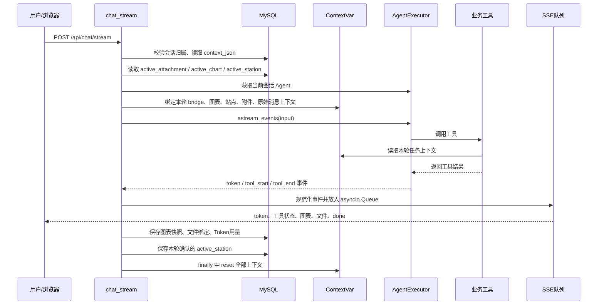
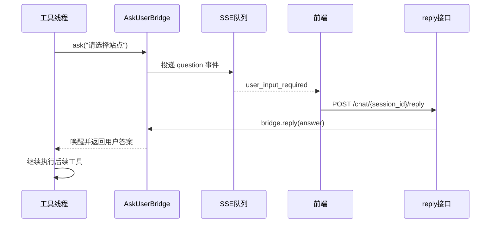

# SolarAgent 流式对话接口与上下文记忆机制

本文围绕 [chat.py](/D:/AAA_myProjects/howso/myAgent/solar_agent/backend/app/routers/chat.py) 中的 `POST /api/chat/stream`，解释一次流式任务如何执行、不同上下文如何绑定，以及“单次任务记忆”和“多轮会话记忆”的区别。

---

## 一、先记住一个核心结论

SolarAgent 的记忆不是一种技术完成的，而是三层机制组合：

```text
单次 Agent 执行
    └─ ContextVar：保存本轮任务临时状态

多轮会话
    └─ MySQL：保存会话级结构化状态、历史消息和摘要

模型可见上下文
    └─ Agent Memory：每轮从 MySQL 读取摘要 + 最近窗口消息
```

因此：

- `ContextVar` 解决“本次任务中工具之间如何复用信息”；
- `chat_session.context_json` 解决“下一轮任务还能不能记住上次确认的站点、附件和图表”；
- `message_store` 和 `agent_summary_store` 解决“模型如何看到之前的对话”；
- 它们不是互相替代，而是职责不同。

---

## 二、完整调用链



---

## 三、入口阶段：请求进入 `chat_stream`

代码位置：

[chat.py:339](/D:/AAA_myProjects/howso/myAgent/solar_agent/backend/app/routers/chat.py:339)

```python
@router.post("/chat/stream")
async def chat_stream(req: ChatRequest, current_user: dict = Depends(get_current_user)):
```

### 3.1 身份和会话隔离

```python
user_id = current_user["user_id"]
_verify_session_ownership(req.session_id, user_id)
```

这一步保证：

- 当前用户已经登录；
- 当前会话属于当前用户；
- 用户不能通过修改 `session_id` 读取别人的历史或上下文。

随后获取会话级锁：

```python
lock = agent_manager.get_lock(req.session_id)
```

同一个会话同时只能执行一个任务，避免两个请求同时修改同一份 Agent Memory 或同时等待同一个 `ask_user`。

### 3.2 读取持久化会话上下文

```python
persisted_context = load_session_context(req.session_id, user_id)
```

这里读取的是 `chat_session.context_json` 中保存的轻量结构化信息，例如：

```json
{
  "active_station": {
    "station_id": "4",
    "name": "哲丰新材料九号机新增",
    "city": "衢州市",
    "lat": 28.941447,
    "lon": 118.525745
  },
  "active_attachment": {
    "attachment_id": "att_xxx",
    "filename": "多站点数据.xlsx"
  },
  "active_chart": {
    "chart_id": "chart_xxx",
    "artifact_id": "artifact_xxx",
    "title": "英杰站逐小时发电量"
  }
}
```

这里不保存完整图表数组、文件真实路径或所有历史消息，避免上下文变得过大。

### 3.3 构造本轮 Agent 输入

```python
agent_input = _build_agent_input_with_context(
    req.message,
    attachments,
    persisted_context,
)
```

这个函数会把必要的引用注入本轮输入：

```text
当前会话最近一次已生成图表，可在用户要求导出刚才数据时复用：
{"chart_id":"chart_xxx","artifact_id":"artifact_xxx"}

用户原始任务：把刚才的数据导出来
```

注意：这里注入的是 `artifact_id`、`attachment_id` 等引用，不是完整数据内容。真正的数据仍由后端工具根据 ID 去数据库、快照存储或文件存储中读取。

---

## 四、为什么要有 `event_generator`

`chat_stream` 本身不是直接把 Agent 最终结果一次性返回，而是返回：

```python
return EventSourceResponse(event_generator(), ping=15)
```

`event_generator` 的作用是把 Agent 的异步事件转换成 SSE：

```text
Agent内部事件
    ↓
asyncio.Queue
    ↓
event_generator
    ↓
浏览器ReadableStream
```

队列的意义是把两个过程解耦：

- `consume_agent` 负责执行 Agent、调用工具、接收事件；
- `event_generator` 负责从队列取事件并发送给前端。

这样工具执行、模型输出和浏览器接收可以并行推进，不必等整个任务完成后才显示结果。

---

## 五、几种上下文绑定分别是什么

`consume_agent` 中最重要的代码是：

```python
bridge_token = agent_manager.bind_bridge(bridge)
chart_context_token = bind_chart_context(req.session_id, user_id)
station_context_token = bind_station_resolution_context(
    active_station=active_station,
)
attachment_context_token = bind_attachment_context(
    req.session_id,
    user_id,
    attachments,
)
raw_message_token = bind_raw_user_message(req.message)
```

这些对象都通过 `ContextVar` 绑定到“当前异步任务上下文”。可以把它理解为：

```text
当前 Agent 执行任务
    ├─ 当前会话的 ask_user Bridge
    ├─ 当前用户和会话的 Chart Context
    ├─ 当前任务的 Station Resolution Context
    ├─ 当前会话允许访问的附件范围
    └─ 用户真正输入的原始消息
```

### 5.1 Bridge 上下文：解决 `ask_user` 如何找到正确会话

位置：[agent_manager.py:71](/D:/AAA_myProjects/howso/myAgent/solar_agent/backend/app/services/agent_manager.py:71)

```python
bridge_token = agent_manager.bind_bridge(bridge)
```

`ask_user` 是同步工具，但前端交互是异步 SSE。它不能直接知道当前请求属于哪个会话，因此使用 `ContextVar` 保存当前会话的 `AskUserBridge`。

执行过程：



它解决的是“当前工具线程如何等待当前会话的用户回答”，不是长期记忆。

### 5.2 Chart Context：解决图表工具的会话归属和次数限制

位置：[context.py](/D:/AAA_myProjects/howso/myAgent/solar_agent/backend/app/charting/context.py:1)

其中包含：

```python
ChartExecutionContext(
    session_id=session_id,
    user_id=user_id,
    capability_preflight_done=False,
    chart_plan_attempts=0,
)
```

图表工具可以通过 `get_chart_context()` 知道：

- 当前是谁在请求图表；
- 当前属于哪个会话；
- 是否已经检查图表能力注册表；
- 当前 `ChartPlan` 已经尝试了几次。

它是本轮任务的状态，不是数据库中的永久状态。任务结束后必须 reset。

### 5.3 Station Resolution Context：解决一次任务内重复询问站点

位置：[station_resolver.py](/D:/AAA_myProjects/howso/myAgent/solar_agent/backend/app/services/station_resolver.py:20)

它包含三个关键字段：

```python
resolved_by_alias: dict[str, dict]
active_station: dict | None
last_user_selected_station: dict | None
```

#### `resolved_by_alias`

保存当前任务中已经解析过的别名：

```text
“哲丰” → 哲丰新材料九号机新增
“九号机” → 哲丰新材料九号机新增
station_id=4 → 哲丰新材料九号机新增
```

因此一次任务中可以这样复用：

```text
get_station_location("哲丰")
    → 用户选择九号机

predict_power("哲丰")
    → 从 resolved_by_alias 直接拿到九号机结构化对象
    → 不再次弹出选择
```

#### `active_station`

它来自上一轮任务结束后保存到 MySQL 的会话上下文，用于处理：

```text
上一轮：查询哲丰九号机
下一轮：继续看看它的天气
```

`StationResolver` 识别“它”“刚才那个站点”等上下文指代后，会读取 `active_station`，而不是让模型猜测。

#### `last_user_selected_station`

当用户在歧义站点中做出选择时，解析器把最终选择暂存在这里。只有任务成功结束后，`chat.py` 才执行：

```python
save_active_station(
    req.session_id,
    user_id,
    selected_station,
)
```

这样失败任务不会污染下一轮会话状态。

### 5.4 Attachment Context：解决附件权限和“这个文件”引用

位置：[attachment_context.py](/D:/AAA_myProjects/howso/myAgent/solar_agent/backend/app/services/attachment_context.py:1)

它保存：

```python
AttachmentExecutionContext(
    session_id=session_id,
    user_id=user_id,
    attachments=(...)
)
```

这里保存的是附件元数据和 `attachment_id`，不是文件内容和真实磁盘路径。

工具拿到 `attachment_id` 后，再通过附件服务完成：

```text
attachment_id
    → 校验用户和会话归属
    → 解析真实文件路径
    → 读取 / 导入 / 预览文件
```

这样模型即使看到附件信息，也无法直接操作服务器路径。

### 5.5 Raw Message Context：避免把系统包装内容写进历史

本轮 `agent_input` 可能包含：

```text
附件上下文
图表引用
会话上下文
用户原始问题
```

但数据库历史消息只应该保存用户真正输入的内容。因此：

```python
raw_message_token = bind_raw_user_message(req.message)
```

`PersistentWindowSummaryMemory.save_context()` 会优先读取这个原始消息，再写入 `message_store`。

这避免了以后历史记录中出现大段内部上下文，也避免摘要把系统内部控制信息误认为用户原话。

---

## 六、Agent 事件如何被处理

核心循环是：

```python
async for ev in executor.astream_events(
    {"input": agent_input},
    version="v2",
):
    processed = _process_agent_event(ev)
```

`_process_agent_event()` 把 LangChain 原始事件统一转换成前端事件：

| LangChain 事件 | 后端事件 | 前端用途 |
|---|---|---|
| `on_chat_model_stream` | `token` | 打字机输出 |
| `on_tool_start` | `tool_start` | 显示正在调用哪个工具 |
| `on_tool_end` | `tool_end` | 显示工具结果摘要 |
| 图表工具成功 | `chart_spec` / `tool_end` | 渲染 ECharts |
| 文件工具成功 | `tool_end` + `file` | 显示文件卡片 |
| 异常 | `error` | 显示结构化错误 |
| 任务结束 | `done` | 结束本轮流式请求 |

例如一次真实预测任务：

```text
token: 正在理解你的任务
tool_start: get_station_info
tool_end: 站点信息已获取
tool_start: parse_date
tool_end: 日期解析完成
tool_start: predict_power
tool_end: 预测完成
token: 预测结果如下……
done: {...}
```

### Token 用量为什么要按 run 聚合

一次 Agent 任务可能调用多次 LLM：

```text
第1次：理解问题
第2次：决定调用站点工具
第3次：读取工具结果并决定下一步
第4次：生成最终回答
```

因此代码使用：

```python
token_usage_by_run: dict[str, dict[str, int]] = {}
```

同一个 `run_id` 的流式事件和结束事件不能重复累加，最后再通过 `_merge_token_usage()` 汇总成本。

---

## 七、任务成功后的持久化

Agent 事件流结束后，`chat.py` 根据本轮产生的结果执行持久化。

### 7.1 图表快照

```python
save_chart_snapshot(req.session_id, user_id, chart_specs)
save_active_chart(req.session_id, user_id, chart_specs[-1])
```

完整图表数据存入图表快照表；会话上下文只保存最近图表的短引用：

```text
chat_session.context_json
    └─ active_chart.artifact_id

chart_snapshot_store
    └─ 完整 ChartSpec / 数据序列
```

下一轮用户说“把刚才的图导出来”时，后端把 `active_chart` 引用注入 Agent 输入，导出工具再根据 ID 找回完整数据。

### 7.2 文件绑定

```python
attach_files_to_latest_assistant_message(...)
```

Agent 只返回文件 ID，聊天消息保存文件关联关系，前端通过文件卡片下载，不暴露服务器路径。

### 7.3 Token 用量

```python
attach_token_usage_to_latest_assistant_message(...)
```

这样重新加载历史会话时，前端仍能看到该轮的输入、输出和总 Token。

### 7.4 active_station

在 `finally` 中，如果任务成功并且本轮有明确的用户站点选择：

```python
context = get_station_resolution_context()
selected_station = context.last_user_selected_station
save_active_station(...)
```

保存的是紧凑的结构化实体，不保存整个工具输出文本。

---

## 八、`finally` 为什么必须 reset

代码最后会执行：

```python
agent_manager.reset_bridge(bridge_token)
reset_chart_context(chart_context_token)
reset_station_resolution_context(station_context_token)
reset_attachment_context(attachment_context_token)
reset_raw_user_message(raw_message_token)
```

这些 token 是 `ContextVar.set()` 返回的恢复凭证。

如果不 reset，可能出现：

```text
请求A绑定了英杰站
请求A结束但上下文未清理
请求B没有站点信息，却读到了请求A的英杰站
```

或者：

```text
用户A的附件上下文
    ↓ 未清理
用户B的 Agent 误用用户A的附件 ID
```

所以 `ContextVar` 的正确生命周期一定是：

```text
set / bind
    → 执行 Agent
    → 读取上下文
    → 保存需要长期保留的信息
    → reset
```

---

## 九、单次任务记忆和多次任务记忆的区别

### 9.1 单次任务内记忆：ContextVar + 任务对象

特点：

- 生命周期只覆盖一次 `chat_stream` 执行；
- 速度快，不需要频繁查库；
- 适合别名解析、工具间传递、当前会话权限和本轮计数；
- 任务结束后主动清理。

例子：

```text
用户：预测哲丰站点今天发电量，并画图

get_station_info("哲丰")
    → 用户选择九号机
    → resolved_by_alias 保存结构化站点对象

predict_power("哲丰")
    → 复用当前任务中的结构化站点对象

get_power_dataset(...)
    → 继续复用同一个站点 ID
```

### 9.2 多轮任务间记忆：MySQL 会话上下文

特点：

- 跨越多次 HTTP 请求；
- 服务重启后仍能恢复；
- 只存紧凑业务事实；
- 需要用户和会话权限校验。

例子：

```text
第1轮：查询“哲丰”，用户选择九号机
    → 保存 active_station 到 chat_session.context_json

第2轮：看看它的天气
    → load_context 读取 active_station
    → bind_station_resolution_context(active_station=...)
    → StationResolver 解析“它”
    → 天气工具直接复用站点经纬度
```

### 9.3 模型对话记忆：摘要 + 最近窗口

`PersistentWindowSummaryMemory` 每轮从 MySQL 读取：

```text
agent_summary_store.summary
    + message_store 最近 2*k 条消息
    → chat_history
    → Prompt
    → LLM
```

当前 `k=3`，因此最近窗口通常是 6 条消息；更早内容通过增量摘要保存。

这和 `active_station` 不一样：

- `active_station` 是结构化事实，适合程序稳定读取；
- `chat_history` 是自然语言对话，适合模型理解上下文。

不能只依赖对话摘要保存站点 ID、artifact_id 或用户确认条件，因为摘要可能丢字段；关键事实应结构化保存。

---

## 十、两类记忆的对照表

| 类型 | 载体 | 生命周期 | 保存内容 | 典型用途 |
|---|---|---|---|---|
| 任务内临时上下文 | `ContextVar` | 一次 Agent 执行 | 当前站点解析、Bridge、附件范围、图表计数 | 工具之间复用、权限隔离、避免重复询问 |
| 会话结构化状态 | `chat_session.context_json` | 多轮会话、重启后仍在 | `active_station`、`active_chart`、`active_attachment` | “它”“刚才那张图”“上一个文件” |
| 原始消息历史 | `message_store` | 长期 | 用户消息、Agent 消息 | 恢复聊天记录、摘要输入 |
| 摘要记忆 | `agent_summary_store` | 长期 | 历史对话压缩摘要、游标、版本 | 控制 Prompt 长度、保留长期语义 |
| 图表数据快照 | `chart_snapshot_store` | 长期 | 完整 ChartSpec 和数据 | 历史图表恢复、再次导出 |

---

## 十一、一个完整例子：预测、画图、下一轮导出

### 第一次请求

```text
用户：预测哲丰站点今天的发电量，并画出逐小时曲线
```

执行：

```text
1. 从 chat_session 读取旧上下文
2. 绑定本轮 StationResolutionContext
3. get_station_info / StationResolver 解析哲丰
4. 用户选择九号机
5. resolved_by_alias 保存九号机对象
6. predict_power 复用该对象
7. get_chart_capabilities
8. get_power_dataset
9. create_chart_plan
10. 保存 chart_snapshot
11. 保存 active_chart
12. 保存 active_station
13. reset 所有 ContextVar
```

### 第二次请求

```text
用户：把刚才的图导出成 Excel
```

执行：

```text
1. load_context 读取 active_chart
2. 把 artifact_id 注入本轮 Agent 输入
3. Agent 调用 export_table
4. 导出工具根据 artifact_id 找回完整数据
5. 生成文件并保存 file_id
6. 前端显示文件卡片
7. 用户从卡片下载
```

这里没有把整个图表数组再次塞进 Prompt，也没有重新让模型猜站点、日期和字段。

---

## 十二、面试时可以这样讲

> 我把 Agent 的上下文分成了任务级和会话级两层。一次任务内部使用 ContextVar 保存当前会话的 Bridge、站点解析缓存、附件权限范围和图表执行状态，让多个工具能够复用同一个结构化结果，同时避免不同请求之间串数据。跨轮次的信息则不依赖进程内存，而是保存到 MySQL 的会话上下文中，例如 active_station、active_chart 和 active_attachment。下一轮请求进入时，后端先读取这些轻量引用，再绑定到新的任务上下文。对话文本本身由 message_store 和增量摘要维护，完整图表数据放在快照表，文件通过 file_id 关联。这样既保留了短期执行效率，又具备服务重启后的恢复能力，并且把结构化事实、自然语言记忆和大数据制品分开管理。

---

## 十三、需要注意的工程细节

1. `ContextVar` 不是持久化存储，进程重启后全部消失；它只负责当前执行链路。
2. 重要事实不能只写进 Prompt 或摘要，应该结构化保存到 MySQL。
3. `active_station` 只在任务成功后保存，失败任务不应污染下一轮。
4. 图表和文件只在聊天上下文中保存引用，完整内容放到独立存储。
5. 同一 `session_id` 使用 `asyncio.Lock` 串行执行，避免同一会话的上下文和 Agent Memory 并发冲突。
6. 当前 `consume_agent` 会在 `finally` 中发送 `done`，外层用 `stream_completed` 判断是否调度摘要。若后续要严格区分“流关闭”和“任务成功”，可以把 `task_succeeded` 一并放入 `done` 事件，避免异常任务也被误认为正常完成。

